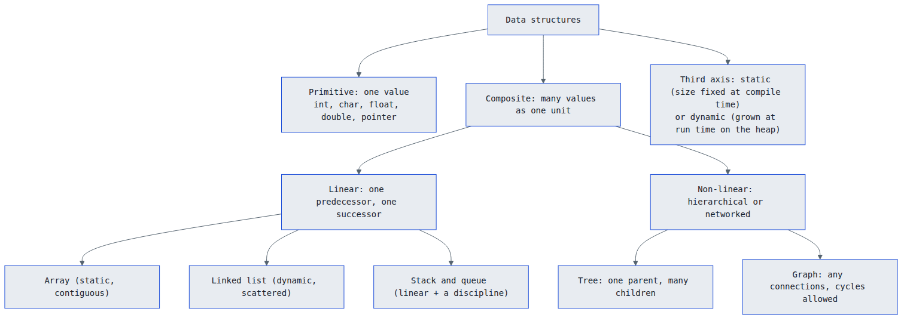
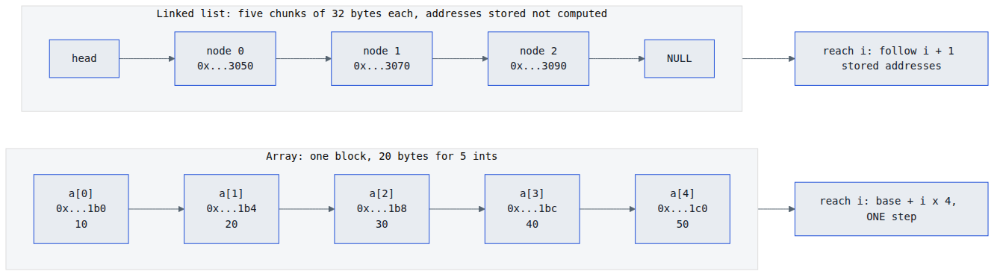
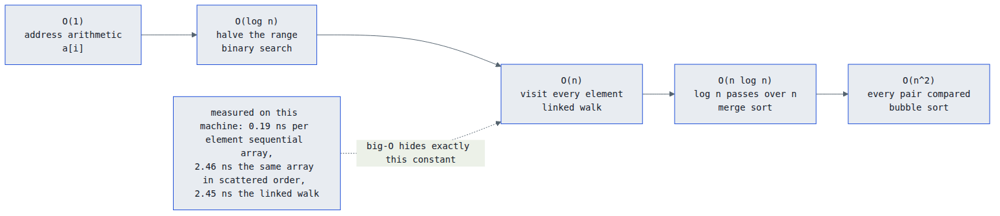
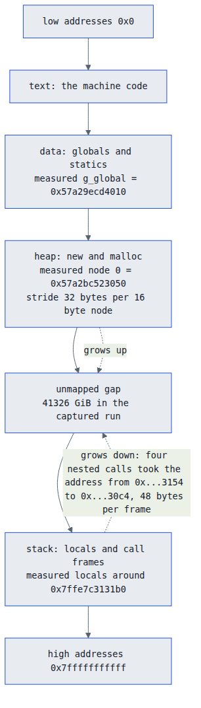
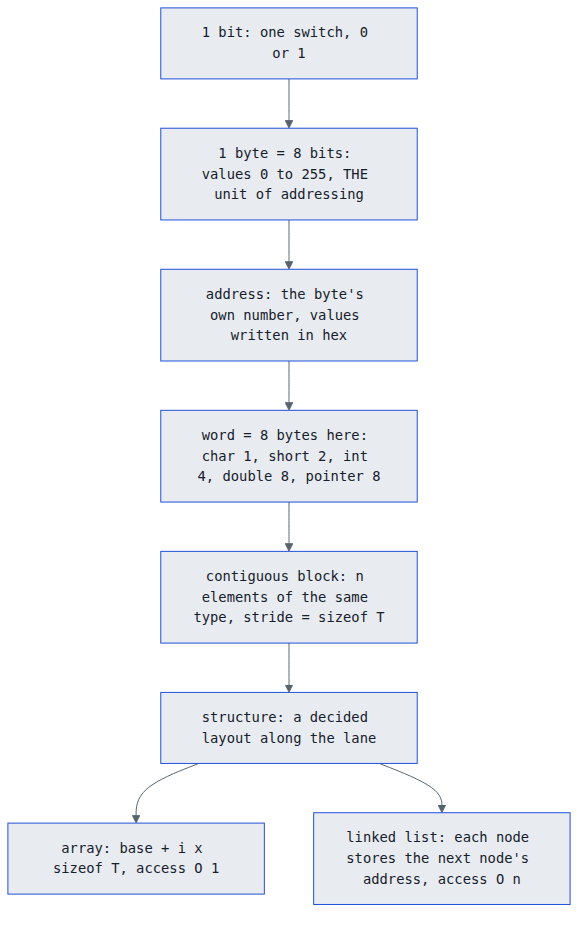

# Memory Representation of Data Structures · ECE2104 (DSA), MUJ Sem 3

Lecture 5, *Introduction to Data Structures and Memory Representation*.
Session outcome: **define basic data structures and explain their memory allocation** · CO1 · mid-term material.

Every number below was measured in one compiled run on this machine, not transcribed from a slide.
The companion visual guide is `INTRO-MEMORY-VISUAL-GUIDE.html` in this folder.

| Lecture | Official topic | Session outcome | CO | Lesson file |
|---|---|---|---|---|
| 5 | Introduction to Data Structures and Memory Representation | define basic data structures, explain memory allocation | 1 | `~/learning/cpp/lessons/05_ds_memory_representation.cpp` |
| 6 | Linked List: Concept, Types, Node Representation | represent linked lists in memory | 1 | (next topic) |

Provenance: `g++ 15.2.0 -Wall -Wextra -std=c++17 -O2`, x86-64, Ubuntu 26.04.
Raw output: `~/learning/cpp/exercises/lec05_run_output.txt`. Addresses shift every run (ASLR);
sizes, offsets and strides do not. Re-verify with `python3 ~/learning/cpp/exercises/verify_ds_memory_lec5.py`.

---

## 1. The definitions to write, word for word

| Term | Definition that earns full marks |
|---|---|
| Memory | a linear array of addressable bytes; each byte has a unique address |
| Address | an integer identifying one byte; `0x` prefixed hex is how it is written |
| Data structure | a way of organising data in memory so the required operations are efficient |
| Static structure | size and memory fixed at compile time, held as one contiguous block |
| Dynamic structure | size decided at run time, memory obtained from the heap one allocation at a time |
| Abstract data type | logical description of data, operations and their rules, with the implementation hidden |
| Contiguous layout | elements stored back to back, so the i-th address is computable |
| Linked layout | each element stores the address of the next, so consecutive elements need not be consecutive in memory |

## 2. The lane: units and their real sizes

| Unit | Meaning | Bytes here |
|---|---|---|
| bit | one switch, 0 or 1 | 1/8 |
| nibble | 4 bits, exactly one hex digit | 1/2 |
| byte | 8 bits, values 0 to 255, the unit of addressing | 1 |
| short | 2 bytes | 2 |
| int | the workhorse | 4 |
| float | single precision | 4 |
| double, pointer | both 8 bytes on a 64-bit machine | 8 |
| word | the hardware's natural register width | 8 |

Measured directly: `sizeof(char)=1`, `sizeof(short)=2`, `sizeof(int)=4`, `sizeof(long)=8`,
`sizeof(float)=4`, `sizeof(double)=8`, `sizeof(void*)=8`, `alignof(int)=4`, `alignof(double)=8`.

A pointer is 8 bytes because an address is 64 bits. That single fact is why a linked node costs
more than the number it carries, and it comes back in section 6.

## 3. Address arithmetic: the one formula

```
addr(&a[i]) = base + i × sizeof(element)
```

| i | captured address | byte offset from base | value |
|---|---|---|---|
| 0 | `0x7ffe7c3131b0` | 0 | 10 |
| 1 | `0x7ffe7c3131b4` | 4 | 20 |
| 2 | `0x7ffe7c3131b8` | 8 | 30 |
| 3 | `0x7ffe7c3131bc` | 12 | 40 |
| 4 | `0x7ffe7c3131c0` | 16 | 50 |

The program computed `base + 4 × sizeof(int)` in one step and compared it with `&a[4]`: equal.
That is the entire reason indexed access is **O(1)**, and it is a multiply plus an add, never a search.

⚠ Trap: address arithmetic is type-aware. `(char*)p + 1` moves one byte, `(int*)p + 1` moves four.
`&a[0] + i` and `&a[i]` are the same address. `(char*)&a[0] + i` is not.

## 4. An array seen as raw bytes, not as numbers

`int a[5] = {10, 20, 30, 40, 50}` printed byte by byte:

| Offset | Byte | Belongs to |
|---|---|---|
| +0 … +3 | `0a 00 00 00` | a[0] = 10 |
| +4 … +7 | `14 00 00 00` | a[1] = 20 |
| +8 … +11 | `1e 00 00 00` | a[2] = 30 |
| +12 … +15 | `28 00 00 00` | a[3] = 40 |
| +16 … +19 | `32 00 00 00` | a[4] = 50 |

The smallest byte comes first, which is little-endian. One hex byte is 0 to 255 (`0x1e` = 30), so two
hex digits describe a byte exactly. Measured for a string: `char s[] = "DSA"` occupies 4 bytes,
`44 53 41 00`, where `0x00` is the terminator the compiler added.

## 5. Alignment and padding: the visible price

Two rules. Each field starts at an offset that is a multiple of its own alignment, and the struct's
total size is a multiple of its largest field alignment.

| Struct | Fields and offsets (measured `offsetof`) | sizeof | Padding paid |
|---|---|---|---|
| `P1 {int a; char b; char c;}` | a@0, b@4, c@5 | 8 | 2 bytes (a multiple of 4) |
| `P2 {char a; int b; char c;}` | a@0, b@4, c@8 | 12 | 6 bytes |
| `P3 {char a; char b; int c;}` | a@0, b@1, c@4 | 8 | 2 bytes |
| `Node {int data; Node* next;}` | data@0, next@8 | 16 | 4 bytes so the pointer lands on 8 |

Real evidence for the rule itself: the compiler placed a local `double` at `0x7ffe7c3131a8`,
which is divisible by 8. Same fields, different order, different footprint: that is why `P2` costs
12 bytes while `P1` and `P3` cost 8.

## 6. The heap: what the allocator really does

Five consecutive `new Node` calls, `sizeof(Node)` = 16 bytes:

| Node | Address | Distance from previous |
|---|---|---|
| 0 | `0x57a2bc523050` | first allocation |
| 1 | `0x57a2bc523070` | 32 bytes |
| 2 | `0x57a2bc523090` | 32 bytes |
| 3 | `0x57a2bc5230b0` | 32 bytes |
| 4 | `0x57a2bc5230d0` | 32 bytes |

Three measured facts worth quoting:

1. You ask for 16 bytes, the allocator reports **24 usable** bytes, and it charges a **32 byte stride**.
2. The extra 16 bytes are its own bookkeeping plus alignment, so a linked node costs roughly double
   its payload here. Five ints in an array cost 20 bytes; five nodes cost 160 bytes charged.
3. The addresses rose evenly only because nothing had been freed yet. Free the middle node, allocate
   again, and the next `new` may take that hole, so nodes scatter. Do not claim heap blocks are
   contiguous, and never compute the address of node i: it is stored, not derived.

⚠ `delete p` returns the block to the allocator. It does not wipe the bytes and it does not change
your pointer, and losing the head of a chain leaks every node behind it.

## 7. Stack and heap: two ends of one address space

| | Stack | Heap |
|---|---|---|
| Who places it | the compiler | the allocator, on `new` / `malloc` |
| When | compile time | run time |
| Lifetime | until the frame returns | until you free it |
| Growth here | downward | upward |
| Size | small and fixed (megabytes) | large, bounded by RAM |
| Cost to place | one register subtraction | a search for a free chunk |
| Failure mode | stack overflow | failed allocation, or a leak |
| Who frees | automatic | you, with `delete` |
| Measured address | locals near `0x7ffe7c3131b0` | nodes from `0x57a2bc523050` |
| Measured gap | 41326 GiB between the two regions in the captured run | |

Four nested calls, the innermost last and lowest:

| Frame depth | Address of its local | Delta |
|---|---|---|
| 3 (first call) | `0x7ffe7c313154` | - |
| 2 | `0x7ffe7c313124` | 48 bytes lower |
| 1 | `0x7ffe7c3130f4` | 48 bytes lower |
| 0 (innermost) | `0x7ffe7c3130c4` | 48 bytes lower |

Recursion depth × 48 bytes is your stack use, which is exactly why infinite recursion dies.

⚠ The first version of this lesson program returned the address of a local variable and `-Wall`
refused to compile it: *warning: address of local variable returned*. A stack address dies with its
frame, a heap address lives until freed. Return `new`, never `&local`.

## 8. Classification: three questions that place any structure



| Question | Answers | Examples |
|---|---|---|
| One value or many? | primitive / composite | `int` / array, struct, list, tree |
| A line or a hierarchy? | linear / non-linear | array, list, stack, queue / tree, graph |
| Fixed or grown? | static / dynamic | array of fixed size / linked nodes |

The first two questions give the familiar tree; the third is a separate axis and examiners test it
on its own.

| | Static (fixed size array) | Dynamic (linked nodes) |
|---|---|---|
| Size decided | compile time | run time, node by node |
| Memory source | stack frame or one block | heap, one allocation per node |
| Grow beyond declared size | impossible | until the allocator refuses |
| Access element i | O(1), arithmetic | O(n), follow links |
| Insert in the middle | O(n), shift the tail | O(1) after the predecessor is held |
| Overhead per element | none | a link plus allocator bookkeeping |
| Measured | 20 bytes for 5 ints | 32 bytes charged per node |

## 9. Abstract data type versus implementation



An **ADT** names the values, the operations and the rules, and says nothing about storage: create,
insert, delete, search, traverse, plus the invariants that must hold after every operation. A
**data structure** is one realisation of it in memory.

| Operation | Array backed | Linked backed |
|---|---|---|
| Insert at front | O(n), shift everything | O(1), new head |
| Insert at back | O(1) amortised | O(1) with a tail pointer |
| Delete at front | O(n), shift back | O(1), move the head |
| Access element i | O(1), `base + i × sizeof(T)` | O(n), walk the links |
| Search a value | O(n) | O(n) |
| Memory per element | 4 bytes measured | 32 bytes measured |

A stack is an ADT because push, pop, top and LIFO order describe it completely, and both columns
above can implement it. An array is not an ADT: it fixes the storage in its definition.

## 10. Cost is the shape you chose



Same n, same arithmetic, three layouts, timed here (2 million elements, 8 passes):

| Layout | ns per element | Why |
|---|---|---|
| Array, sequential `arr[i]` | 0.19 | contiguous, the hardware prefetcher predicts the next cache line |
| Array, scattered order | 2.46 | same array, locality lost, 12.7× the sequential walk |
| Linked list, `cur = cur->next` | 2.45 | locality lost again, plus one dependent load per hop, 12.6× |

| Cost | Shape that produces it | Example |
|---|---|---|
| O(1) | address arithmetic, one stride | `a[i]` |
| O(log n) | halving the range each step | binary search on a sorted array |
| O(n) | visiting n elements, or following n links | the linked walk |
| O(n log n) | log n passes over n elements | merge sort |
| O(n²) | every element compared with every other | bubble sort |

Big-O counts steps as n grows and deliberately hides the constant. The constant is where the memory
layout lives: 0.19 against 2.45 ns is a 12.6× constant, invisible in the notation, which is why
"O(1) means fast" is a wrong sentence.

## 11. Where data structures live (one picture)





## 12. Self-check, answers at the bottom

1. What does "a byte is addressable" mean in one sentence?
2. `int a[5]` starts at `0x7ffe7c3131b0`. Give the address of `a[3]` and the number of steps.
3. Why is `struct Node {int data; Node* next;}` 16 bytes and not 12?
4. Same five integers: 20 bytes versus 160 bytes. Which layout is which, and what does the extra buy?
5. Distinguish the stack and the heap as memory regions in three sentences.
6. Classify a static array of records and a binary tree, naming the axis you used.
7. Correct the claim "a linked list is always better because insertion is O(1)".
8. Define an ADT and explain why "stack" is one while "array" is not.

---

## Answer key

| Q | Key point |
|---|---|
| 1 | every byte has its own address and can be read or written independently |
| 2 | `0x7ffe7c3131bc`, one multiply and one add, so one step, O(1) |
| 3 | `next` is 8 bytes and must start on an 8-byte boundary, so 4 padding bytes sit after `data` |
| 4 | 20 bytes is the array (5 × 4); 160 bytes is the list (5 × 32 charged); the extra buys O(1) insert and delete at a held position |
| 5 | stack: compiler-placed locals and frames, automatic lifetime, downward growth, small; heap: `new`-placed objects, manual lifetime, upward growth, large |
| 6 | array: composite, linear, static. tree: composite, non-linear (hierarchical), dynamic. axes: one or many, line or hierarchy, fixed or grown |
| 7 | reaching the position costs O(n) unless the predecessor is held, and access plus memory density are worse (32 bytes per node against 4 per element, 12.6× slower per element measured) |
| 8 | an ADT is the data, operations and rules with the implementation hidden; a stack is fully described by push, pop, top and LIFO and can be array or node backed, an array fixes its storage |

## Files in this folder

| File | What it is |
|---|---|
| `INTRO-MEMORY-VISUAL-GUIDE.html` | the interactive visual guide, ten sheets, everything above made draggable |
| `tokens.css` | the design tokens, audited for contrast before the build |
| `og-card.svg` | the share card for the guide |
| `diagrams/*.mmd` | Mermaid sources for the five diagrams |
| `diagrams/*.png` | rendered diagrams, so they open in any viewer |
| `render-diagrams.sh` | re-renders the diagrams using the chromium already on this box |
| `~/learning/cpp/lessons/05_ds_memory_representation.cpp` | the capture program every number came from |
| `~/learning/cpp/exercises/verify_ds_memory_lec5.py` | recompiles, re-runs and checks these numbers |
