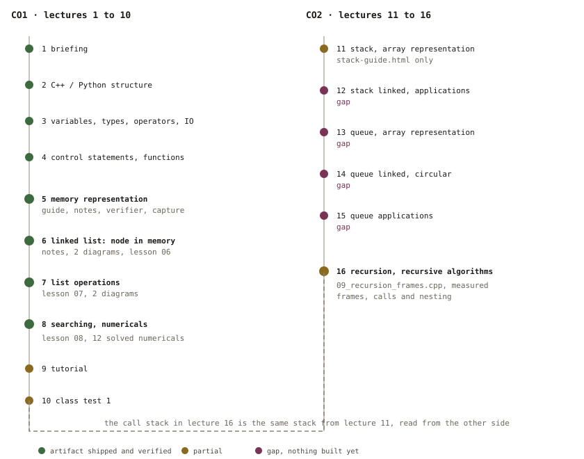
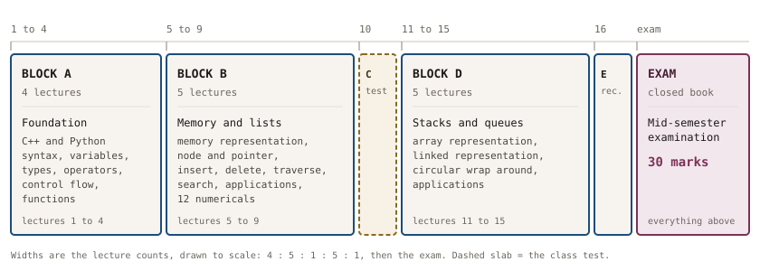
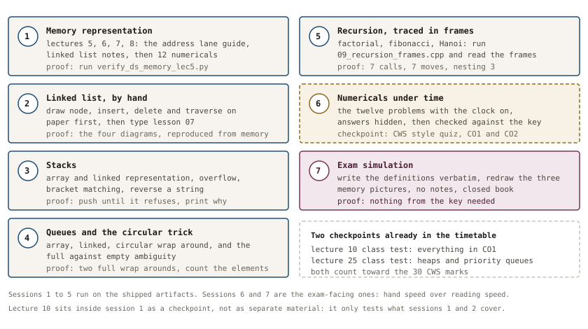

# DSA Mid-Term Roadmap · ECE2104

**Course:** Data Structures and Algorithms (ECE2104 / VDT2104), Manipal University Jaipur, Sem 3
**Coverage:** lectures 1 to 16, which is everything before the handout's "MID SEMESTER EXAMINATION" row
**Extracted from:** `Handouts/Course Handout ECE2104VDT2104_26.pdf` with `pdftotext -layout`, then the lecture plan rows were re-read from 300 dpi page images (`pdftoppm -r 300`) because a table this dense is exactly the place where a text layer scrambles columns. Topic and outcome wording below is the handout's, not a paraphrase.

## 1. What the exam is worth, and what it covers

| Assessment | Detail | Marks |
|---|---|---|
| Mid-Term Examination | closed book, lectures 1 to 16 | 30 |
| Class Work Sessional | quiz, MOOC, assignment | 30 |
| End Term Examination | closed book, whole syllabus | 40 |

| Coverage fact | Value |
|---|---|
| Lectures in the mid-term | 1 to 16 |
| Course outcomes examined | CO1 (lectures 1 to 10), CO2 (lectures 11 to 16) |
| Class tests inside the plan | lecture 10 (CO1 topics), lecture 25 (after the mid-term) |
| Session outcome verbs used | understand, define, represent, perform, implement, apply |
| Stated assessment mode per lecture | in-class quiz throughout, and every CO1/CO2 lecture also counts to Mid Term |

## 2. The sixteen lectures, as the handout lists them

| L | Topic (handout wording) | Session outcome (handout wording) | CO | Material status |
|---|---|---|---|---|
| 1 | Introduction and Course Hand-out briefing | Understand basics of subject and assessment | 1 | no artifact needed |
| 2 | Introduction to C++/Python, Features, Program Structure | Understand basic language syntax and operations | 1 | `~/learning/cpp/lessons/01_basics.cpp` |
| 3 | Basic Terms: Variables, Data Types, Operators, Input/Output | Understand basic language syntax and operations | 1 | `02_variables.cpp`, `03_control_flow.cpp` |
| 4 | Control Statements and Functions (Overview) | Understand basic language syntax and operations | 1 | `03_control_flow.cpp`, `04_functions.cpp` |
| 5 | Introduction to Data Structures and Memory Representation | Define basic data structures and explain their memory allocation | 1 | **shipped:** `Notes/intro-memory/` guide + notes + verifier |
| 6 | Linked List: Concept, Types, Node Representation | Represent linked lists in memory | 1 | **shipped:** `Notes/linked-list/` notes + `06_linked_list_representation.cpp` |
| 7 | Linked List Operations: Creation and Insertion, Deletion and Traversal | Represent linked lists in memory | 1 | **shipped:** `07_linked_list_operations.cpp` + lec7 diagrams |
| 8 | Searching in Linked List, Applications, Numerical Problems and Practice | Perform traversal and search operations | 1 | **shipped:** `08_linked_list_searching_apps.cpp` + lec8 diagrams |
| 9 | Tutorial | Perform traversal and search operations | 1 | linked-list notes section 7 |
| 10 | Class Test | Assess understanding and application of covered topics | 1 | use the self-tests in the two shipped guides |
| 11 | Stack: Concept and array representation | Implement stacks and queues in memory | 2 | partial: `~/learning/dsa/stack-guide.html`, no array-cost artifact |
| 12 | Stack using Linked List, Stack Application | Implement stacks and queues in memory | 2 | **gap** |
| 13 | Queue: Concepts and Array Representation | Implement stacks and queues in memory | 2 | **gap** |
| 14 | Queue using Linked List and Circular Queue | Implement stacks and queues in memory | 2 | **gap** |
| 15 | Queue Applications | Implement stacks and queues in memory | 2 | **gap** |
| 16 | Recursion and Recursive Algorithms | Apply recursion and linear DS to solve problems | 2 | improved: `DAS-LAB/Exp3_Recursion/` plus `09_recursion_frames.cpp` (measured calls, depth, frame bytes) |
| 17 onward | Trees, heaps, sorting, graphs, analysis | end-term material | 3, 4, 5 | out of scope here |

## 3. How the puzzle fits together

The 16 lectures are not 16 independent topics. There is one chain, and every exam question about memory, lists, stacks or queues sits on it:

| Step | What it gives you | Where it is examined |
|---|---|---|
| Memory is bytes with addresses | `addr(&a[i]) = base + i × sizeof(T)` | lecture 5 |
| Contiguous vs scattered layout | array stride 4 bytes vs node 32 bytes charged | lecture 5, 6 |
| A node is data plus a pointer | linked list types, 16 byte singly node | lecture 6 |
| Pointers make insert and delete cheap | O(1) at a held position, O(n) to reach it | lecture 7 |
| Reaching costs hops | traversal and search, list vs array in numbers | lecture 8 |
| One end only gives LIFO | stack, array or linked backed | lecture 11, 12 |
| Two ends give FIFO | queue, circular queue wrap-around | lecture 13, 14 |
| The call stack is a stack | recursion, frames 48 bytes apart measured | lecture 16 |

## 4. What to be able to do, per course outcome

| CO | Statement (shortened, handout) | What "done" looks like in the exam |
|---|---|---|
| 1 | Explain concepts of object-oriented programming using C++/Python | write and trace a small C++ class or function; declare types correctly; pass by value vs reference |
| 2 | Explain the basic operations on arrays, lists, stacks and queue data structures with programming examples | draw the memory picture, write the node struct, write insert/delete/traverse, give the cost in O and in bytes |

| Skill | Proof you own it |
|---|---|
| Address arithmetic | compute `&a[7]` from a given base by hand, in one line |
| Node representation | draw a 16 byte node with padding marked, name both offsets |
| Insert and delete | write the pointer writes for insert-at-position and delete-last without notes |
| Traversal and search | count hops for a given list, compare with the array's 1 |
| Memory accounting | state 4 bytes per array element vs 32 bytes per node, and say why |
| Stack both ways | push and pop on an array and on a linked list, say which is cheaper when |
| Queue wrap-around | given capacity, front and rear, compute the element count and the next slot |
| Recursion | trace factorial, fibonacci and Hanoi; state depth, moves and frame bytes |

## 5. Seven sessions, each with a proof

One session is roughly 90 minutes. Do not move on until the proof is produced; the proof is the exam answer.

| Session | Work | Proof of work |
|---|---|---|
| 1 | Lecture 5 material: read `INTRO-MEMORY-STUDY-NOTES.md`, then play the interactive guide sheets 01 to 04 | `python3 ~/learning/cpp/exercises/verify_ds_memory_lec5.py` prints 81/81 |
| 2 | Lecture 6: linked list concept, types, node representation; run `06_linked_list_representation.cpp` | draw from memory: 16 byte node, both offsets, three list types |
| 3 | Lecture 7: insert and delete; run `07_linked_list_operations.cpp`, then the exercises file | write insert-at-position on paper, then diff against the code |
| 4 | Lecture 8: search and applications; run `08_linked_list_searching_apps.cpp` | solve the twelve numerical problems in section 6 without looking |
| 5 | Lectures 11 and 12: stack in an array and as a linked list; push, pop, top, isEmpty | both implementations compile and print the same operation log |
| 6 | Lectures 13 and 14: queue in an array, as a linked list, and circular; enqueue, dequeue, wrap | a circular queue that survives 2 full wrap-arounds, plus the count formula |
| 7 | Lecture 16: recursion; `DAS-LAB/Exp3_Recursion/` factorial, fibonacci, Hanoi, then `09_recursion_frames.cpp` | trace Hanoi for n = 3, then match your counts against the probe's measured 7 calls, 3 frames deep |
| check | 40 question mock, closed book, 60 minutes, section 6 and the two shipped guides' self-tests | score, then re-read only the misses |

## 6. Numerical problems (the part lecture 8 explicitly names)

Constants measured on this machine and used in every answer below: `sizeof(int) = 4`, `sizeof(char) = 1`, `sizeof(pointer) = 8`, `sizeof(Node) = 16` for `{int data; Node* next;}`, allocator stride `32` bytes per node, `24` usable bytes per allocation, one stack frame `48` bytes.

1. An array `int a[5]` starts at `0x7ffe7c3131b0`. Give the address of `a[3]`, and how many memory accesses it takes.
2. A linked list holds the same five integers. Give the address expression for node 3, and how many accesses it takes.
3. `int a[5]` occupies how many bytes? The equivalent 5 node list occupies how many bytes charged? Give the ratio.
4. Write the formula for `&a[i]` and use it with `base = 0x1000`, `i = 7`, `sizeof(int) = 4`.
5. `struct Node { int data; Node* next; };` is 16 bytes, not 12. Where do the extra 4 bytes sit, and why must they?
6. A singly linked list has 5 nodes. How many pointer writes does inserting a new node at position 3 need, assuming you already hold the predecessor?
7. Same list: how many pointer writes does deleting the last node need, and what must you hold to do it in O(1)?
8. How many hops does the search for the value in the last node take in a list of `n` nodes, and what is the same search's cost in an array?
9. A stack is implemented over an array of capacity 8 and the program pushes 9 values. What happens in C++ with `std::vector` grown by doubling, and what happens with a raw array?
10. A circular queue has capacity 5, `front = 3`, `rear = 1`. How many elements are stored, and which slot does the next enqueue use?
11. `factorial(4)` is called. How many frames are alive at the deepest point, and how many bytes of stack is that at 48 bytes per frame?
12. Towers of Hanoi with 3 disks: how many moves, and how many recursive calls?

## 7. Recursion, measured (lecture 16 evidence)

`~/learning/cpp/lessons/09_recursion_frames.cpp` instruments the same two exercises your lab uses and counts frames instead of guessing. Raw output: `~/learning/cpp/exercises/lec16_recursion_output.txt`.

| Call | Recursive calls | Deepest nesting | Moves |
|---|---|---|---|
| `factorial(1)` to `factorial(5)` | n | n | n/a |
| `factorial(4)` frames alive | 4 | 4 plus `main` | n/a |
| Hanoi n = 1 | 1 | 1 | 1 |
| Hanoi n = 2 | 3 | 2 | 3 |
| Hanoi n = 3 | 7 | 3 | 7 |
| Hanoi n = 4 | 15 | 4 | 15 |

Two things this pins down: each Hanoi call performs exactly one move, so calls and moves are both `2ⁿ - 1`, and the frame span measured 144 bytes across 4 nested frames, which is the same 48 bytes per frame the lecture 5 capture reported.

## 8. What exists, what is missing

| Area | Materials | State |
|---|---|---|
| Lecture 5 memory | `Notes/intro-memory/` (guide, notes, 5 diagrams, verifier) | complete, verified |
| Lectures 6 to 8 lists | `Notes/linked-list/` (notes, 4 diagrams), lessons 06 to 08, verifier | complete, verified |
| Lectures 2 to 4 C++ | `~/learning/cpp/lessons/01` to `05`, `Notes/C++-LANGUAGE-PLAN.md` | complete |
| Lectures 11 to 12 stacks | `~/learning/dsa/stack-guide.html` only | weak: no course-mapped notes, no array vs linked cost artifact, no numerical problems |
| Lectures 13 to 15 queues | none | missing |
| Lecture 16 recursion | `DAS-LAB/Exp3_Recursion/` code, `09_recursion_frames.cpp` probe, `lec16_recursion_output.txt` | improved: numbers are measured, still no notes page or frame diagram |
| Exam practice | self-tests inside the two shipped guides | partial: nothing for stacks, queues, recursion |

## 9. The honest gaps

1. **Stacks and queues have no course-mapped artifact.** Five of the sixteen lectures sit there, and they are the most likely "draw and compute" questions.
2. **Circular queue wrap-around has no worked example**, and that is a classic two-mark trap.
3. **Recursion has code but no frame trace**, and every recursion question is really a frame question.
4. **Nothing yet ties the numericals together** into one timed paper, which is the only way to find out whether the arithmetic is automatic under exam pressure.
5. This roadmap is a plan, not practice: sections 5 and 6 are what turn reading into marks.

## 10. Sources

| Source | What was taken |
|---|---|
| Course handout PDF, section E | assessment plan, 30 / 30 / 40 marks |
| Course handout PDF, section G, pages 4 to 6 | the lecture plan rows, verbatim topic and session outcome wording, CO mapping, and the position of the MID SEMESTER EXAMINATION row after lecture 16 |
| Course handout PDF, section F and H | syllabus summary and the five CO statements |
| `DAS-LAB/Manuals` and `Exp0` to `Exp4` | lab experiments that already cover array ops, merge sort, quick sort, recursion, priority queue |
| Measured capture | `~/learning/cpp/exercises/lec05_run_output.txt` for every size, offset and stride quoted above |

## Answer key

Work section 6 on paper first; the numbers below are the check, not the lesson.

| Q | Answer |
|---|---|
| 1 | `0x7ffe7c3131b0 + 3 × 4 = 0x7ffe7c3131bc`, one multiply and one add, so ONE access |
| 2 | Not computable: node 3's address is stored inside node 2, so it costs 4 walks from the head |
| 3 | Array 20 bytes; list 5 × 32 = 160 bytes charged; 8× more, and the 8× is padding plus allocator bookkeeping |
| 4 | `&a[i] = base + i × sizeof(T)` = `0x1000 + 7 × 4` = `0x101C` |
| 5 | 4 padding bytes between `data` and `next`, so the 8 byte pointer starts on an 8 byte boundary |
| 6 | Two writes: the new node's `next` to the successor, and the predecessor's `next` to the new node |
| 7 | Two writes for the deletion itself, but you must hold the SECOND to last node to avoid an O(n) walk |
| 8 | `n` hops in a list, versus 1 computed access in an array, but the array needs the index, not the value |
| 9 | `std::vector` reallocates and copies into doubled capacity; a raw array writes out of bounds, which is undefined behaviour |
| 10 | `(1 - 3 + 5) mod 5 = 3` elements; next enqueue at slot 2 |
| 11 | Measured: `factorial(4)` nests 4 recursive calls, so 5 frames are alive counting `main`, about 240 bytes at 48 bytes per frame |
| 12 | Measured: 7 moves and 7 recursive calls, `2³ - 1` each, with the deepest nesting at 3 frames |
