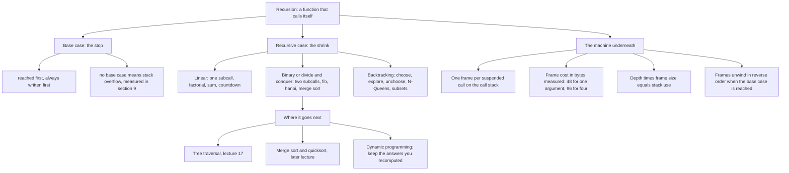
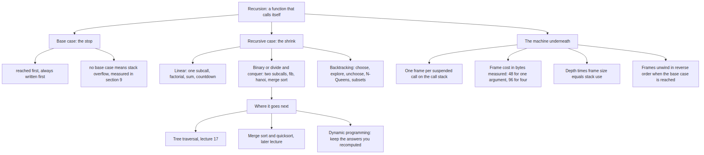
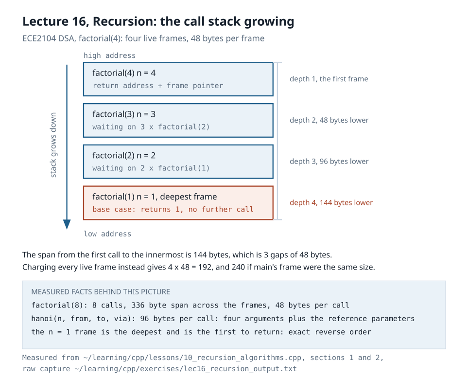
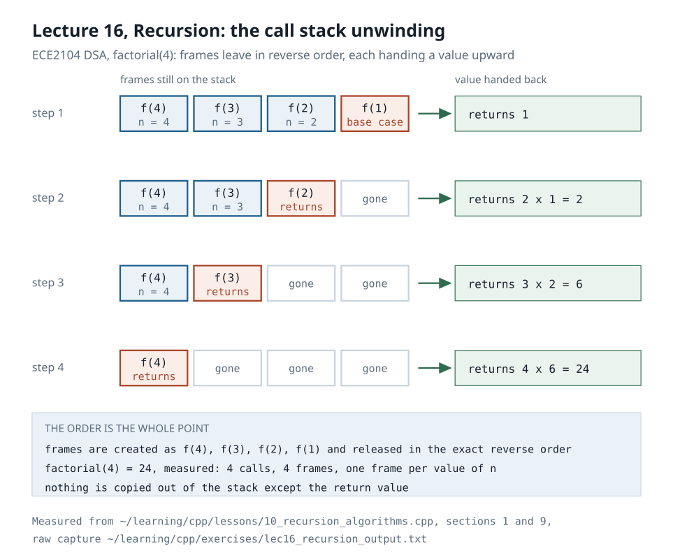
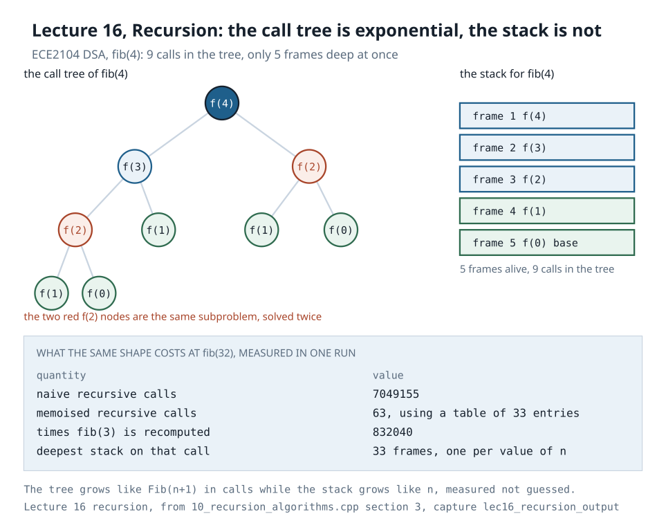

# Recursion and Recursive Algorithms · ECE2104 (DSA), MUJ Sem 3

Lecture 16, *Recursion and Recursive Algorithms*.
Session outcome: **apply recursion and linear data structures to solve problems** · CO2 · mid-term material.

Every number below was measured in one compiled run on this machine, then saved.
The capture is `~/learning/cpp/exercises/lec16_recursion_output.txt` and the program that
produced it is `~/learning/cpp/lessons/10_recursion_algorithms.cpp`. Nothing here is
transcribed from a slide.

| Item | Value |
|---|---|
| Program | `~/learning/cpp/lessons/10_recursion_algorithms.cpp` |
| Build line | `g++ -Wall -Wextra -Wpedantic -std=c++17 -O2 -o /tmp/lec10 10_recursion_algorithms.cpp` |
| Warnings from that build | 0 |
| Machine | Linux 7.0.0-31-generic x86_64, g++ 15.2.0, Python 3.14.4 |
| Capture file | `~/learning/cpp/exercises/lec16_recursion_output.txt` |
| Re-verify with | `python3 ~/learning/cpp/exercises/verify_recursion_lec16.py` |
| Diagrams | `diagrams/01-call-stack-growth.svg`, `02-call-stack-unwind.svg`, `03-fibonacci-tree-vs-stack-depth.svg` |

Addresses change every run (ASLR). Counts, depths, frame sizes and checksums do not.

---

## 1. The lecture map

| Lecture | Official topic | Session outcome | CO |
|---|---|---|---|
| 15 | Queue Applications | implement stacks and queues in memory | 2 |
| **16** | **Recursion and Recursive Algorithms** | **apply recursion and linear DS to solve problems** | **2** |
| 17 | Trees: Terminology and Types | differentiate between various tree structures | 3 |
| after | MID SEMESTER EXAMINATION | the exam sits right after lecture 16 | - |

The recursion lecture is the last lecture before the mid-term, and it is the one that
comes back in every later topic: a tree traversal is a recursion, a heap sift-down is a
recursion, quicksort is a recursion. Learn the shape here.

## 2. The topic map

_source: `diagrams/10-recursion-topic-map.mmd`, rendered by render-diagrams.sh_

## 3. The frame: what one suspended call costs

| Shape | Arguments | Bytes per call | Why |
|---|---|---|---|
| `linearSumRec(n)` | one `long long` | 48 | one argument, one saved return address, one saved frame pointer |
| `factorialRec(n)` | one `int` | 48 | same shape, same measurement |
| `hanoi(n, from, to, via)` | four arguments | 96 | four arguments plus the reference parameter |
| the runaway in section 9 | one | 32 | fewer live values after optimisation |

Factorial, measured call by call, `n` from 1 to 6:

| n | factorial(n) | calls | deepest depth |
|---|---|---|---|
| 1 | 1 | 1 | 1 |
| 2 | 2 | 2 | 2 |
| 3 | 6 | 3 | 3 |
| 4 | 24 | 4 | 4 |
| 5 | 120 | 5 | 5 |
| 6 | 720 | 6 | 6 |

`factorial(8) = 40320` with **8** calls, from the same capture. Calls equal n, depth
equals n, so this recursion is linear in n and the stack use is 8 × 48 = 384 bytes.

The eight frame addresses printed by the run span **336 bytes**, which is 7 gaps of 48,
not 8. The span is from the outermost frame to the innermost, and eight frames have
seven gaps between them. Charging each live frame instead gives 8 × 48 = 384.

## 4. Fibonacci: recomputation is the price of the naive shape

| n | fib(n) | naive calls | times fib(3) recomputed | 2·Fib(n+1) - 1 |
|---|---|---|---|---|
| 10 | 55 | 177 | 21 | 177 |
| 17 | 1597 | 5167 | 610 | 5167 |
| 24 | 46368 | 150049 | 17711 | 150049 |

The measured call count and the closed form agree on all three rows.

One call, `fib(32)`, three implementations, from the capture:

| Implementation | Result | Calls | Time (this capture) |
|---|---|---|---|
| Naive recursion | 2178309 | 7049155 | 16.731 ms |
| Recursion with a memo table | 2178309 | 63 | 112.8 ns per call |
| Iterative loop | 2178309 | - | not timed |

| Fact | Value |
|---|---|
| fib(3) computed inside that single fib(32) call | 832040 times |
| Memo table entries | 33 |
| Call count reduction | 111891× |
| Naive against memoised, per call | 16731224.0 ns against 112.8 ns, a ratio of 148359.99 |
| Memo timing evidence | 20000 runs with a fresh table, checksum 43566180000 = 20000 × 2178309 |
| Call count growth | the naive count grows like Fib(n+1), the memo count grows like n |

The redundancy is the whole story. `fib(3)` alone is recomputed 832040 times to answer
one question with 32 inputs, because the naive recursion re-solves every subtree it
already solved. A table that stores each answer once removes 111891 of every 111892
calls. That table is the idea behind dynamic programming, which comes later.

## 5. Towers of Hanoi: tiny code, exponential work, linear stack

| n | moves | 2^n - 1 | calls | 2^n - 1 | frames alive |
|---|---|---|---|---|---|
| 1 | 1 | 1 | 1 | 1 | 1 |
| 2 | 3 | 3 | 3 | 3 | 2 |
| 3 | 7 | 7 | 7 | 7 | 3 |
| 4 | 15 | 15 | 15 | 15 | 4 |
| 5 | 31 | 31 | 31 | 31 | 5 |
| 6 | 63 | 63 | 63 | 63 | 6 |

| Fact | Value |
|---|---|
| Calls for n = 6 | 63, the same as the moves |
| Calls for n = 20 | 2^20 - 1 = 1048575, the same as the moves |
| At one move per second | 0.033 years |
| Stack cost | n frames, so O(n) |
| Work | 2^n - 1 moves, so O(2^n) |
| Why calls equal moves | every hanoi call performs exactly one move |

The measured calls equal the measured moves in every row, and that is not a coincidence:
each hanoi call performs exactly one move, so the call count IS the move count, 2^n - 1.
The program prints a check column that is computed in code, not asserted in prose, so the
table cannot drift from the measurement again. Two recursions with the same three lines,
two different costs: hanoi is exponential in time and linear in stack, which is exactly
why recursion is the right tool even when the work explodes.

## 6. Recursive and iterative give the same answer

| Problem | Recursive | Iterative | Equal |
|---|---|---|---|
| `factorial(12)` | 479001600 | 479001600 | yes |
| sum 1..1000 | 500500 | 500500 | yes |
| `fib(32)` | 2178309 | 2178309 | yes |
| sum 1..1000, closed form | 1000 × 1001 / 2 = 500500 | same | yes |

Timing, both walks doing the same 500-term sum, checksum printed by the program:

| Walk | ns per walk | Checksum |
|---|---|---|
| Recursive `linearSumRec` | 1054.1 | 250500000 |
| Iterative loop | 101.6 | 250500000 |
| Expected by the closed form | - | 2000 × 500 × 501 / 2 = 250500000 |

The ratio in this capture is **10.38×**, and the loop wins by that factor. The arithmetic
is identical in both walks: the 10.38× is the call, the frame, the return and the
register save, nothing else. Recursion buys clarity, the loop buys those nanoseconds.

One warning about these numbers, measured rather than assumed. The nanosecond figures and
the runaway depth both move between runs, so treat any single one as a sample: the same
binary printed 886.7, 1054.1 and 2657.0 ns for the recursive walk across runs, a spread of
about 3x, the last one taken while this machine was busy. The capture of record in
`~/learning/cpp/exercises/lec16_recursion_output.txt` holds 1054.1 ns against 101.6 ns for
the loop (10.38x), and the runaway died at depth 261579 there against 261640 on an earlier
run, both within 0.3% of the 262144 ceiling the frame-size model predicts. Quote the
checksums (250500000, 3817763271) and the call counts, which never move; treat any single
timing or depth as one sample, never as a property of the algorithm.

## 7. Recursion on the heap: building a tree with recursive calls

A complete binary tree of depth 9, allocated node by node through the program's own
`heapAlloc`, then freed by a recursive destroy:

| Fact | Value |
|---|---|
| Nodes | 2^10 - 1 = 1023 |
| Heap requests made by the recursive build | 1023 |
| Bytes requested | 24552 |
| Bytes per node | 24 |
| `sizeof(TreeNode{int; TreeNode*; TreeNode*})` | 24 |
| `offsetof(left)`, `offsetof(right)` | 8, 16 |
| Usable bytes for that 24 byte request | 24 |
| Nodes visited by recursive inorder | 1023 |
| Nodes visited with an explicit stack | 1023 |
| Sum of all node values | 523776 |
| Closed form 1..1023 | 1023 × 1024 / 2 = 523776 |
| Free calls made by the recursive destroy | 1023 |

Counters are taken at the source, in the program's own `heapAlloc` and `heapFree`. The
global `operator new` is deliberately not overridden, because GCC 15 rejects that with a
mismatched or sized deallocation warning and the build must stay warning free.

The rebuild and the destroy are both recursions, and both make exactly 1023 calls, one
per node. The heap does the growing and shrinking; the stack only holds the path from
the root to the node being worked on, which is the tree height.

## 8. The recursion topic map, in one table

| Question | Recursion | Loop |
|---|---|---|
| Who holds the state | the call stack, one frame per suspended call | one set of variables, updated in place |
| Nested state needed | free, the frames are the nesting | you must build a stack yourself |
| Extra memory | depth × frame bytes, measured 48 to 96 per call | O(1) for a simple loop |
| Speed per step | slower, measured 10.38× on the 500-term sum | faster |
| Failure mode | stack overflow at the depth computed in section 9 | an infinite loop, if the condition is wrong |
| Where it shines | trees, divide and conquer, backtracking | flat repetition, tail recursion |
| Cost of the worst flat loop you should avoid | - | O(n²) for the double loop, which recursion replaces with O(n log n) |
| Safe if | depth × frame bytes ≤ stack limit | the loop condition is proved to terminate |

## 9. The limit is a number, not a warning

`getrlimit(RLIMIT_STACK)` reports **8192 KiB** for this process. Divide by the measured
frame stride and you get the depth at which the process dies.

| Quantity | Measured | Arithmetic |
|---|---|---|
| Stack limit | 8192 KiB | 8388608 bytes |
| `linearSumRec` frame stride | 48 bytes | measured over 8 frames |
| Ceiling for that function | 174762 calls | 8388608 ÷ 48 |
| Safe run | depth 87381 | half the ceiling |
| Checksum at that depth | 3817763271 | 87381 × 87382 / 2 = 3817763271, matches |
| Stack used by that run | 4095 KiB | 87381 × 48 |
| Time for that run | 23 µs | this capture |

Then the prediction is checked on the function it describes. A forked child recurses
with no base case until it dies, and a SIGSEGV handler on its own stack writes the depth
back down a pipe:

| Quantity | Value |
|---|---|
| Runaway frame stride, measured inside the child | 32 bytes |
| Predicted ceiling | 8388608 ÷ 32 = 262144 calls |
| Measured death depth | 261579 |
| Error against the prediction | -565 calls, -0.216% |
| Stack consumed | 8174 KiB of the 8192 KiB limit |
| How the child ended | the handler ran and exited with code 42 |

A 0.216% error is the whole argument: depth × frame size predicts the crash depth, so
the limit is a number you can compute before your program crashes, not a mystery.

Restated as one inequality, for this machine only: the recursion survives while
depth × frame bytes ≤ 8388608, and it dies when depth × frame bytes ≥ 8388608. Both
sides of that bound were measured above, the safe side at 4095 KiB and the fatal side
at 8174 KiB.

| Trap | What happens | Fix |
|---|---|---|
| No base case | the depth grows every call until the guard page is hit, then SIGSEGV | write the base case first |
| Base case never reached | same, the argument must move toward the base case | check the shrink step |
| Too deep, correct code | depth × frame bytes exceeds 8 MiB, so it still dies | make it a loop, or a shallower recursion |
| Reference to something huge | every frame carries it, so the frame stride grows | pass by reference, not by value |

The two diagrams, `diagrams/01-call-stack-growth.svg` and
`diagrams/02-call-stack-unwind.svg`, draw the frames this program measured, growing and
then unwinding in reverse order.
`diagrams/03-fibonacci-tree-vs-stack-depth.svg` draws the other half of the story: the
call tree is exponential while the stack depth is only the height.

_sources: the three `.svg` files beside these `.png` files, hand-authored, 840 px wide_

## 10. Numerical problems

Work these with the measured constants from this page: 48 bytes per call for a
one-argument recursion, 96 for the four-argument hanoi, 32 for the runaway, an 8192 KiB
stack, `fib(n)` naive calls = 2·Fib(n+1) - 1, hanoi moves = hanoi calls =
2^n - 1, tree nodes for depth d = 2^(d+1) - 1.

**N1.** `factorial(6)` is measured at 6 calls and depth 6. How much stack does it hold at
its deepest, and how many bytes does that recursion release when it unwinds?

**N2.** The factorial run measured a 336 byte span across 8 frames. Show that this is 7
gaps of 48 and not 8 frames of 48, and state the bytes charged to all 8 live frames.

**N3.** A one-argument recursion has a 48 byte frame. How many such frames fit in 2 MiB
of stack, where ⌈ ⌉ rounds up?

**N4.** For `fib(17)` the program counted 5167 calls. Verify that against
2·Fib(18) - 1, given Fib(18) = 2584.

**N5.** For `fib(24)` the program counted 150049 calls and 17711 calls to `fib(3)`.
What percentage of all calls are calls to `fib(3)`?

**N6.** `fib(32)` takes 7049155 naive calls and 63 memoised calls. Express the reduction
as a ratio and as a percentage of calls removed.

**N7.** The memo table for `fib(32)` stores 33 entries. For `fib(n)`, how many entries
does it store, and how many calls does it make?

**N8.** `hanoi(6)` moves 63 disks in 63 calls. State the number of moves and the number of
recursive calls for `hanoi(9)`, using the measured fact that one call performs one move.

**N9.** `hanoi(20)` needs 1048575 moves. At one move per second, and 31536000 seconds in
a year, how many years is that?

**N10.** The hanoi function uses 96 bytes per frame. What is the deepest stack use of
`hanoi(64)`, and why is that depth fine while the *work* is not?

**N11.** A complete binary tree of depth 3 has how many nodes? Give the formula first,
then the number.

**N12.** For the depth 9 tree the program measured 1023 heap requests and 24552 bytes
requested. How many bytes is that per node, and what does the allocator report as usable
for a 24 byte request?

**N13.** The depth 9 tree's node values sum to 523776. Show that this equals
∑(i = 1 to 1023) i, and that the closed form 1023 × 1024 ÷ 2 gives the same number.

**N14.** With an 8192 KiB stack and a 96 byte frame, compute the ceiling on recursion
depth. ⌈ 8388608 ÷ 96 ⌉ = ?

**N15.** With a 48 byte frame the ceiling is 174762 calls. What does the same stack allow
for the 32 byte runaway frame, and why is the ceiling larger?

**N16.** The measured death depth for the runaway was 261579 and the prediction was
262144. Compute the relative error as a percentage, and say what that error means.

**N17.** The recursive 500-term sum took 1054.1 ns and the loop took 101.6 ns in this
capture. Compute the ratio, then the ns per term for each walk.

**N18.** `factorial(12)` is 479001600 and fits in a 32-bit `int` whose maximum is
2147483647. Compute `factorial(13)` and state why the type must change.

**N19.** Solve the recurrence T(n) = T(n-1) + 1 with T(0) = 1. Which measured function
does this describe?

**N20.** Solve the recurrence T(n) = 2·T(n-1) + 1 with T(1) = 1. Which measured function
does this describe, and what is T(20)?

**N21.** Solve the recurrence T(n) = 2·T(n ÷ 2) + n for n a power of two. Use the
substitution n = 2^k and give the final Θ.

**N22.** The naive `fib(32)` call count is 7049155 and the memoised count is 63. The
memo table costs 33 `long long` values. How many bytes is that, and how does it compare
with the 7049155 frames the naive version would have charged at 32 bytes each?

**N23.** A recursion has depth 500 and a 48 byte frame, and depth × frame ≤ stack is the
safety condition for it. Express its stack use in KiB,
then say what happens at depth 500000 on this machine.

**N24.** `hanoi(3)` calls are measured at 7 with deepest nesting 3. Write out the call
sequence (A, C, B are the rods) and count the moves, then check against 2^3 - 1.

**N25.** The runaway frame stride is 32 bytes and the `linearSumRec` stride is 48 bytes
for the same machine and the same 8 MiB stack. Explain why two functions that both
recurse with one argument differ by 16 bytes.

## 11. Self-check questions

**C1.** State the two parts every recursion must have, and what happens without each.

**C2.** Explain why the 8 frame addresses span 336 bytes when 8 frames of 48 bytes would
be 384.

**C3.** Why does the naive fibonacci take 7049155 calls for n = 32 while the memoised
version takes 63?

**C4.** Hanoi does exponential work with linear stack. Explain how both are true at once.

**C5.** Give the two reasons a recursion can die with a stack overflow even when its base
case is correct.

**C6.** Why is the allocation counter in this program taken at the source rather than by
overriding `operator new`?

**C7.** Convert the recursive 1..n sum to a loop and state what is lost and what is
gained, using the measured ratio.

**C8.** Describe the order in which frames are created and destroyed for `factorial(4)`,
naming which frame is deepest and which returns first.

**C9.** A recursion is 0.216% away from a prediction made from two measured numbers.
What are the two numbers?

**C10.** Name three later topics in this course that are recurrences in disguise.

---

## Answer key

**N1.** 6 frames × 48 bytes = 288 bytes held at the deepest point, and the same 288 bytes
released as the frames unwind.

**N2.** 8 frames have 7 gaps between the outermost and the innermost, and
7 × 48 = 336. Charging every live frame gives 8 × 48 = 384 bytes.

**N3.** 2 MiB = 2097152 bytes, so ⌈ 2097152 ÷ 48 ⌉ = 43691 frames.

**N4.** 2 × 2584 - 1 = 5167, which is exactly the counted 5167.

**N5.** 17711 ÷ 150049 = 0.1180, so about 11.8% of all calls are calls to `fib(3)`.

**N6.** 7049155 ÷ 63 = 111891.35, so about 111891× fewer calls, or
(1 - 63 ÷ 7049155) × 100 = 99.9991% of the calls removed.

**N7.** n + 1 entries and 2n - 1 calls; for n = 32 that is 33 entries and 63 calls, which
is what the run printed.

**N8.** `hanoi(9)`: 2^9 - 1 = 511 moves and 511 calls, since calls equal moves.

**N9.** 1048575 ÷ 31536000 = 0.0333 years, about 12 days.

**N10.** 64 × 96 = 6144 bytes, under 1 MiB, so the stack is safe. The work is
2^64 - 1 moves, which no machine will finish.

**N11.** 2^(d+1) - 1 nodes, so depth 3 gives 2^4 - 1 = 15 nodes.

**N12.** 24552 ÷ 1023 = 24 bytes per node requested, and the allocator reports 24 usable
bytes for that request, so the real cost is 24 bytes.

**N13.** ∑(i = 1 to 1023) i = 1023 × 1024 ÷ 2 = 523776, which is exactly the measured sum.
As a check, 1023 × 1024 = 1047552 and 1047552 ÷ 2 = 523776.

**N14.** ⌈ 8388608 ÷ 96 ⌉ = 87382 calls.

**N15.** 8388608 ÷ 32 = 262144 calls, larger because a smaller frame means more frames
fit in the same stack; the ceiling is inversely proportional to the frame size.

**N16.** |261579 - 262144| ÷ 262144 = 0.216%, so the depth × frame size model predicted
the crash depth to within about one frame in a thousand.

**N17.** 1054.1 ÷ 101.6 = 10.38×, so about 2.11 ns per term recursive against 0.20 ns per
term iterative for 500 terms.

**N18.** 13 × 479001600 = 6227020800, which is greater than 2147483647, so the result
must be held in a 64-bit `long long`; 12! is the largest factorial that fits in a signed
32-bit int.

**N19.** T(n) = n + 1, so Θ(n). This is `linearSumRec` and `factorialRec`: one call per
value, measured as calls = n with depth n.

**N20.** T(n) = 2^n - 1, so Θ(2^n). This is the hanoi call count, and the moves count is
the same recurrence; T(20) = 2^20 - 1 = 1048575.

**N21.** With n = 2^k, T(2^k) = 2·T(2^(k-1)) + 2^k, so T(n) = n·(k + 1) = n log₂ n + n,
which is Θ(n log n). This is merge sort.

**N22.** 33 × 8 = 264 bytes for the table against 7049155 × 32 = 225572960 bytes, about
215 MiB of stack that the naive version would need and cannot have.

**N23.** 500 × 48 = 24000 bytes, about 23.4 KiB, which is safe. At depth 500000 the stack
needs 24000000 bytes, about 22.9 MiB, which is larger than the measured 8192 KiB limit,
so it dies.

**N24.** hanoi(3, A, C, B): move disk 1 A→C, disk 2 A→B, disk 1 C→B, disk 3 A→C, disk 1
B→A, disk 2 B→C, disk 1 A→C. That is 7 moves, the measured 7, and 2^3 - 1 = 7.

**N25.** The stride is the frame the compiler actually allocates, not the number of
arguments: `linearSumRec` keeps a 48 byte frame with its saved return address, saved
frame pointer and live values, while the runaway's frame was optimised down to 32 bytes.
Frame size is a property of the compiled function, so measure it, never assume it.

**C1.** A base case, which stops the descent, and a recursive case, which shrinks the
problem. Without a base case every call keeps a frame alive until the guard page is hit
and the process dies with SIGSEGV; without a shrink the base case is never reached, which
ends the same way.

**C2.** The span is the distance from the outermost frame to the innermost, and eight
frames have seven gaps between them: 7 × 48 = 336. Charging all eight live frames gives
384.

**C3.** The naive recursion re-solves every subtree: `fib(3)` alone is computed 832040
times inside one `fib(32)`. The memo table answers each of the 33 distinct subproblems
once, so the call count falls from 7049155 to 63.

**C4.** The two costs are different resources. Time is the number of calls, which doubles
per extra disk: 2^n - 1 moves. Stack is the depth of the deepest chain of suspended
calls, which is n, because each call makes its second recursive call only after the first
has returned. Exponential time, linear stack.

**C5.** The depth times the frame size can exceed the stack even when the base case is
correct and reachable, and a frame that carries a large object by value makes each step
cost far more than the 48 bytes measured here. Reduce the depth, shrink the frame, or
convert to a loop.

**C6.** Because GCC 15 rejects overriding `operator new` and `operator delete` under
`-Wall -Wextra`: with both delete overloads it emits `-Wmismatched-new-delete`, and with
only one it emits `-Wsized-deallocation`. The build must stay warning free, so the
program routes its own allocations through `heapAlloc` and `heapFree` and counts there.
The counters are then exact by construction rather than estimated.

**C7.** A loop keeps the same arithmetic and the same answer with O(1) extra memory and
is measured 10.38× faster per walk here. What is lost is the direct expression of the
recursive definition: the loop needs a running accumulator that the recursion got from
the stack for free.

**C8.** `factorial(4)` pushes frames for n = 4, 3, 2, 1 in that order; the n = 1 frame is
the deepest and it returns first, because it hits the base case. Then n = 2 returns,
then n = 3, then n = 4, so creation order and destruction order are exact reverses.

**C9.** The two measured numbers are the frame stride (32 bytes for the runaway) and the
stack limit (8192 KiB from `getrlimit`). Their quotient, 262144, was 0.216% away from the
measured death depth of 261579.

**C10.** Tree traversal (lecture 17), merge sort and quicksort, and dynamic programming,
which is the memoised fibonacci of section 4.

---

## Files in this folder

| File | What it is |
|---|---|
| `RECURSION-STUDY-NOTES.md` | this page |
| `diagrams/01-call-stack-growth.svg` | the call stack growing, drawn from the measured 48 byte frames |
| `diagrams/02-call-stack-unwind.svg` | the same frames unwinding in reverse order |
| `diagrams/03-fibonacci-tree-vs-stack-depth.svg` | the fib(32) call tree against the 32-frame depth |
| `~/learning/cpp/lessons/10_recursion_algorithms.cpp` | the program every number came from |
| `~/learning/cpp/exercises/lec16_recursion_output.txt` | its saved output, plus the preserved earlier probe capture |
| `~/learning/cpp/exercises/verify_recursion_lec16.py` | recompiles, re-runs and checks every number above |
| `/tmp/build_lec16.sh`, `/tmp/run_lec16.sh` | the build and capture scripts |
