# Stacks and Queues · ECE2104 (DSA), MUJ Sem 3

Lectures 11 to 15, stack and queue representation plus applications. Session outcome
for all five lectures, verbatim from the course handout: **Implement stacks and queues
in memory** · CO2 · midterm window Sep 21 to 29.

Every number below was measured in one compiled run on this machine, not copied from a
slide. Sizes, offsets, strides, counts and timings come from
`~/learning/cpp/exercises/lec11_15_run_output.txt`, captured 2026-09-18 17:23 IST,
built with `g++ -Wall -Wextra -Wpedantic -std=c++17 -O2` (zero warnings on all five
programs). Addresses change every run (ASLR). Every other number in the capture does not.

How to read this file:

| Part | Sections | What it is |
|---|---|---|
| theory | 1 to 9 | the five lectures, one section group each |
| reference | 10 and 11 | formula sheet, then the trap list |
| practice | 12 | 33 numericals, all answerable from the theory above |
| checking | 13 | the answer key, arithmetic shown, not just values |

## 1. The lecture map, in the handout's own words

The session outcome is the same five times over, verbatim: **Implement stacks and queues
in memory**, CO2. The official topic wording, one row per lecture:

| Lecture | Official topic | CO | Lesson program |
|---|---|---|---|
| 11 | Stack: Concept and array representation | CO2 | `11_stack_array.cpp` |
| 12 | Stack using Linked List, Stack Application | CO2 | `12_stack_linked_apps.cpp` |
| 13 | Queue: Concepts and Array Representation | CO2 | `13_queue_array.cpp` |
| 14 | Queue using Linked List and Circular Queue | CO2 | `14_queue_linked_circular.cpp` |
| 15 | Queue Applications | CO2 | `15_queue_apps.cpp` |

All five programs live in `~/learning/cpp/lessons/`.

## 2. The hierarchy: where stacks and queues sit

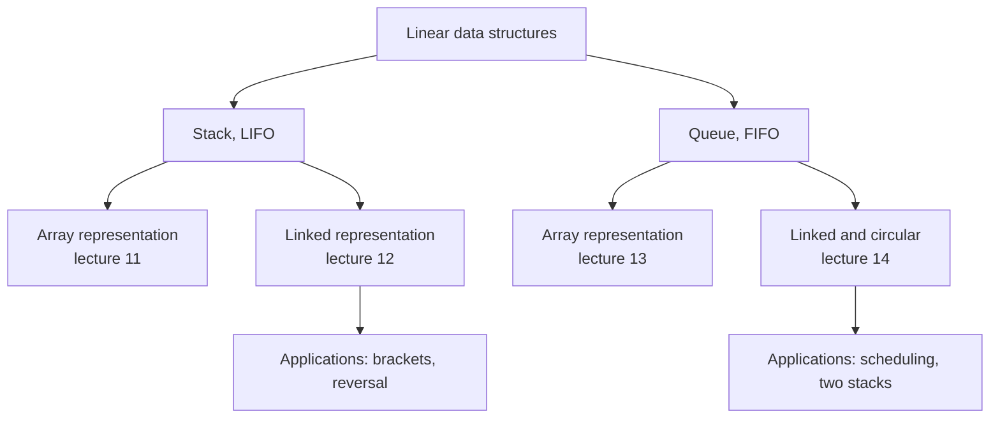

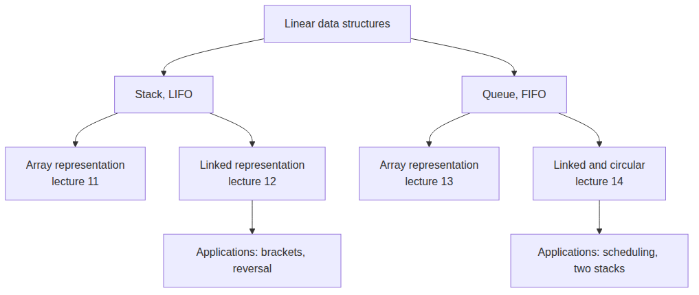
_source: `diagrams/10-linear-data-structures.mmd`, rendered by render-diagrams.sh_

Three questions place any structure in that tree, and the examiner can ask any of them:

| Question | Stack answer | Queue answer |
|---|---|---|
| Linear or non-linear? | linear | linear |
| Order rule? | LIFO, newest out first | FIFO, oldest out first |
| Storage choice? | array (fixed, fast) or linked (unbounded) | array (fixed), circular array, or linked |

A stack and a queue are abstract data types: push, pop, top describe a stack completely,
and both storage columns above can implement either one. The array is the storage, not
the definition.

## 3. The two order rules, proved by the capture

| Rule | Who leaves first | Captured order check |
|---|---|---|
| Stack, LIFO | the element pushed last | pushed 10 20 30, popped 30 20 10 |
| Queue, FIFO | the element enqueued first | enqueued 10 20 30, dequeued 10 20 30 |

Why the order matters in one line each: a queue is what a printer does with its jobs and
what a scheduler does with processes; a stack is what a bracket checker, a function call
and a reversal need.

## 4. Lecture 11: stack, array representation

### 4.1 The object in bytes

| Field | Offset | Bytes | Note |
|---|---|---|---|
| `data[5]` (ints) | 0 | 20 | 5 × `sizeof(int)` = 5 × 4, contiguous, base never moves |
| padding | 20 | 4 | `size_t` wants an 8 byte boundary, so 4 bytes are lost here |
| `top_` | 24 | 8 | the only index the stack needs |
| `refusals_` | 32 | 8 | counts refused pushes, proof that overflow was detected |

| Measured size | Value | Why |
|---|---|---|
| `sizeof(ArrayStack<int,5>)` | 40 | 20 array + 4 padding + 16 bookkeeping |
| `sizeof(ArrayStack<char,5>)` | 24 | 5 chars + 3 padding = 8, then the same 16 |
| the 5 ints alone | 20 | 5 × 4 |
| the bookkeeping | 16 | `top_` + `refusals_`, both `size_t` |

The array comes first and the index trails it, which is why the base address never moves
when the stack is used. The stack object owns its storage, so `sizeof` carries the
capacity: 40 bytes for five ints, not 20.

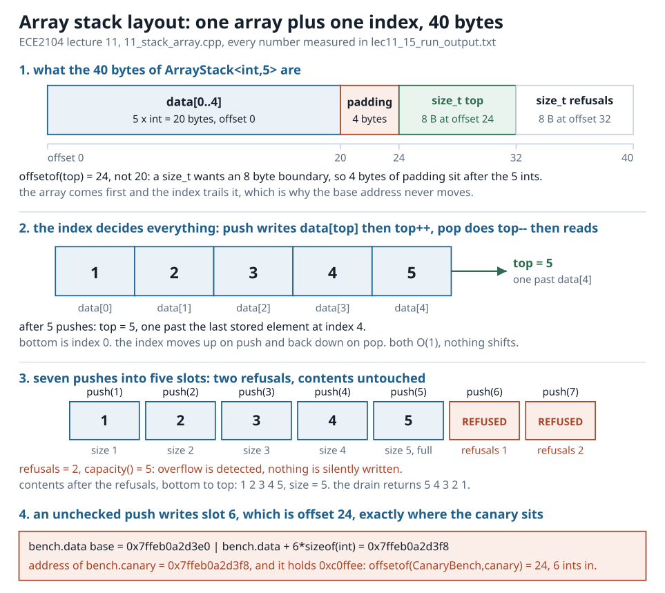
_source: `diagrams/01-array-stack-layout.svg`, hand-authored, 840 px wide_

*Figure 1. The array stack object byte by byte: data at 0, padding at 20, `top_` at 24,
`refusals_` at 32, 40 bytes in total.*

### 4.2 Push, pop and top in one line each

| Operation | Work | Cost | Shifting | Allocation |
|---|---|---|---|---|
| `push(x)` | `data_[top_] = x; top_++` | O(1) | none | none |
| `pop()` | `top_--; return data_[top_]` | O(1) | none | none |
| `top()` | `return data_[top_ - 1]` | O(1) | none | the stack is not modified |

Both push and pop refuse on the boundary and say so through the return value: `full()`
is `top_ == CAP`, `empty()` is `top_ == 0`. Nothing is silently written.

### 4.3 The capacity limit is real

Seven pushes into a five slot stack, captured one line per push:

| Push | Result | size | full | refusals |
|---|---|---|---|---|
| 1 | stored | 1 | no | 0 |
| 2 | stored | 2 | no | 0 |
| 3 | stored | 3 | no | 0 |
| 4 | stored | 4 | no | 0 |
| 5 | stored | 5 | yes | 0 |
| 6 | REFUSED | 5 | yes | 1 |
| 7 | REFUSED | 5 | yes | 2 |

After the two refusals the contents are untouched: bottom to top `1 2 3 4 5`, size 5.
Draining that stack prints `5 4 3 2 1`. Overflow here is detected, not written.

### 4.4 Where an unchecked push would land

Address arithmetic on the same run, `base = bench.data`:

| Expression | Address | Offset from base |
|---|---|---|
| `bench.data` | `0x7ffeb0a2d3e0` | 0 |
| `bench.data + 6 * sizeof(int)` | `0x7ffeb0a2d3f8` | 24 |
| `&bench.canary` | `0x7ffeb0a2d3f8` | 24 |

`offsetof(CanaryBench, canary) = 24`, which is exactly 6 ints in. The unchecked slot 6
IS the canary slot, and the canary held `0xc0ffee` before the experiment. That is the
byte a stack with no `full()` check would overwrite: this is why the check earns marks.

### 4.5 Cost at scale, and why the top end

Two million pushes then two million pops:

| Measurement | Value |
|---|---|
| the container's own heap request | 1 block of 8000016 bytes for an 8000016 byte object |
| further heap blocks during the 4,000,000 operations | 0 blocks, 0 bytes |
| per operation | push 0.688 ns, pop 0.378 ns |
| popped values sum | 1999999000000, equal to the reverse-order sum |
| refusals at the end | 0 |

Same stack, same elements, only the end changed:

| End used | ns per push | Relative |
|---|---|---|
| bottom end, every push shifts the whole stack | 484.7 ns | 4267.2× more, same 20,000 pushes |
| top end, nothing shifts | 0.1 ns | baseline |

Both loops end in a checksum (399980000) so the compiler cannot delete the work. The gap
grows with n, which is the entire argument for choosing the top end.

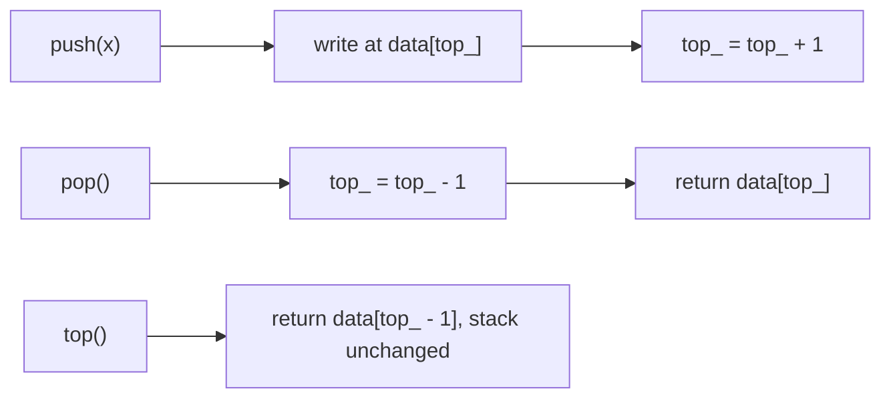

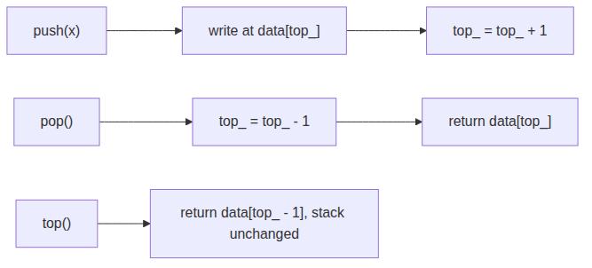
_source: `diagrams/11-push-x.mmd`, rendered by render-diagrams.sh_

## 5. Lecture 12: stack using a linked list

### 5.1 Node and stack in bytes

| Type | Size | Fields and offsets |
|---|---|---|
| `Node{int data; Node* next;}` | 16 | `data` at 0, `next` at 8 |
| `LinkedStack` | 24 | head pointer 8, count 8, underflow counter 8 |

The node is 4 payload bytes + 4 padding bytes + 8 pointer bytes. The padding exists so
the pointer sits on an 8 byte boundary, the same rule lecture 5 measured for
`Node{int data; Node* next;}`. The stack object itself is constant size, and every
element lives on the heap.

### 5.2 Push log: the newest node becomes the head

| Push | New node address | head_ after | head_->data | head_->next | size |
|---|---|---|---|---|---|
| 10 | `0x5aaba91d1030` | `0x5aaba91d1030` | 10 | 0 | 1 |
| 20 | `0x5aaba91d1050` | `0x5aaba91d1050` | 20 | `0x5aaba91d1030` | 2 |
| 30 | `0x5aaba91d1070` | `0x5aaba91d1070` | 30 | `0x5aaba91d1050` | 3 |

The head moved on every push: LIFO is head insertion, and nothing is traversed to push.
The newest node is the top of the stack, so `top()` is just `head_->data`.

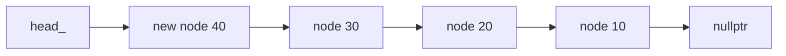

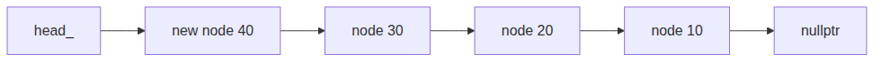
_source: `diagrams/12-head.mmd`, rendered by render-diagrams.sh_

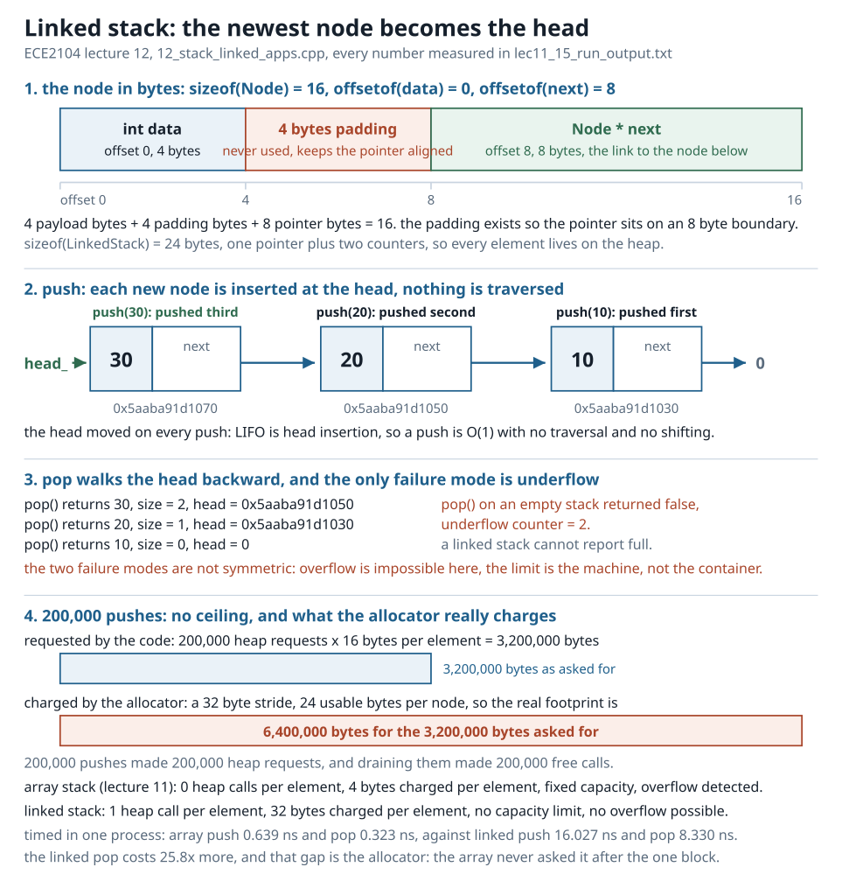
_source: `diagrams/02-linked-stack-nodes.svg`, hand-authored, 840 px wide_

*Figure 2. Head insertion is the whole push: the newest node becomes `head_`, and the
chain behind it is the stack.*

### 5.3 Pop log and the real underflow

| Pop | Value | size | head_ after |
|---|---|---|---|
| 1 | 30 | 2 | `0x5aaba91d1050` |
| 2 | 20 | 1 | `0x5aaba91d1030` |
| 3 | 10 | 0 | 0 (null) |

The drain loop's last attempt plus the explicit test pushed the underflow counter to 2.
A linked stack cannot overflow, it can only underflow: the two failure modes are not
symmetric, and that asymmetry is a favourite one-mark question.

### 5.4 No ceiling, and what it costs

200,000 pushes through the linked stack:

| Measurement | Value |
|---|---|
| heap requests | 200000, one per element |
| bytes requested | 3200000, which is 16 bytes per element |
| allocator's usable bytes per node | 24 (for the 16 byte request) |
| allocator's stride | 32 bytes, so the real footprint is 6400000 bytes |
| free calls during the drain | 200000 |
| underflows during that drain | 1 |
| `full()` check anywhere in the class | none, the limit is the machine's memory |

### 5.5 The trade, measured in one process

| Property | Array stack (lecture 11) | Linked stack |
|---|---|---|
| heap calls per element | 0 | 1 |
| bytes charged per element | 4 | 32 |
| capacity limit | fixed at compile time | none |
| overflow possible | yes, detected | no |
| underflow possible | yes, detected | yes, detected |
| push and pop work | O(1) | O(1) |
| locality | contiguous, cache friendly | scattered, pointer chase |

One million elements, timed in the same process:

| Representation | push ns | pop ns | heap requests | storage bytes |
|---|---|---|---|---|
| linked stack | 16.027 | 8.330 | 1000000 | one 16 byte node per element |
| array stack | 0.639 | 0.323 | 1 request of 4000008 bytes | 4000000 |

The linked stack pays 25.8× more per pop, and that is the allocator, not the pointer
arithmetic: the array stack never asked it for anything after the single block was
reserved. What the links buy is no ceiling. Choose the array when the bound is known,
the links when it is not.

### 5.6 Application 1: balanced bracket checker

| Input | Verdict | Reason from the capture |
|---|---|---|
| `(a[b]{c})` | BALANCED | all pairs matched |
| `{[()]}` | BALANCED | all pairs matched |
| `""` | BALANCED | empty input, nothing to match |
| `([)]` | NOT BALANCED | expected `(` but found `)` at index 2 |
| `(((` | NOT BALANCED | never closed, deepest unmatched opener is `(` at index 2 |
| `)(` | NOT BALANCED | closing `)` with nothing open at index 0 |

Trace of the case a counter would miss, `([)]`:

| Step | Action | Stack depth after |
|---|---|---|
| index 0 | push `(` | 1 |
| index 1 | push `[` | 2 |
| index 2 | read `)` while the top is `[`, fail | 2 |

An opened bracket is pushed; a closing bracket must match the TOP, never just a count of
opens. A plain counter would see two opens and two closes in `([)]` and pass it, while
the stack catches it at index 2. That is why this application is O(n) and correct.

### 5.7 Application 2: reverse a string, and palindrome check

| Input | Output | Palindrome? |
|---|---|---|
| `DSA` | `ASD` | no |
| `ECE2104` | `4012ECE` | no |
| `level` | `level` | yes |

Reversing is push everything then pop everything: the LIFO rule IS the reversal, no extra
logic is needed. The palindrome test is the same reversal compared with the original.

## 6. Lecture 13: queue, array representation

### 6.1 The queue is two indices plus its array

| Form | sizeof | Array | Padding | Bookkeeping |
|---|---|---|---|---|
| `NaiveQueue<int,5>` | 48 | 20 | 4 | 24 (front, rear, refusals) |
| `CircularQueue<int,5>` | 64 | 20 | 4 | 40 (front, rear, count, refusals, wraps) |

The two ends do different jobs, and that is the whole design:

| Operation | Touches | Index move |
|---|---|---|
| `enqueue(x)` | the rear end | write at rear, then `rear++` |
| `dequeue()` | the front end | read at front, then `front++` |
| `front()` | the front end | reads, no move |

### 6.2 FIFO proof

| Step | Value | Index after | size |
|---|---|---|---|
| enqueue 10 | stored at rear 0 | rearIndex 1 | 1 |
| enqueue 20 | stored at rear 1 | rearIndex 2 | 2 |
| enqueue 30 | stored at rear 2 | rearIndex 3 | 3 |
| dequeue | 10 | frontIndex 1 | 2 |
| dequeue | 20 | frontIndex 2 | 1 |
| dequeue | 30 | frontIndex 3 | 0 |

In 10 20 30 and out 10 20 30: same order, the opposite of the stack.

### 6.3 The exact point where a naive queue wastes slots

| After | frontIndex | rearIndex | size | empty | full | slots |
|---|---|---|---|---|---|---|
| 5 enqueues (1 2 3 4 5) | 0 | 5 | 5 | no | yes | `[1] [2] [3] [4] [5]` |
| 3 dequeues (1 2 3) | 3 | 5 | 2 | no | yes | `[--] [--] [--] [4] [5]` |
| enqueue 6 | 3 | 5 | 2 | no | yes | REFUSED, rear == capacity |
| enqueue 7 | 3 | 5 | 2 | no | yes | REFUSED, rear == capacity |

The queue holds 2 elements, index 5 is off the end of the array, and indices 0 to 2,
that is 3 slots, are still valid memory but unreachable. Space lost equals `frontIndex`,
here 3 slots. The exact operation where it happens: enqueue number 6 of this sequence,
after 5 enqueues and 3 dequeues.

After draining the rest (4 5 came out):

| frontIndex | rearIndex | size | empty | full | Consequence |
|---|---|---|---|---|---|
| 5 | 5 | 0 | yes | yes | empty and full true at once, it can never enqueue again |

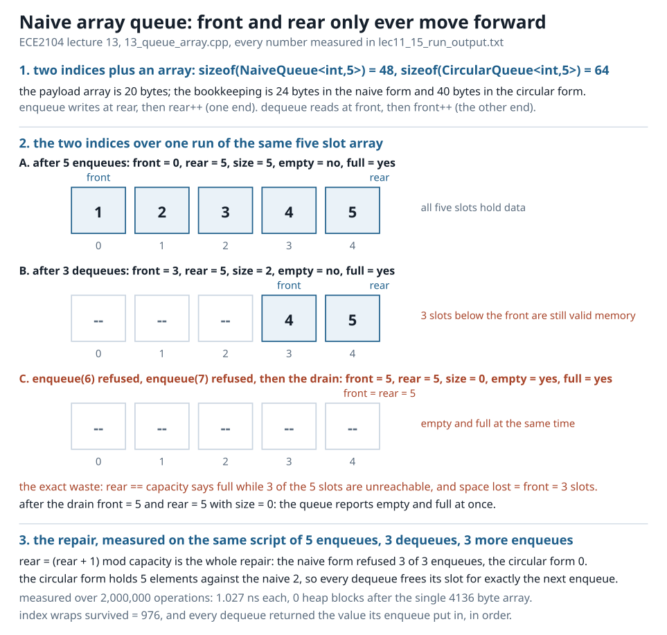
_source: `diagrams/03-naive-queue-waste.svg`, hand-authored, 840 px wide_

*Figure 3. After 5 enqueues and 3 dequeues the naive queue holds 2 elements, refuses the
next enqueue, and leaves 3 slots unreachable below the front.*

### 6.4 The repair in one line

```
rear = (rear + 1) % capacity      and      front = (front + 1) % capacity
```

Same script, five enqueues, three dequeues, then three more enqueues, run on both forms:

| Form | Refusals among those 3 enqueues | Elements held |
|---|---|---|
| naive | 3 of 3 refused | 2 |
| circular | 0 refused | 5 |

Every dequeue in the circular form frees its slot for exactly the next enqueue.

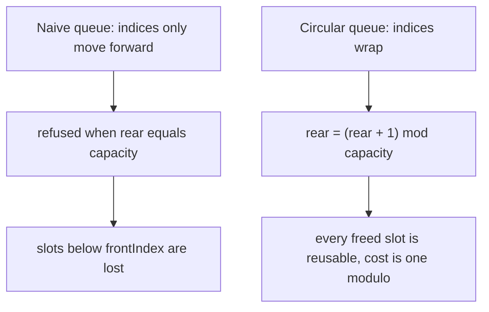

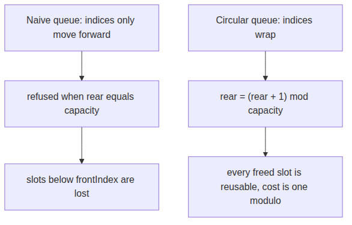
_source: `diagrams/13-naive-queue-indices-only-move-forward.mmd`, rendered by render-diagrams.sh_

### 6.5 Cost

| Measurement | Value |
|---|---|
| heap request | 1 block of 4136 bytes, the array lives inside the object |
| the 2,000,000 operations | 0 further blocks, 0 further bytes |
| every dequeue returned the value its enqueue put in, in order | yes |
| per operation | 1.027 ns |
| index wraps survived | 976 |

A naive array queue is correct for at most `capacity` operations before the front
abandons the space behind it. Making the index wrap is what turns a one-shot queue into
a reusable one, and it costs one modulo per operation.

## 7. Lecture 14: linked queue and circular queue

### 7.1 The linked queue in bytes

| Type | Size | Parts |
|---|---|---|
| `QNode{int data; QNode* next;}` | 16 | `data` at 0, `next` at 8, same padding rule |
| `LinkedQueue` | 32 | front pointer, rear pointer, count, underflow counter |

The queue holds TWO ends: `enqueue` writes through `rear_`, `dequeue` reads `front_`,
both O(1). A linked queue never says full, it has no capacity to exceed.

### 7.2 Enqueue and dequeue log

| Operation | Node address | front | rear | size |
|---|---|---|---|---|
| enqueue 7 | `0x6466e9ca0030` | `0x6466e9ca0030` | `0x6466e9ca0030` | 1 |
| enqueue 8 | `0x6466e9ca0050` | `0x6466e9ca0030` | `0x6466e9ca0050` | 2 |
| enqueue 9 | `0x6466e9ca0070` | `0x6466e9ca0030` | `0x6466e9ca0070` | 3 |
| dequeue 7 | freed | `0x6466e9ca0050` | `0x6466e9ca0070` | 2 |
| dequeue 8 | freed | `0x6466e9ca0070` | `0x6466e9ca0070` | 1 |
| dequeue 9 | freed | 0 | 0 | 0 |

The front node stays put while the rear walks away from it: that is the whole queue. The
dequeue on the empty queue returned false, underflows = 2. The allocator charges 24
usable bytes per node for the 16 byte request.

### 7.3 No ceiling

| Measurement | Value |
|---|---|
| enqueues | 200000 |
| heap requests | 200000, 3200000 bytes requested, 16 bytes per element |
| free calls during the drain | 200000 |
| cost | one 16 byte node per element and a pointer per hop, in exchange for no limit |

### 7.4 Circular queue: the index trajectory over two wrap-arounds

Capacity 5, the script is `enqueue enqueue dequeue dequeue`, five times over:

| op | val | front | rear | count | wraps | note |
|---|---|---|---|---|---|---|
| enq | 100 | 0 | 1 | 1 | 0 | |
| enq | 101 | 0 | 2 | 2 | 0 | |
| deq | 100 | 1 | 2 | 1 | 0 | |
| deq | 101 | 2 | 2 | 0 | 0 | |
| enq | 102 | 2 | 3 | 1 | 0 | |
| enq | 103 | 2 | 4 | 2 | 0 | |
| deq | 102 | 3 | 4 | 1 | 0 | |
| deq | 103 | 4 | 4 | 0 | 0 | |
| enq | 104 | 4 | 0 | 1 | 1 | rear wrapped past the end |
| enq | 105 | 4 | 1 | 2 | 1 | |
| deq | 104 | 0 | 1 | 1 | 1 | |
| deq | 105 | 1 | 1 | 0 | 1 | |
| enq | 106 | 1 | 2 | 1 | 1 | |
| enq | 107 | 1 | 3 | 2 | 1 | |
| deq | 106 | 2 | 3 | 1 | 1 | |
| deq | 107 | 3 | 3 | 0 | 1 | |
| enq | 108 | 3 | 4 | 1 | 1 | |
| enq | 109 | 3 | 0 | 2 | 2 | rear wrapped past the end |
| deq | 108 | 4 | 0 | 1 | 2 | |
| deq | 109 | 0 | 0 | 0 | 2 | |

Ten enqueues into a five slot array and the rear index came round twice: the same five
slots served all of them. A naive queue would have refused after five enqueues.

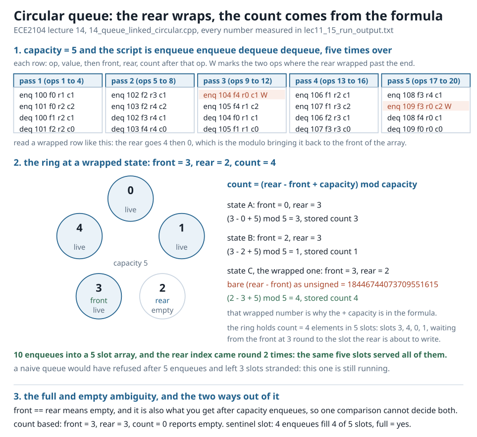
_source: `diagrams/04-circular-ring-two-wraps.svg`, hand-authored, 840 px wide_

*Figure 4. The rear index wrapping from 4 to 0, twice, is what lets 10 enqueues pass
through a 5 slot array.*

### 7.5 The count formula

```
count = (rear - front + capacity) mod capacity
```

| State | front | rear | Substitution | Formula | Stored count |
|---|---|---|---|---|---|
| A | 0 | 3 | (3 - 0 + 5) mod 5 = 8 mod 5 | 3 | 3 |
| B | 2 | 3 | (3 - 2 + 5) mod 5 = 6 mod 5 | 1 | 1 |
| C (wrapped) | 3 | 2 | (2 - 3 + 5) mod 5 = 4 mod 5 | 4 | 4 |

On state C the bare unsigned difference prints 18446744073709551615, because 2 - 3
underflows a 64 bit unsigned integer and lands on 2⁶⁴ - 1. That wrapped number is the
whole reason the `+ capacity` sits in the formula.

### 7.6 Full and empty are ambiguous, and the two ways out

`front == rear` means EMPTY in a count-free design, and it is also what you get after
`capacity` enqueues, when rear has caught up with front again. One comparison cannot
decide both.

| Design | Empty test | Full test | What it costs |
|---|---|---|---|
| count based | `count == 0` | `count == capacity` | one extra variable, 8 bytes, stores all 5 slots |
| sentinel slot | `front == rear` | `(rear + 1) % capacity == front` | one slot of the array, stores 4 of 5 |

The captured states, one line each:

| Captured state | Reading |
|---|---|
| front 3, rear 3, count 0 | the count decides: empty |
| after 4 enqueues, front 0, rear 4 | usable 4, full yes, refusals 0 |

The sentinel design stores 4 of 5 slots. The count design stores all 5.

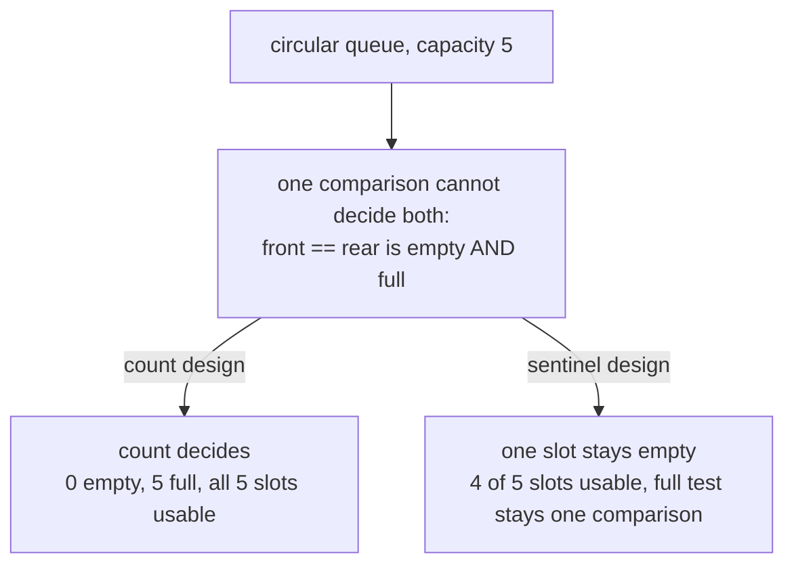

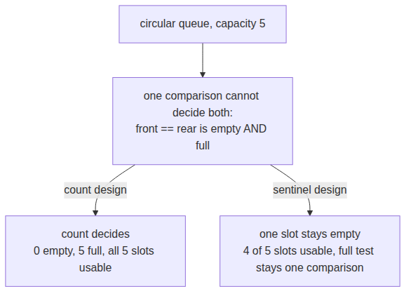
_source: `diagrams/14-circular-queue-capacity-5.mmd`, rendered by render-diagrams.sh_

### 7.7 Cost of the three queue shapes, one process

| Shape | ns per operation | heap requests | Limit |
|---|---|---|---|
| naive array queue | not timed, refuses early | 0 | reuses nothing, dies after capacity ops |
| circular queue | 0.531 | 0 during the operations | needs a known capacity |
| linked queue | 14.023 | 1000000, one node per element, freed on the way out | none |

FIFO order was verified in both timed loops. The linked queue is 26.42× slower per
operation, and that gap is the allocator, not the pointer arithmetic. The circular queue
pays one modulo per operation instead.

## 8. Lecture 15: queue applications

### 8.1 Round robin scheduling, quantum = 3

Bursts: A = 8, B = 4, C = 9, D = 2, E = 6. Every unfinished task goes back to the tail:

| start | end | task | ran | remaining | state after the slice |
|---|---|---|---|---|---|
| 0 | 3 | A | 3 | 5 | back to the tail |
| 3 | 6 | B | 3 | 1 | back to the tail |
| 6 | 9 | C | 3 | 6 | back to the tail |
| 9 | 11 | D | 2 | 0 | DONE |
| 11 | 14 | E | 3 | 3 | back to the tail |
| 14 | 17 | A | 3 | 2 | back to the tail |
| 17 | 18 | B | 1 | 0 | DONE |
| 18 | 21 | C | 3 | 3 | back to the tail |
| 21 | 24 | E | 3 | 0 | DONE |
| 24 | 26 | A | 2 | 0 | DONE |
| 26 | 29 | C | 3 | 0 | DONE |

| Result | Value |
|---|---|
| slices, one context switch each | 11 |
| total time | 29 |
| completion order | D B E A C |
| average waiting time | 15.80 |
| average turnaround time | 21.60 |
| worst waiting time | 20 |

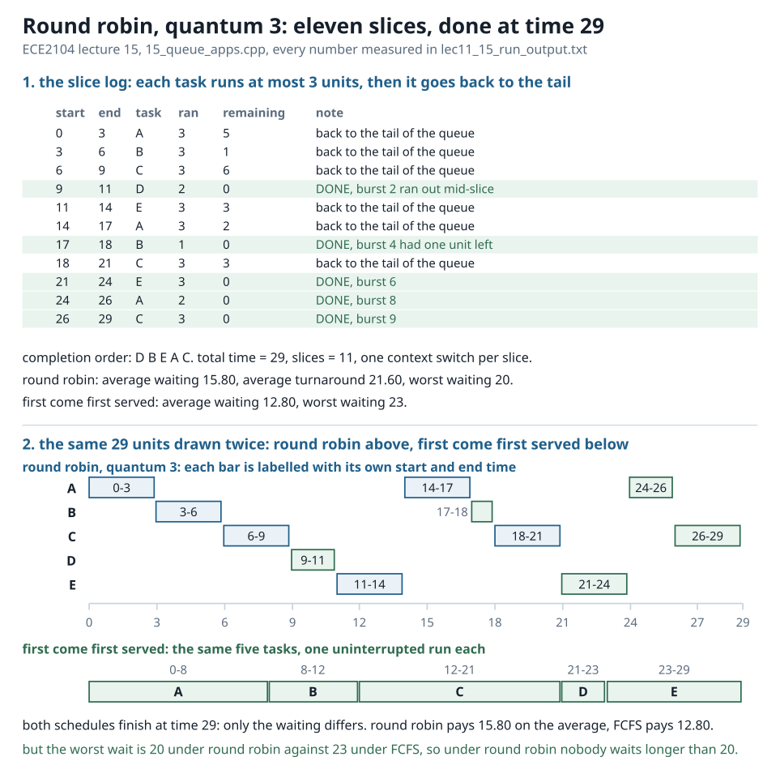
_source: `diagrams/06-round-robin-timeline.svg`, hand-authored, 840 px wide_

*Figure 5. The same five tasks as a timeline: 11 slices, time 0 to 29, completion order
D B E A C.*

### 8.2 The same five tasks under FCFS

| start | end | task | burst | waiting |
|---|---|---|---|---|
| 0 | 8 | A | 8 | 0 |
| 8 | 12 | B | 4 | 8 |
| 12 | 21 | C | 9 | 12 |
| 21 | 23 | D | 2 | 21 |
| 23 | 29 | E | 6 | 23 |

| Result | Round robin | FCFS |
|---|---|---|
| average waiting | 15.80 | 12.80 |
| average turnaround | 21.60 | 18.60 |
| worst waiting | 20 | 23 |

The measured trade: the worst wait is 20 under round robin against 23 under FCFS, so
round robin wins there by 3 time units, and it loses 3.00 on the average wait. Nobody
starves under round robin; the average pays for it.

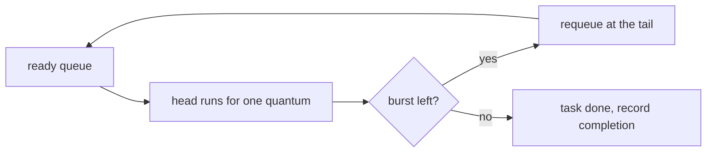


_source: `diagrams/15-ready-queue.mmd`, rendered by render-diagrams.sh_

### 8.3 A queue built from two stacks

Enqueue pushes onto the IN stack, dequeue pops from the OUT stack. When OUT is empty,
everything is poured from IN to OUT, which reverses it twice, so the oldest element ends
up on top of OUT. That is FIFO order made out of LIFO parts.

| op | value | transfers | size | note |
|---|---|---|---|---|
| enqueue | 10 | 0 | 1 | pushed onto IN, no transfer yet |
| enqueue | 20 | 0 | 2 | pushed onto IN |
| enqueue | 30 | 0 | 3 | pushed onto IN |
| enqueue | 40 | 0 | 4 | pushed onto IN |
| enqueue | 50 | 0 | 5 | pushed onto IN |
| enqueue | 60 | 0 | 6 | pushed onto IN |
| dequeue | 10 | 6 | 5 | one bulk transfer of 6, then plain pops |
| dequeue | 20 | 6 | 4 | |
| dequeue | 30 | 6 | 3 | |
| dequeue | 40 | 6 | 2 | |
| dequeue | 50 | 6 | 1 | |
| dequeue | 60 | 6 | 0 | |

Order check: enqueued 10 20 30 40 50 60 and they came back in that order. Total transfers
for 6 elements = 6: each element moved from IN to OUT exactly once, so a dequeue costs
1 pop on average even though the worst single one cost 6. Amortised O(1) with a worst
single dequeue of 6.

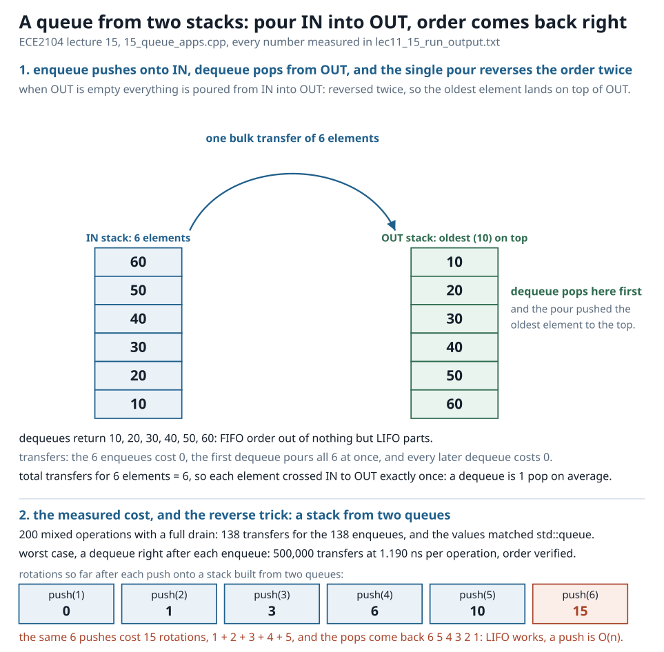
_source: `diagrams/05-queue-from-two-stacks.svg`, hand-authored, 840 px wide_

*Figure 6. Enqueue pushes onto IN; the first dequeue pours all six elements into OUT in
one transfer, and every later dequeue is a plain pop.*

| Check against `std::queue` | Value |
|---|---|
| mixed operations run | 200, followed by a full drain |
| same values in the same order | yes |
| transfers over the whole run | 138 for 138 enqueues |
| invariant | transfers ≤ enqueues always, each element is poured at most once |

### 8.4 The reverse trick: a stack from two queues

Push into the queue, then rotate the other n - 1 elements behind it so it sits at the
front.

| push | rotations for that push | cumulative rotations |
|---|---|---|
| 1 | 0 | 0 |
| 2 | 1 | 1 |
| 3 | 2 | 3 |
| 4 | 3 | 6 |
| 5 | 4 | 10 |
| 6 | 5 | 15 |

Pops come back `6 5 4 3 2 1`, so LIFO is recovered out of two FIFO queues. The price: the
same 6 pushes cost 15 rotations, which is 1 + 2 + 3 + 4 + 5 = 15. A push is O(n) here
against O(1) for a real stack: the trick works, it just is not free.

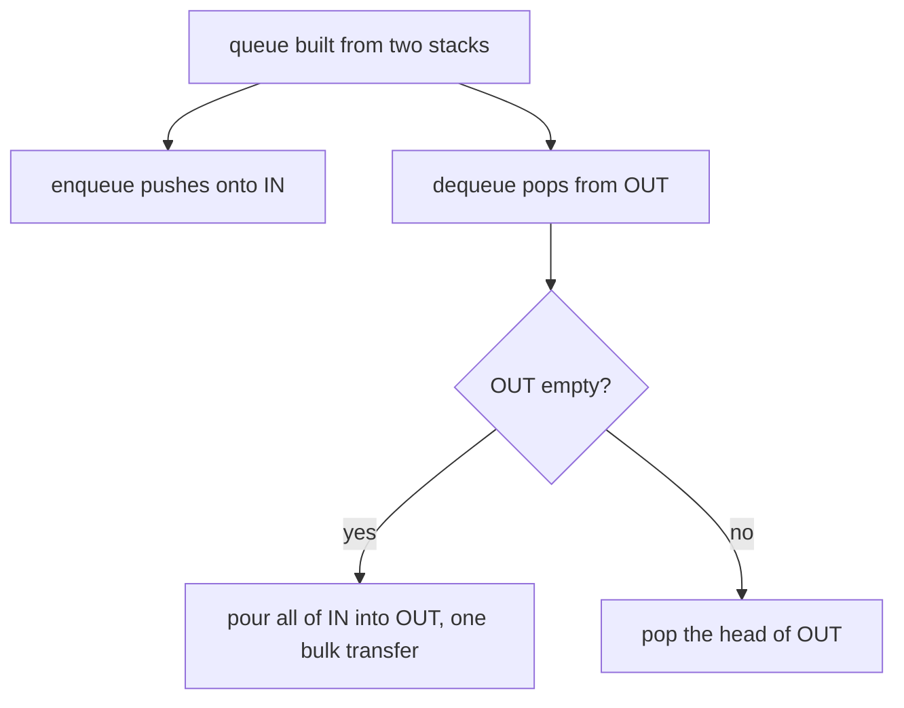


_source: `diagrams/16-queue-built-from-two-stacks.mmd`, rendered by render-diagrams.sh_

### 8.5 Cost of the two-stack queue, worst pattern

| Measurement | Value |
|---|---|
| operations run | 500000 enqueues and 500000 dequeues, each dequeue immediately after its enqueue |
| transfers | 500000, the transfer happens on every single dequeue |
| per operation | 1.190 ns |
| order verified | yes |

That interleaved pattern IS the worst case for the design. A real workload batches, and
the 6 element run above shows the good case: 1 transfer per element in total.

## 9. The lecture-15 one-liner

A queue is the shape of anything that must serve arrival order, and any structure that can
reverse a sequence twice can imitate it. Check the cost: round robin pays in average
waiting, the two-stack queue pays in transfers, both own their place.

## 10. Formula and rule sheet

| Rule | Formula or statement | Where it comes from |
|---|---|---|
| Address of the next slot | `base + i × sizeof(T)` | array stack, array queue |
| Stack full, empty | `top_ == CAP`, `top_ == 0` | lecture 11 |
| Circular enqueue, dequeue | `rear = (rear + 1) % CAP`, `front = (front + 1) % CAP` | lecture 13 |
| Elements inside a circular queue | `count = (rear - front + CAP) % CAP` | lecture 14 |
| Circular queue full with a count | `count == CAP` | lecture 14 |
| Circular queue full with a sentinel | `(rear + 1) % CAP == front`, one slot unused | lecture 14 |
| Struct size | sum of fields + padding to the largest alignment | lectures 11 to 14 |
| Node cost on the heap | ask 16, usable 24, charged 32 | lecture 12 |
| Round robin slices | sum over tasks of ⌈burst ÷ quantum⌉ | lecture 15 |
| Rotations for n pushes from two queues | 1 + 2 + ... + (n - 1) = n(n - 1) / 2 | lecture 15 |

## 11. Traps that cost marks

| Trap | The correct statement |
|---|---|
| "a stack needs two indices" | one index, `top_`, is enough, the array is written at `top_` and read at `top_ - 1` |
| "overflow is fine, it just overwrites" | an unchecked push at index 6 lands exactly on the canary at offset 24 and destroys it |
| "the array stack object is 20 bytes" | the object is 40, it owns the 5 ints plus 16 bookkeeping bytes plus 4 padding |
| "padding only happens in structs with pointers" | `offsetof(top) = 24` shows 4 padding bytes caused by a `size_t` alone |
| "a linked stack can overflow" | it has no `full()`; 200000 pushes made 200000 heap requests and 0 refusals |
| "16 bytes asked means 16 bytes paid" | the allocator charges a 32 byte stride and reports 24 usable for the 16 byte request |
| "the naive queue is broken" | it is correct for at most `capacity` operations, then the front leaves 3 unusable slots behind |
| "an empty naive queue can be refilled" | after draining, front 5 rear 5 size 0 is empty AND full, it can never enqueue again |
| "front == rear tells you empty or full" | one comparison cannot decide both, use a count or a sentinel slot |
| "the sentinel design stores 5" | it stores 4 of 5 slots, the count design stores all 5 |
| "subtracting indices always gives the count" | on a wrapped state the bare difference is 18446744073709551615, the `+ capacity` fixes it |
| "26.42× is pointer arithmetic" | that gap is the allocator, the circular queue does 0 heap requests during the operations |
| "round robin is always better" | it wins 3 on the worst wait and loses 3.00 on the average wait |
| "a queue from two stacks is slow" | 138 transfers for 138 enqueues, each element poured at most once |
| "a stack from two queues is O(1)" | 6 pushes cost 15 rotations, so a push is O(n) |

## 12. Numericals

Answer everything from the tables above. The answer key is section 13, with the
arithmetic written out.

### Lecture 11, array stack

1. `sizeof(ArrayStack<int,5>)` is 40 and the five ints alone are 20 bytes. Where do the
   other 20 bytes go, and give the three measured offsets.
2. `offsetof(top)` is 24 and not 20. Give the padding in bytes and the alignment rule
   that produces it.
3. `sizeof(ArrayStack<char,5>)` is 24. Derive that size from the char array, the padding
   and the bookkeeping.
4. Seven values, 1 to 7, are pushed into a five slot stack. How many are refused, what
   are the contents afterwards, and what does the drain print.
5. A stack with no `full()` check pushes a sixth int into a five int array. Give the byte
   offset that push writes to, the address it lands on, and the value it destroys.
6. Two million pushes then two million pops: how many heap blocks do the 4,000,000
   operations ask for, and what is the per push and per pop time.
7. From those same two timings, give the average ns per operation, and state what the
   printed checksum 1999999000000 proves.
8. The same 20,000 pushes cost 484.7 ns each at the bottom end and 0.1 ns each at the
   top end. Give the printed ratio and both total times.

### Lecture 12, linked stack and its applications

9. Break `sizeof(Node) = 16` into payload, padding and pointer, and give
   `offsetof(next)`.
10. `sizeof(LinkedStack)` is 24. Name the three fields and say why the size does not grow
    with the number of elements.
11. 200,000 pushes: how many heap requests, how many bytes requested, how many bytes per
    element, and what is the real charged footprint.
12. Give the underflow count for the small push/pop log and for the 200,000 node drain,
    and explain in one line why a linked stack cannot overflow.
13. Trace the input `([)]` through the bracket checker and say why a counter would pass it.
14. What does the checker report for `(((` and for `)(`, and which index is blamed each time.
15. Reverse `ECE2104` using a stack, and state which of `DSA`, `level` is a palindrome.
16. One million elements on both representations: heap requests, storage bytes, push and
    pop times, and the printed pop ratio.

### Lecture 13, array queue

17. Break `sizeof(NaiveQueue<int,5>) = 48` and `sizeof(CircularQueue<int,5>) = 64` into
    array, padding and bookkeeping, naming the bookkeeping fields.
18. Show FIFO order with three enqueues of 10, 20, 30 and three dequeues, using indices.
19. After 5 enqueues and 3 dequeues, why is the next enqueue refused, how many slots are
    unreachable, and what is the space lost equal to.
20. After the queue is drained, give frontIndex, rearIndex, size, empty and full, and say
    what the queue can never do again.
21. The circular repair on the same script: refusals and elements held for each form, and
    the cost per operation of the fix.
22. One million enqueue plus dequeue pairs: heap blocks during the operations, per
    operation time, and how many index wraps survived.

### Lecture 14, linked queue and circular queue

23. Evaluate `count = (rear - front + capacity) mod capacity` for front 0 rear 3, for
    front 2 rear 3, and for the wrapped state front 3 rear 2. Also give the bare unsigned
    difference for the last one.
24. From the trajectory table, at which enqueue does the rear wrap each of the two times,
    and what is the full state after the enqueue of 109.
25. Explain the full/empty ambiguity with numbers, then give both ways out and how many
    slots each design can store.
26. Give the sizes of `QNode` and `LinkedQueue`, and the heap requests and bytes requested
    for 200,000 enqueues.
27. Circular queue 0.531 ns per operation against linked queue 14.023 ns per operation:
    give the printed ratio and say where the difference comes from.

### Lecture 15, applications

28. Round robin, quantum 3, bursts A 8, B 4, C 9, D 2, E 6: give slices, total time,
    completion order, average waiting, average turnaround and worst waiting, with the
    waiting arithmetic for each task.
29. The same tasks under FCFS: give the waiting times, average waiting, average turnaround
    and worst waiting.
30. Compare the two schedulers on the worst wait and on the average wait, and give both
    differences.
31. A queue from two stacks: six enqueues then six dequeues. Give the transfers, the
    output order, and the average transfers per element.
32. The same two-stack queue over 200 mixed operations, and then over the interleaved
    worst pattern of 500,000 pairs: give the transfer counts and the per operation time of
    the worst pattern.
33. A stack from two queues: how many rotations for 6 pushes, why that number, and what
    is the resulting cost of a single push.

## 13. Answer key

**1.** The five ints are 5 × 4 = 20 bytes at offsets 0 to 19. `top_` is a `size_t`, so it
must start on an 8 byte boundary; the next multiple of 8 after 20 is 24, so 4 padding
bytes sit at offsets 20 to 23. Then `top_` 8 bytes and `refusals_` 8 bytes = 16 bytes of
bookkeeping. Total 20 + 4 + 16 = 40. Measured offsets: `data` 0, `top` 24, `refusals` 32.

**2.** Padding = 24 - 20 = 4 bytes. Rule: every field starts at an offset that is a
multiple of its own alignment, and `alignof(size_t) = 8` on this 64 bit machine, so a
`size_t` cannot sit at offset 20.

**3.** 5 chars = 5 bytes, then padding to the struct's alignment of 8, so 3 padding bytes,
giving 8. Add `top_` 8 and `refusals_` 8 = 16. Total 8 + 16 = 24, which is a multiple of
8, as required. Measured `sizeof(ArrayStack<char,5>)` = 24, confirmed.

**4.** Pushes 1 to 5 are stored (size 1, 2, 3, 4, 5; full becomes yes at the fifth).
Pushes 6 and 7 are refused because `full()` is true, so refusals = 2 and the size stays 5.
Contents afterwards, bottom to top: 1 2 3 4 5. Drain prints 5 4 3 2 1. Overflow was
detected, not written.

**5.** The unchecked slot is index 6, and 6 × `sizeof(int)` = 6 × 4 = 24 bytes past the
base. With `base = 0x7ffeb0a2d3e0`, `base + 24 = 0x7ffeb0a2d3f8`, which is exactly
`&bench.canary` because `offsetof(CanaryBench, canary) = 24`. The value destroyed is the
canary `0xc0ffee`.

**6.** 0 further blocks and 0 further bytes: the container took its one block of 8000016
bytes up front and the 4,000,000 operations reused it. Per operation: push 0.688 ns,
pop 0.378 ns. Refusals at the end = 0.

**7.** Average = (0.688 + 0.378) ÷ 2 = 1.066 ÷ 2 = 0.533 ns per operation. The popped
values sum to 1999999000000, which equals the sum the reverse order would give, so every
value came back in LIFO order: the checksum is the proof that the work was real.

**8.** Printed ratio 4267.2× for the same 20,000 pushes. Bottom end: 20000 × 484.7 ns =
9,694,000 ns = 9.694 ms. Top end: 20000 × 0.1 ns = 2,000 ns = 2 µs. The difference is
about 9.692 ms for the same amount of stored data.

**9.** Payload `int data` = 4 bytes at offset 0, then 4 padding bytes so the pointer lands
on an 8 byte boundary, then `Node *next` = 8 bytes. 4 + 4 + 8 = 16, and
`offsetof(next) = 8`.

**10.** head pointer (8) + count (8) + underflow counter (8) = 24 bytes. Every element is a
separate heap node, so the stack object holds only state, never elements: its size is
constant no matter how many elements are inside.

**11.** 200,000 heap requests, 3,200,000 bytes requested, so 3200000 ÷ 200000 = 16 bytes
per element. The allocator reports 24 usable bytes and charges a 32 byte stride, so the
real footprint is 200000 × 32 = 6400000 bytes, twice the bytes asked for.

**12.** Small log: 2 underflows (the drain loop's last attempt plus the explicit test on
the empty stack). 200,000 node drain: underflows = 1, with 200,000 free calls. A linked
stack cannot overflow because it has no `full()`: there is no index to exceed, only
memory to run out of, so all 200,000 pushes succeeded.

**13.** Index 0: push `(`, depth 1. Index 1: push `[`, depth 2. Index 2: read `)` while
the top is `[`, so the pair does not match and the check fails at index 2. A counter would
count 2 opens and 2 closes and report balanced, which is wrong: the stack compares with
the TOP, so it catches the mis-nesting.

**14.** `(((` is never closed: the deepest unmatched opener is `(` at index 2 (a push with
no matching pop). `)(` fails at index 0, a closing `)` with nothing open. Both are NOT
BALANCED, while `""` is reported BALANCED because there is nothing to match.

**15.** Push E, C, E, 2, 1, 0, 4 and pop seven times: 4, 0, 1, 2, E, C, E, giving
`4012ECE`. `DSA` becomes `ASD`, so it is not a palindrome; `level` pops back as `level`,
so it is one.

**16.** Linked stack: 1000000 heap requests, one 16 byte node per element, push 16.027 ns,
pop 8.330 ns. Array stack: 1 heap request of 4000008 bytes for 4000000 bytes of storage,
push 0.639 ns, pop 0.323 ns. Printed pop ratio 25.8×, and the cause is allocation, since
the array stack asked the heap for nothing after the single block.

**17.** The int array is 5 × 4 = 20 bytes in both, followed by 4 padding bytes so the
first `size_t` lands on 8 (offset 24). Naive bookkeeping: front, rear, refusals = 3 × 8 =
24, so 20 + 4 + 24 = 48. Circular bookkeeping: front, rear, count, refusals, wraps = 5 ×
8 = 40, so 20 + 4 + 40 = 64. The extra 16 bytes in the circular form are the count and the
wrap counter.

**18.** enqueue 10 → rear 1, size 1. enqueue 20 → rear 2, size 2. enqueue 30 → rear 3,
size 3. dequeue → 10, front 1, size 2. dequeue → 20, front 2, size 1. dequeue → 30,
front 3, size 0. In order 10 20 30, out in order 10 20 30: FIFO.

**19.** After 5 enqueues front = 0, rear = 5, size = 5, full = yes. After 3 dequeues
front = 3, rear = 5, size = 2, slots `[--] [--] [--] [4] [5]`. The next enqueue is refused
because `rear == capacity`, even though the queue holds only 2 elements. Slots 0 to 2 are
valid memory but unreachable, so 3 slots are unreachable. Space lost = `frontIndex` = 3.

**20.** Draining prints 4 then 5, giving frontIndex 5, rearIndex 5, size 0, empty = yes
and full = yes at the same time. `dequeue` reports empty (front == rear) while `full()`
still reports full (rear == capacity), so the queue can never enqueue again: it is dead
with an empty array.

**21.** Naive: 3 of 3 refused, 2 elements held. Circular: 0 refused, 5 elements held,
because each dequeue frees its slot for exactly the next enqueue. Cost of the fix: one
modulo per operation, `rear = (rear + 1) % capacity` and `front = (front + 1) % capacity`,
against 1.027 ns per operation measured over 2,000,000 operations.

**22.** 0 further heap blocks and 0 further bytes, since the array lives inside the object
(its one block was 4136 bytes). Time 1.027 ns per operation, order verified yes, and 976
index wraps survived the run.

**23.** front 0 rear 3: (3 - 0 + 5) mod 5 = 8 mod 5 = 3, stored count 3. front 2 rear 3:
(3 - 2 + 5) mod 5 = 6 mod 5 = 1, stored count 1. front 3 rear 2: (2 - 3 + 5) mod 5 =
4 mod 5 = 4, stored count 4, while the bare difference `rear - front` prints
18446744073709551615, which is 2⁶⁴ - 1, the wrapped unsigned result of 2 - 3.

**24.** First wrap at the enqueue of 104: rear goes 4 → 0 and wraps becomes 1. Second wrap
at the enqueue of 109: rear goes 4 → 0 and wraps becomes 2. After the enqueue of 109 the
state is front 3, rear 0, count 2, wraps 2. Ten enqueues were served by the same five
slots, where a naive queue refuses after five.

**25.** `front == rear` is the empty test, and after `capacity` enqueues rear has caught
up with front again, so the same equality also holds for a full queue: one comparison
cannot decide both. Count design: `count == 0` empty, `count == capacity` full, needs one
extra variable, captured state front 3 rear 3 count 0 decided as empty, stores all 5
slots. Sentinel design: one slot is kept unused, full when `(rear + 1) % capacity ==
front`, captured after 4 enqueues as usable 4, front 0, rear 4, full yes, refusals 0, and
it stores 4 of 5 slots.

**26.** `QNode` = 4 data + 4 padding + 8 pointer = 16 bytes; `LinkedQueue` = front 8 +
rear 8 + count 8 + underflow counter 8 = 32 bytes. For 200,000 enqueues: 200,000 heap
requests requesting 3,200,000 bytes, that is 16 bytes per element, with 200,000 free calls
during the drain.

**27.** Printed ratio 26.42× (14.023 ÷ 0.531). The difference is the allocator: the linked
queue makes 1,000,000 heap requests, one node per element, while the circular queue makes
0 heap requests during the operations because its array lives inside the object. The
circular queue pays one modulo per operation instead, and needs a capacity known in
advance.

**28.** Slices = ⌈8/3⌉ + ⌈4/3⌉ + ⌈9/3⌉ + ⌈2/3⌉ + ⌈6/3⌉ = 3 + 2 + 3 + 1 + 2 = 11, and
total time = 8 + 4 + 9 + 2 + 6 = 29, matching the capture. Completion order D B E A C,
with completion times A 26, B 18, C 29, D 11, E 24. Waiting = completion - burst:
A 26 - 8 = 18, B 18 - 4 = 14, C 29 - 9 = 20, D 11 - 2 = 9, E 24 - 6 = 18, sum =
18 + 14 + 20 + 9 + 18 = 79, average = 79 ÷ 5 = 15.80. Turnaround = completion times, sum =
26 + 18 + 29 + 11 + 24 = 108, average = 108 ÷ 5 = 21.60. Worst waiting = 20 (task C).

**29.** FCFS order A B C D E with waiting 0, 8, 12, 21, 23, sum = 0 + 8 + 12 + 21 + 23 =
64, average = 64 ÷ 5 = 12.80. Completion times 8, 12, 21, 23, 29, sum = 93, average
= 93 ÷ 5 = 18.60. Worst waiting = 23 (task E).

**30.** Worst wait: round robin 20 against FCFS 23, so round robin is better by
23 - 20 = 3 time units, which is exactly one quantum of 3. Average wait: round robin
15.80 against FCFS 12.80, so round robin is worse by 15.80 - 12.80 = 3.00. Round robin
prevents starvation, the average pays for it.

**31.** The six enqueues push onto IN with transfers 0. The first dequeue pours all 6 into
OUT in one bulk transfer (transfers = 6) and then pops; the remaining five dequeues are
plain pops with no transfer. Output order 10 20 30 40 50 60, so FIFO is preserved. Average
transfers per element = 6 ÷ 6 = 1, even though the worst single dequeue cost 6, so the
amortised cost is O(1).

**32.** Over 200 mixed operations plus a drain: 138 transfers for 138 enqueues, with
transfers ≤ enqueues holding always, because each element is poured from IN to OUT at most
once. Worst interleaved pattern (500,000 enqueues each immediately followed by its
dequeue): 500,000 transfers, one per dequeue, at 1.190 ns per operation.

**33.** 6 pushes cost 15 rotations: push 1 costs 0, then 1, 2, 3, 4, 5, giving
1 + 2 + 3 + 4 + 5 = 15, which is n(n - 1)/2 with n = 6, that is 6 × 5 ÷ 2 = 15. Pops come
back 6 5 4 3 2 1, so LIFO is recovered, but a push is O(n) against O(1) for a real stack.

## 14. One-minute revision

| If the question says | Write this |
|---|---|
| represent a stack in an array | one array plus one index, push at `data[top_]` then `top_++`, all three operations O(1), no shifting |
| stack overflow | `full()` is `top_ == CAP`, an unchecked push lands on the next field, measure it with `offsetof` |
| stack in a linked list | the head IS the top, push inserts at the head, no capacity, underflow only |
| bracket check | push openers, a closer must match the top, that is why it is O(n) and a counter is wrong |
| queue in an array | enqueue at rear, dequeue at front, two indices that only move forward |
| the naive queue's flaw | `rear == capacity` refuses while 3 slots below front stay unused, a drained queue is empty and full at once |
| circular queue | `rear = (rear + 1) % CAP`, `count = (rear - front + CAP) % CAP`, one modulo per operation |
| full or empty | use a count, or keep one sentinel slot free |
| linked queue | front and rear pointers, dequeue at front, enqueue at rear, no full() |
| round robin | 11 slices to time 29, average waiting 15.80, worst 20, against FCFS 12.80 and 23 |
| queue from two stacks | enqueue onto IN, dequeue from OUT, pour IN into OUT when OUT is empty, amortised O(1) |
| stack from two queues | rotate behind the new element, 6 pushes cost 15 rotations, so a push is O(n) |

## Files this material came from

| File | Role |
|---|---|
| `~/learning/cpp/exercises/lec11_15_run_output.txt` | the capture, 369 lines, every number in this file |
| `~/learning/cpp/lessons/11_stack_array.cpp` | array stack, sizes, capacity, cost |
| `~/learning/cpp/lessons/12_stack_linked_apps.cpp` | linked stack, bracket checker, reversal, cost race |
| `~/learning/cpp/lessons/13_queue_array.cpp` | naive and circular array queues |
| `~/learning/cpp/lessons/14_queue_linked_circular.cpp` | linked queue, circular trajectory, count formula |
| `~/learning/cpp/lessons/15_queue_apps.cpp` | round robin, FCFS, two-stack queue, stack from two queues |
| `~/Documents/MUJ-SEM-3/DSA/Handouts/Course Handout ECE2104VDT2104_26.pdf` | the official lecture titles and outcomes in section 1 |
