# Topic-wise Explained · ECE2104 Data Structures and Algorithms · Mid-Term

One section per topic, in the order the teacher projected them in class, not the order the
handout lists them. Every measured number below is quoted with the capture file it came from.
Nothing in this file is typed from memory.

| Item | Value |
|---|---|
| Course | ECE2104, Data Structures and Algorithms, MUJ Semester 3 |
| Set | the 14 topics of the projected list `Syllabus_MTE` |
| Scope source | the Notepad list shown in class, not the handout lecture plan |
| Answer keys | last section of this file, one key per topic, numbered 1 to 1 with the questions |
| Measured on | Ubuntu 26.04, Linux 7.0.0-31-generic, g++ 15.2.0, x86-64 |
| Captures quoted | `lec05_run_output.txt`, `lec11_15_run_output.txt`, `lec16_recursion_output.txt`, `lec16_18_sorts_run_output.txt`, `lec19_21_trees_run_output.txt`, `lec22_analysis_run_output.txt`, `lec23_formulations_run_output.txt` |

## Scope: the projected list against the handout

The list wins for the paper. It was projected in class, and it is checkable against the paper on
the day. The handout is still the only document that numbers anything, so every topic below also
carries its handout lecture number where a row exists.

| Question | Course handout | Projected list (`Syllabus_MTE`) |
|---|---|---|
| Where does the mid-term block end? | After lecture 16 | No lecture span given, only topic names |
| Trees, BST, traversals | Lectures 17 to 19, tagged End Term | Named in scope: Trees fundamentals, Tree types and BST |
| Merge sort and quick sort | Lectures 27 and 29, tagged End Term | Named in scope: Merge Sort, Quick Sort |
| Asymptotic notation, finding complexity | Never scheduled: the token appears 0 times in the lecture plan | Named in scope: Asymptotic notation, Finding Complexity |

| Topic | In the handout | Textbook used where no handout row exists |
|---|---|---|
| Array | Lectures 1 to 4, mid-term block | handout row exists |
| Pointers | Lectures 3 to 5, mid-term block | handout row exists, detail from Kanetkar, *Let Us C* |
| Stack by Array | Lecture 11, mid-term block | handout row exists |
| Queue | Lectures 13 to 15, mid-term block | handout row exists |
| Linked List | Lectures 6 to 8, mid-term block | handout row exists |
| Merge Sort | Lecture 27, tagged End Term | handout row exists, tagged out of block |
| Quick Sort | Lecture 29, tagged End Term | handout row exists, tagged out of block |
| Algorithm fundamentals | spread through the plan, never a single row | CLRS, *Introduction to Algorithms*, chapter 1 |
| Asymptotic notation | no row at all, never scheduled | Goodrich and Tamassia, *Algorithm Design*, CLRS chapter 3 |
| Finding Complexity | no row at all, never scheduled | CLRS chapter 3, operation counting measured |
| Trees fundamentals | Lecture 17, tagged End Term | handout row exists, tagged out of block, detail from Drozdek |
| Formulation in C | implied by every implementation row | Kanetkar, *Let Us C*, structs and pointers |
| Tree types and BST | Lectures 18 to 19, tagged End Term | Drozdek, *Data Structures and Algorithms in C++*, Weiss chapter 4 |
| Different Operations | implied by the session outcomes | CLRS chapter 10 and 11, measured operation matrix |

Four of the fourteen are not in the mid-term block of the handout at all, and two of those are
never scheduled anywhere in the plan. Those are taught here from the textbook named beside them.

---

> **Companion page.** This set is the topic-by-topic explanation. The study plan, the scope
> conflict against the handout, the mock paper and the numeric set live in the roadmap:
> [DSA mid-term roadmap, the fourteen projected topics](../midterm-roadmap/DSA-MIDTERM-ROADMAP.html#s5)
> That link opens the roadmap's topic plan section (`#s5`), which is the session-by-session
> schedule that pairs with the fourteen sections below.

## 1 · Array

### The plain explanation

*Scope: in the mid-term block, handout lectures 1 to 4. Source: capture `lec05_run_output.txt`, lesson `05_ds_memory_representation.cpp`.*

An array is a fixed number of values of one type, stored end to end in a single block. It exists
because the machine can compute where an element is instead of searching for it. Element `i` sits
at `base + i × sizeof(element)`, so reading `a[4]` is one multiply, one add and one load, however
long the array is. That single formula is why indexed access is O(1). The price is that the length
is fixed when the array is created, and that inserting or deleting at the front shifts every
element after it.

### The mechanism

| Index | Address, from the measured base | Byte offset | Value |
|---|---|---|---|
| 0 | 0x7ffe7c3131b0 + 0 × 4 = 0x7ffe7c3131b0 | 0 | 10 |
| 1 | 0x7ffe7c3131b0 + 1 × 4 = 0x7ffe7c3131b4 | 4 | 20 |
| 2 | 0x7ffe7c3131b0 + 2 × 4 = 0x7ffe7c3131b8 | 8 | 30 |
| 3 | 0x7ffe7c3131b0 + 3 × 4 = 0x7ffe7c3131bc | 12 | 40 |
| 4 | 0x7ffe7c3131b0 + 4 × 4 = 0x7ffe7c3131c0 | 16 | 50 |

The capture prints the arithmetic back: index 4 in one step equals `&a[4]`, yes.

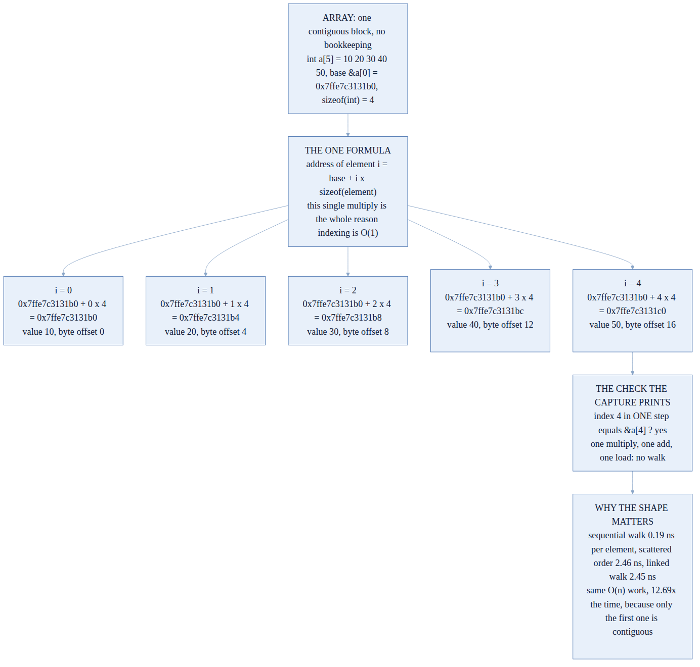

### The proof

| Fact | Measured value | Capture file |
|---|---|---|
| `sizeof(int)` | 4 bytes | `lec05_run_output.txt` |
| byte stride between neighbours | exactly 4 | `lec05_run_output.txt` |
| sequential walk | 0.19 ns per element | `lec05_run_output.txt` |
| same array, scattered order | 2.46 ns per element | `lec05_run_output.txt` |
| linked walk, one hop per element | 2.45 ns per element | `lec05_run_output.txt` |
| ratios the capture prints | 12.69× and 12.64× | `lec05_run_output.txt` |

Both walks visit every element once, so both are O(n). The 12.69× is the shape, not the count.

### The C formulation

```c
#include <stdio.h>

int main(void) {
    int a[5] = {10, 20, 30, 40, 50};
    int *p = a;            /* the array name decays to a pointer to element 0 */
    int x = a[3];          /* the same as *(a + 3): one multiply and one add */
    int n = (int)(sizeof a / sizeof a[0]);   /* 5, works only where the array is visible */
    printf("%d %d %d %d\n", *p, x, n, p[4]);
    return 0;
}
```

### Exam traps

| Trap | What costs the marks |
|---|---|
| `a[i]` is `*(a + i)`, not a lookup | say the multiply and the add, not "the computer knows" |
| the array name is not the array | `sizeof(a)` is 20 in the block, but 8 inside a function, because it decayed to a pointer |
| the last valid index is `n - 1` | `a[5]` on a 5 element array is undefined behaviour, not a zero |
| indexing is 0 based | the first element is index 0, so the offset of element i is `i × 4`, never `(i - 1) × 4` |

### Numericals

1. `int a[5] = {10,20,30,40,50};` starts at 0x7ffe7c3131b0 and `sizeof(int) = 4`. Give `&a[3]` and the value stored there.
2. For the same array give the byte offset of `a[4]` and its address.
3. `int a[8]` starts at 0x1000 and `sizeof(int) = 4`. Give the total bytes, `&a[5]` and `&a[7]`.
4. `int a[1024]` starts at 0x2000. Give `&a[1023]`, and say how many memory steps the address computation costs against how many loads a walk of the whole array costs.
5. The capture prints 0.19 ns per element sequential and 2.46 ns scattered. Quote both times, the ratio the capture prints, and say which one is O(1) per element.
6. Give `sizeof(char)`, `sizeof(short)`, `sizeof(int)`, `sizeof(long)`, `sizeof(float)`, `sizeof(double)` and `sizeof(void*)` on this machine.
7. Give `sizeof` and every member offset for `struct P2 { char a; int b; char c; };`.
8. `struct Node { int data; Node* next; };` is 16 bytes and not 12. Say where the 4 extra bytes sit and why.

---

## 2 · Pointers

### The plain explanation

*Scope: in the mid-term block, handout lectures 3 to 5. Source: capture `lec05_run_output.txt`, textbook Kanetkar, Let Us C, chapter on pointers.*

A pointer is a variable that holds an address, and the type it points at decides what `p + 1`
means. That is the whole idea: the compiler multiplies by the size of the pointee, so
`(char*)p + 1` moves 1 byte while `(int*)p + 1` moves 4 and `(Node*)p + 1` moves 16. Pointers
exist because a structure whose elements live in different places needs a way to say where the
next one is. On this machine an address is 64 bits, so a pointer is 8 bytes, and that 8 byte
alignment rule is what pushes 4 bytes of padding into a node that holds a 4 byte `int`.

### The mechanism

| Struct | `sizeof` | Offset 0 | Padding | Pointer |
|---|---|---|---|---|
| `Node { int data; Node* next; }` | 16 | `data`, 4 bytes | 4 bytes at offsets 4 to 7 | `next`, 8 bytes at offset 8 |
| `P1 { int a; char b; char c; }` | 8 | `a` at 0 | none, `b` at 4, `c` at 5 | none |
| `P2 { char a; int b; char c; }` | 12 | `a` at 0 | 3 bytes at 1 to 3, then 3 at 9 to 11 | none |
| `P3 { char a; char b; int c; }` | 8 | `a` at 0, `b` at 1 | 2 bytes at 2 to 3 | none |

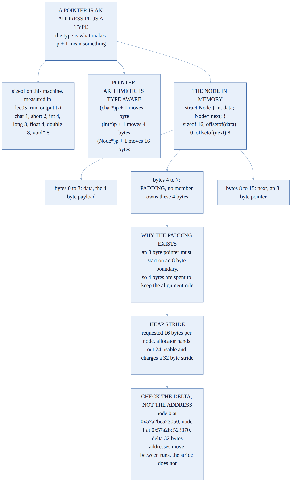

### The proof

| Fact | Measured value | Capture file |
|---|---|---|
| `sizeof(void*)` | 8 bytes | `lec05_run_output.txt` |
| `sizeof(Node)` | 16, `alignof(Node)` 8 | `lec05_run_output.txt` |
| node offsets | `data` 0, `next` 8 | `lec05_run_output.txt` |
| heap stride between 5 nodes | 32 bytes each | `lec05_run_output.txt` |
| requested against handed out | 16 asked, 24 usable | `lec05_run_output.txt` |
| four nested frames | 0x...3154, 0x...3124, 0x...30f4, 0x...30c4 | `lec05_run_output.txt` |

The frames step 48 bytes apart and the innermost is the lowest address, so this stack grows down.

### The C formulation

```c
#include <stdlib.h>

struct Node {
    int data;
    struct Node *next;
};

struct Node *push_front(struct Node *head, int v) {
    struct Node *p = (struct Node *)malloc(sizeof(struct Node));   /* 16 bytes asked for */
    if (!p) return head;
    p->data = v;
    p->next = head;      /* the link first */
    return p;            /* then the head moves, or the old list is lost */
}
```

### Exam traps

| Trap | What costs the marks |
|---|---|
| `p + 1` is type aware | it moves `sizeof(*p)` bytes, so 4 for an `int*` and 16 for a `Node*` |
| order of the two link statements | `head = p` before `p->next = head` drops the entire old list |
| a dangling pointer is not a null pointer | `free(p)` then `p->next` reads freed memory, and nulling `p` afterwards does not repair it |
| padding is not slack to use | bytes 4 to 7 of a node belong to no member, and writing there is undefined behaviour |

### Numericals

1. State `sizeof(void*)` on this machine and say why it is that size.
2. Give the distance `(char*)p + 1`, `(int*)p + 1` and `(Node*)p + 1` each move.
3. Break the 16 bytes of `Node { int data; Node* next; }` into payload, padding and pointer, with the offset of each.
4. Five nodes sit at 0x57a2bc523050, 0x...3070, 0x...3090, 0x...30b0, 0x...30d0. Give the stride, and the heap charged for 5 nodes and for 1000 nodes.
5. A `double` lives at 0x7ffe7c3131a8. Say whether that satisfies the alignment rule, and why.
6. A linked list holds 300 integers. Give the bytes requested, the bytes reported usable, the bytes charged at the measured stride, the bytes the same 300 values cost in an array, and the ratio of charged to array.
7. The capture records four nested frames at 0x7ffe7c313154, 0x7ffe7c313124, 0x7ffe7c3130f4 and 0x7ffe7c3130c4. Give the stride, and say which direction the stack grows.
8. Both a sequential array walk and a scattered array walk are O(n). Explain why one is 12.69× slower than the other.

---

## 3 · Stack by Array

### The plain explanation

*Scope: in the mid-term block, handout lecture 11. Source: capture `lec11_15_run_output.txt`, lesson `11_stack_array.cpp`.*

A stack is a list where you may only touch one end, and that end is the top. Last in, first out:
the value pushed most recently is the first one popped. It exists because a huge number of
problems need exactly that order, from matching brackets to remembering where a function was
called from. Storing it in an array means the whole structure is one array plus one index: push
writes at the index and moves it, pop moves it back and returns the slot. Both are O(1), and
after the array exists nothing else is allocated.

### The mechanism

| Operation | Effect | Cost |
|---|---|---|
| `push(x)` | `data[top] = x; top++` | O(1), one write, one index move |
| `pop()` | `top--; return data[top]` | O(1) |
| `top()` | `return data[top - 1]` | O(1), nothing changes |

| Step | `top` after | Contents, bottom to top |
|---|---|---|
| push(10) | 1 | 10 |
| push(20) | 2 | 10 20 |
| push(30) | 3 | 10 20 30 |
| pop() gives 30 | 2 | 10 20 |
| pop() gives 20 | 1 | 10 |
| pop() gives 10 | 0 | empty |

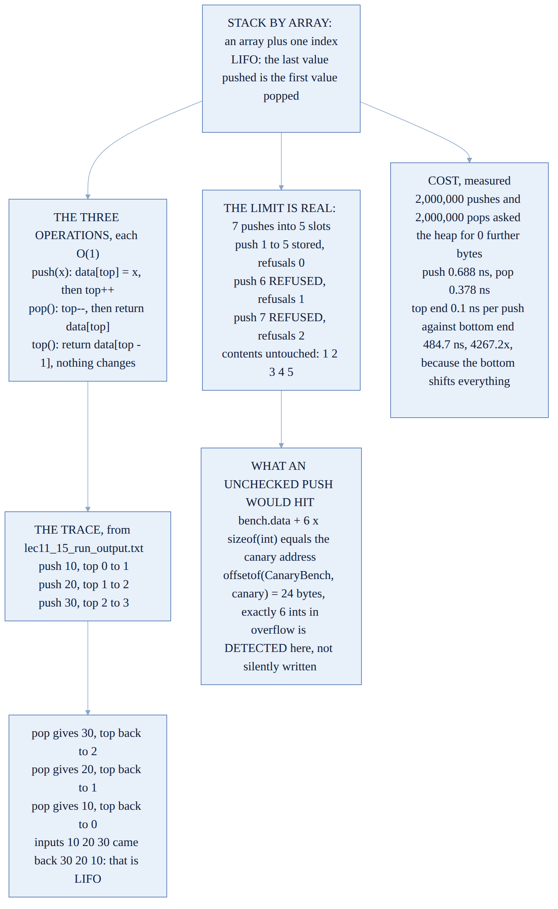

### The proof

| Fact | Measured value | Capture file |
|---|---|---|
| `sizeof(ArrayStack<int,5>)` | 40 bytes | `lec11_15_run_output.txt` |
| the five `int`s alone | 20 bytes | `lec11_15_run_output.txt` |
| offsets | `data` 0, `top` 24, `refusals` 32 | `lec11_15_run_output.txt` |
| 7 pushes into 5 slots | 2 refused, contents untouched | `lec11_15_run_output.txt` |
| unchecked slot 6 address | equals the canary address | `lec11_15_run_output.txt` |
| 2,000,000 pushes and pops | 0 further heap blocks, 0 further bytes | `lec11_15_run_output.txt` |
| per operation | push 0.688 ns, pop 0.378 ns | `lec11_15_run_output.txt` |
| top end against bottom end | 0.1 ns against 484.7 ns, 4267.2× | `lec11_15_run_output.txt` |

### The C formulation

```c
#include <stddef.h>

#define CAP 5
struct ArrayStack {
    int data[CAP];
    size_t top;
};

void push(struct ArrayStack *s, int x) {
    if (s->top < CAP) s->data[s->top++] = x;   /* refuse, never overwrite */
}

int pop(struct ArrayStack *s, int *out) {
    if (s->top == 0) return 0;                 /* underflow, reported */
    *out = s->data[--s->top];
    return 1;
}
```

### Exam traps

| Trap | What costs the marks |
|---|---|
| overflow and underflow are different failures | an array stack can do both; a linked stack can only underflow |
| the index is the next free slot | `top` is a count and an index at once, so `data[top]` is written before `top++` |
| a bottom anchored stack shifts everything | 484.7 ns per push against 0.1 ns, measured, for the same 20,000 pushes |
| padding after the array | `top` lands at offset 24 and not 20, because `size_t` needs an 8 byte boundary |

### Numericals

1. A 5 slot array stack is pushed 10, then 20, then 30. Give the output of `pop()`, then `pop()`, then `top()`.
2. Seven values, 1 to 7, are pushed into a 5 slot array stack. Give the number refused, the contents afterwards, and the drain output.
3. `sizeof(ArrayStack<int,5>)` is 40 and the five `int`s are 20 bytes. Break the 40 into array, padding and bookkeeping, and give the three offsets.
4. Say why `offsetof(top)` is 24 and not 20.
5. An unchecked push would write at `data + 6 × sizeof(int)`. Say what lives there and what the capture measures at that address.
6. Two million pushes and two million pops asked the heap for how many blocks and how many bytes? Give the per operation times as well.
7. A bottom anchored stack costs 484.7 ns per push and a top anchored one 0.1 ns. Give both and the ratio the capture prints.
8. A 5 slot array stack object is 40 bytes and holds 20 bytes of values. Give the payload percentage of the object.

---

## 4 · Queue

### The plain explanation

*Scope: in the mid-term block, handout lectures 13 to 15. Source: capture `lec11_15_run_output.txt`, lessons `13_queue_array.cpp` and `14_queue_linked_circular.cpp`.*

A queue is a list where elements enter at one end and leave at the other. First in, first out:
the element that has waited longest leaves first. It exists because arrival order is what matters
for a printer spool, a scheduler and a breadth first walk. In an array you keep two indices, one
at each end: enqueue writes at the rear, dequeue reads at the front. Both are O(1). The catch is
that both indices only move forward, so the free slots behind the front become unreachable, and
that is the problem the circular form solves.
### The mechanism

| Operation | Effect | Cost |
|---|---|---|
| `enqueue(x)` | write at rear, then `rear++` | O(1) |
| `dequeue()` | read at front, then `front++` | O(1) |
| `count` | `(rear - front + capacity) mod capacity` | O(1) |

| Step | `front` | `rear` | size | Slots |
|---|---|---|---|---|
| 5 enqueues | 0 | 5 | 5 | `1 2 3 4 5` |
| 3 dequeues | 3 | 5 | 2 | `-- -- -- 4 5` |
| enqueue(6) | 3 | 5 | 2 | REFUSED, `rear` is at capacity |

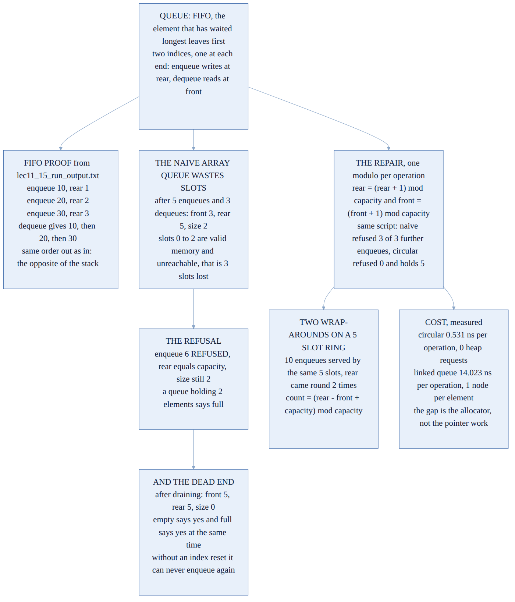

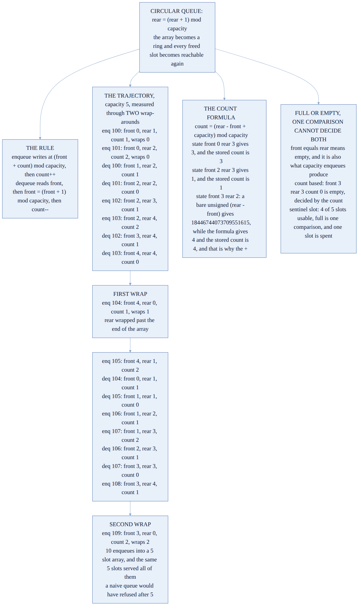

### The proof

| Fact | Measured value | Capture file |
|---|---|---|
| FIFO order | 10 20 30 in, 10 20 30 out | `lec11_15_run_output.txt` |
| `sizeof(NaiveQueue<int,5>)` | 48 bytes | `lec11_15_run_output.txt` |
| `sizeof(CircularQueue<int,5>)` | 64 bytes | `lec11_15_run_output.txt` |
| slots lost at the refusal | 3 of 5 | `lec11_15_run_output.txt` |
| naive against circular on the same script | 3 refusals against 0 | `lec11_15_run_output.txt` |
| wrap-arounds on a 5 slot ring | 2 | `lec11_15_run_output.txt` |
| circular cost per operation | 0.531 ns | `lec11_15_run_output.txt` |
| linked queue cost per operation | 14.023 ns | `lec11_15_run_output.txt` |

### The C formulation

```c
#include <stddef.h>

#define CAP 5
struct CircularQueue {
    int data[CAP];
    size_t front;
    size_t count;
};

int enqueue(struct CircularQueue *q, int x) {
    if (q->count == CAP) return 0;                       /* full, refuse */
    q->data[(q->front + q->count) % CAP] = x;
    q->count++;
    return 1;
}

int dequeue(struct CircularQueue *q, int *out) {
    if (q->count == 0) return 0;                         /* empty, refuse */
    *out = q->data[q->front];
    q->front = (q->front + 1) % CAP;
    q->count--;
    return 1;
}
```

### Exam traps

| Trap | What costs the marks |
|---|---|
| the naive queue's dead end | after a full drain `front` and `rear` both equal capacity, so `empty` and `full` are both true and it can never enqueue again |
| a count member is not optional in the ring | `front == rear` means empty and it is also what `capacity` enqueues produce |
| the wrapped subtraction | a bare unsigned `(rear - front)` gives 18446744073709551615, which is why `+ capacity` is in the formula |
| the sentinel design costs a slot | the count design stores all 5 slots, the sentinel design stores 4 of 5 |

### Numericals

1. Enqueue 10, then 20, then 30, then dequeue twice. Give both values that leave.
2. A naive array queue of capacity 5 has had 5 enqueues and 3 dequeues. Give `front`, `rear`, `size` and the number of free slots below `front`.
3. In that state, `enqueue(6)` is attempted. Say what happens and why, with the two numbers that disagree.
4. After the queue is fully drained, `front = 5` and `rear = 5`, `size = 0`. Say what `empty()` and `full()` each return, and what the queue can never do again without a reset.
5. A circular queue has capacity 5, `front = 2`, `rear = 4`. Give the element count, the slot the next enqueue writes, the new `rear`, and the count after that enqueue. Is it full then?
6. The capture's trajectory makes 10 enqueues into a 5 slot ring. Give the number of wrap-arounds and say what a naive queue would have done after 5.
7. Evaluate `count = (rear - front + capacity) mod capacity` for `front = 3`, `rear = 2`, capacity 5, and give the bare unsigned difference as well.
8. A circular queue costs 0.531 ns per operation and a linked queue 14.023 ns. Give both and the ratio the capture prints.
9. Say how many of its 5 slots each of the two full detection designs can store.

---

## 5 · Linked List

### The plain explanation

*Scope: in the mid-term block, handout lectures 6 to 8. Source: capture `lec05_run_output.txt`, lessons `06_linked_list_representation.cpp`, `07_linked_list_operations.cpp`, `08_linked_list_searching_apps.cpp`.*

A linked list stores each value in its own small block, with a pointer to the next block. The
list object itself holds only a head pointer, so it does not care how many elements exist. It
exists because an array cannot grow and cannot insert in the middle without shifting. Here
inserting at the front is three pointer writes whatever the length is, and no element moves. The
price is that reaching element i means following i pointers one at a time, and that every node is
a separate allocation with its own overhead.
### The mechanism

| Field | Offset | Size | Note |
|---|---|---|---|
| `data` | 0 | 4 | the payload |
| padding | 4 | 4 | no member owns these bytes |
| `next` | 8 | 8 | address of the next node, 0 marks the end |

| Step | Writes | Cost |
|---|---|---|
| `p = malloc(sizeof *p)` | allocator call | one allocation |
| `p->next = head` | one pointer write | O(1) |
| `head = p` | one pointer write | O(1) |
| traverse to position i | `cur = cur->next` i times | O(i) |

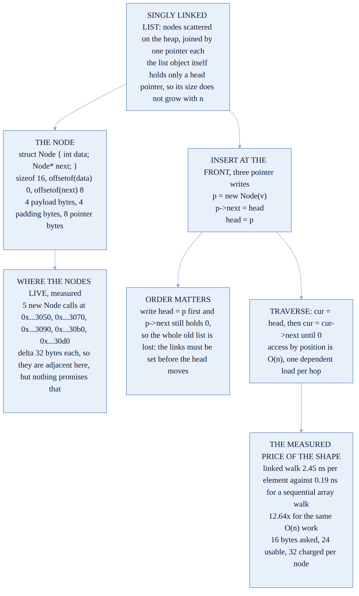

### The proof

| Fact | Measured value | Capture file |
|---|---|---|
| `sizeof(Node)` | 16, offsets 0 and 8 | `lec05_run_output.txt` |
| five `new Node` addresses | 0x...3050 to 0x...30d0, stride 32 | `lec05_run_output.txt` |
| requested, usable, charged | 16, 24, 32 bytes | `lec05_run_output.txt` |
| linked walk | 2.45 ns per element | `lec05_run_output.txt` |
| sequential array walk | 0.19 ns per element | `lec05_run_output.txt` |
| search 30 in a 5 node list | 3 comparisons | `lec08` lesson run |
| search an absent key | 5 comparisons, the whole list | `lec08` lesson run |

### The C formulation

```c
#include <stddef.h>
#include <stdlib.h>

struct Node {
    int data;
    struct Node *next;
};

struct Node *push_front(struct Node *head, int v) {
    struct Node *p = (struct Node *)malloc(sizeof(struct Node));
    if (!p) return head;
    p->data = v;
    p->next = head;      /* link first */
    return p;            /* the new head */
}

size_t length(const struct Node *head) {
    size_t n = 0;
    for (const struct Node *c = head; c; c = c->next) n++;
    return n;
}
```

### Exam traps

| Trap | What costs the marks |
|---|---|
| the two link statements have an order | `head = p` before `p->next = head` loses the whole old list |
| access is O(n), not O(1) | a linked list cannot binary search, there is no index arithmetic to jump with |
| deleting needs the predecessor | a singly linked list must walk to the node before the one being removed, so deletion by value is O(n) |
| the node is not the payload | 16 bytes asked for, 24 usable, 32 charged, and the difference is allocator bookkeeping |

### Numericals

1. The list is `10 -> 20 -> 30 -> NULL`. Give the traversal output and `sizeof` of one node.
2. Break the node's 16 bytes into payload, padding and pointer, with the offset of each.
3. Given `10 -> 20 -> 40 -> 50 -> NULL`, insert 30 so the list stays sorted. Give the pointer writes and the cost.
4. For the same list, delete the last node. Give the pointer writes, the cost, and why it is not O(1).
5. A linked list holds 300 integers. Give the bytes requested, the bytes the allocator reports usable, the bytes charged at the measured stride, the bytes the same 300 values cost in an array, and the ratio of charged to array.
6. The list is `10 -> 20 -> 30 -> 40 -> 50 -> NULL`. Give the comparison count for searching 30 and for searching 35, and say why the second is larger.
7. For that 5 node list give the best, worst and average comparison counts for a successful search.
8. Explain in one line why a sorted linked list cannot answer a query in O(log n) the way a sorted array can.

---

## 6 · Merge Sort

### The plain explanation

*Scope: in the handout, tagged End Term, lecture 27. Source: capture `lec16_18_sorts_run_output.txt`, lesson `17_merge_sort.cpp`.*

Merge sort splits the data in half, sorts each half the same way, then merges the two sorted
halves in one linear pass. It exists because it makes a guarantee the simple sorts cannot: the
split is by position, so the recursion tree is balanced whatever the values are. The depth is
log2 n for every input, and the cost is about n log2 n comparisons in the best, average and worst
case. It is stable too, because the merge takes from the left run when two keys are equal. The
price is a second copy of the data.
### The mechanism

| Step | Left front | Right front | Take | Result so far |
|---|---|---|---|---|
| 1 | 2 | 1 | 1 | 1 |
| 2 | 2 | 4 | 2 | 1 2 |
| 3 | 5 | 4 | 4 | 1 2 4 |
| 4 | 5 | 8 | 5 | 1 2 4 5 |
| 5 | 9 | 8 | 8 | 1 2 4 5 8 |
| 6 | 9 | 10 | 9 | 1 2 4 5 8 9 |
| 7 | 11 | 10 | 10 | 1 2 4 5 8 9 10 |
| 8 | 11 | empty | 11 | 1 2 4 5 8 9 10 11 |

Comparisons in that merge: 7, against the bounds 4 and 7 for runs of 4 and 4.

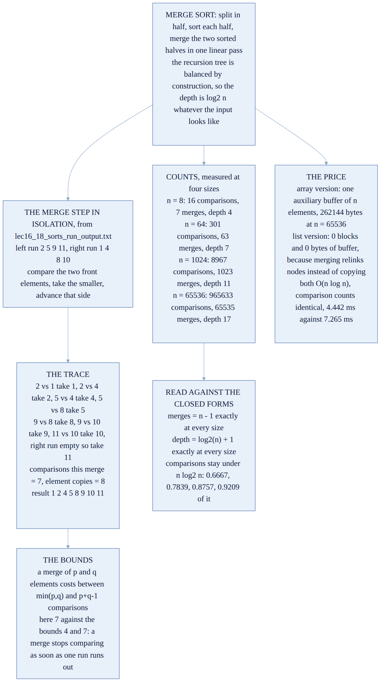

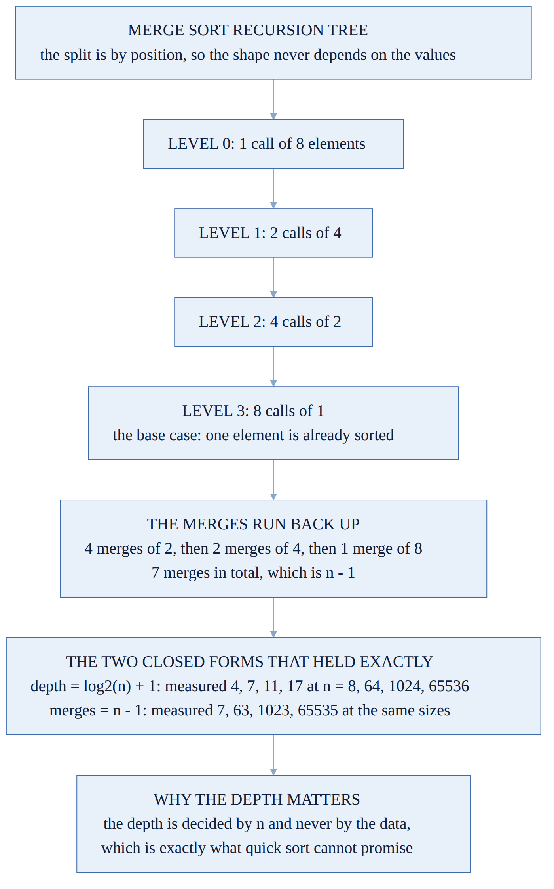

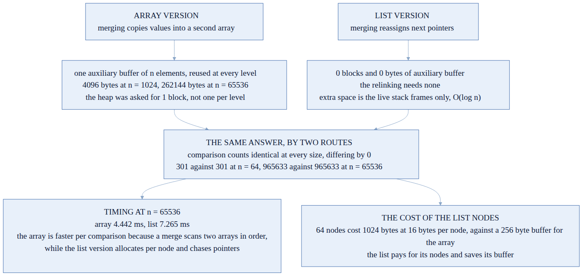

### The proof

| n | comparisons | merges | n − 1 | element copies | n log₂ n | depth | log₂ n + 1 |
|---|---|---|---|---|---|---|---|
| 8 | 16 | 7 | 7 | 24 | 24 | 4 | 4 |
| 64 | 301 | 63 | 63 | 384 | 384 | 7 | 7 |
| 1024 | 8967 | 1023 | 1023 | 10240 | 10240 | 11 | 11 |
| 65536 | 965633 | 65535 | 65535 | 1048576 | 1048576 | 17 | 17 |

All rows from `lec16_18_sorts_run_output.txt`. Merges equal n − 1 and depth equals log₂ n + 1
exactly at every size. The auxiliary buffer is one block, not one per level: 4096 bytes at
n = 1024, 262144 bytes at n = 65536. The linked list version allocated 0 blocks and 0 bytes for a
buffer, and its comparison counts differed from the array version by 0 at every size.

### The C formulation

```c
void merge(int *a, int lo, int mid, int hi, int *buf) {
    int i = lo, j = mid, k = lo;
    while (i < mid && j < hi)
        buf[k++] = (a[i] <= a[j]) ? a[i++] : a[j++];   /* <= keeps it stable */
    while (i < mid) buf[k++] = a[i++];
    while (j < hi)  buf[k++] = a[j++];
    for (int t = lo; t < hi; t++) a[t] = buf[t];
}

void merge_sort(int *a, int lo, int hi, int *buf) {
    if (hi - lo < 2) return;                  /* base case: one element is sorted */
    int mid = lo + (hi - lo) / 2;             /* no overflow, no midpoint bug */
    merge_sort(a, lo, mid, buf);
    merge_sort(a, mid, hi, buf);
    merge(a, lo, mid, hi, buf);
}
```

### Exam traps

| Trap | What costs the marks |
|---|---|
| the measured count is not n log₂ n | it is below it, 0.6667 to 0.9209 of it, because a merge stops when one run empties |
| merges are n − 1, not n | 7 merges at n = 8, 65535 at n = 65536, measured |
| the buffer is n, not n log n | one buffer reused at every level, 4096 bytes at n = 1024 |
| stability comes from `<=` | writing `<` takes from the right run on a tie and the sort stops being stable |

### Numericals

1. Merge `2 5 9 11` with `1 4 8 10`. Give the comparisons, the result, and the two bounds for a merge of 4 and 4 elements.
2. Merge sort `0 5 1 2 6 4 7 3` (the capture's seed 20260918). Give the number of merges, the element copies, the comparisons and the recursion depth.
3. At n = 1024 the measured comparisons are 8967 against n log₂ n = 10240. Give the ratio the capture prints.
4. At n = 65536 give the measured depth and the closed form log₂ n + 1.
5. Give the auxiliary array bytes requested and the allocator usable size at n = 1024.
6. The list version at n = 64: give the blocks and bytes it allocated for a buffer, and its comparison count against the array version.
7. Write the recurrence for merge sort and solve it for n a power of two. State the Θ class.
8. Give the worst case comparison bound for merge sort at n = 8 using n·⌈log₂ n⌉ − 2^⌈log₂ n⌉ + 1, and compare it with the measured 16.

---

## 7 · Quick Sort

### The plain explanation

*Scope: in the handout, tagged End Term, lecture 29. Source: capture `lec16_18_sorts_run_output.txt`, lesson `18_quick_sort.cpp`.*

Quick sort picks a pivot, moves everything smaller to its left and everything larger to its right,
then repeats on both sides. It exists because that partition is a single linear pass that works in
place, so it needs no second copy of the data. Its cost is the depth of the recursion: log₂ n
levels when the pivot splits the range evenly, n levels when it does not. Nothing is guaranteed
about the split, because the split is decided by the data and the pivot rule together. That is why
the pivot choice is the whole subject of this topic.

### The mechanism

| Step | `[lo,hi)` | pivot | lands at | left size | right size | comparisons | swaps |
|---|---|---|---|---|---|---|---|
| 1 | [0,8) | 3 at index 7 | 3 | 3 | 4 | 7 | 3 |
| 2, sorted input | [0,8) | 7 at index 7 | 7 | 7 | 0 | 7 | 0 |
| 3 | [0,7) | 6 at index 6 | 6 | 6 | 0 | 6 | 0 |
| 4 | [0,6) | 5 at index 5 | 5 | 5 | 0 | 5 | 0 |

Steps 2 to 4 continue down to 1, and 7 + 6 + 5 + 4 + 3 + 2 + 1 = 28, which is n(n − 1)/2 at
n = 8. On the sorted input nothing ever needs to move, so the swaps column stays 0.

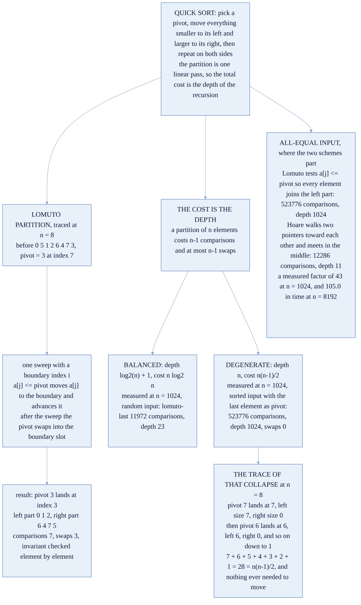

### The proof

| Input | Variant | n | comparisons | swaps | depth |
|---|---|---|---|---|---|
| random | lomuto-last | 1024 | 11972 | 4988 | 23 |
| random | hoare-first | 1024 | 15713 | 2458 | 23 |
| sorted | lomuto-last | 1024 | 523776 | 0 | 1024 |
| sorted | lomuto-median3 | 1024 | 9229 | 1024 | 11 |
| all-equal | lomuto-last | 1024 | 523776 | 0 | 1024 |
| all-equal | hoare-first | 1024 | 12286 | 5120 | 11 |

All rows from `lec16_18_sorts_run_output.txt`. Read them against the two closed forms the capture
prints: n(n − 1)/2 = 523776 and n log₂ n = 10240 at n = 1024. At n = 8192 on all-equal input the
capture measures 139260 comparisons in 0.131 ms for hoare-median3 against 33550336 comparisons in
13.760 ms for lomuto-last, a factor of 105.0 in time from the pivot choice alone.

### The C formulation

```c
int lomuto(int *a, int lo, int hi) {
    int pivot = a[hi - 1];            /* last element as pivot */
    int i = lo;
    for (int j = lo; j < hi - 1; j++) {
        if (a[j] <= pivot) {          /* <= sends every equal element left */
            int t = a[i]; a[i] = a[j]; a[j] = t;
            i++;
        }
    }
    int t = a[i]; a[i] = a[hi - 1]; a[hi - 1] = t;
    return i;                          /* the pivot's final index */
}

void quick_sort(int *a, int lo, int hi) {
    if (hi - lo < 2) return;
    int p = lomuto(a, lo, hi);
    quick_sort(a, lo, p);              /* the pivot is already in place */
    quick_sort(a, p + 1, hi);
}
```

### Exam traps

| Trap | What costs the marks |
|---|---|
| the worst case is reachable with real data | sorted input with a last element pivot gives 523776 comparisons and depth 1024 at n = 1024 |
| all-equal input is not a best case | Lomuto sends every equal element left, so it is quadratic, and median-of-three does not rescue it |
| quick sort is not stable | the partition swaps elements across the whole range, so equal keys change order |
| median-of-three does not remove the bound | it decides which inputs reach the quadratic case, not whether the case exists |

### Numericals

1. Lomuto partition on `0 5 1 2 6 4 7 3` with the last element as pivot. Give the pivot's final index, the comparisons, the swaps, and the array after the partition.
2. The same code on the already sorted `0 1 2 3 4 5 6 7`. Give the comparisons, the recursion depth and the swaps.
3. At n = 1024 on sorted input with the last element as pivot, give the comparisons and the depth, and the two closed forms they equal.
4. At n = 1024 on all-equal input, give comparisons and depth for lomuto-last and for hoare-first.
5. Give the ratio between those two comparison counts, as the capture states it.
6. At n = 8192 on all-equal input, give the fastest and the slowest variant with their comparison counts and times, and the factor the capture prints.
7. At n = 65536 on random input, give the swap counts for lomuto-last and for hoare-first.
8. Is quick sort stable? Answer in one line with the reason.
9. On the sorted input at n = 8, median-of-three samples `a[0] = 0`, `a[3] = 3`, `a[7] = 7`. Give the index it picks and why that is the pivot that splits the range in half.

---

## 8 · Algorithm fundamentals

### The plain explanation

*Scope: never as a single row, spread through the handout plan. Source: capture `lec22_analysis_run_output.txt`, lesson `22_algorithm_analysis.cpp`, textbook CLRS, Introduction to Algorithms.*

An algorithm is a finite sequence of unambiguous, effectively computable steps that takes zero or
more inputs, produces one or more outputs, and terminates. The definition exists because those
five properties are exactly the things that can go wrong, and each one can be checked. An
algorithm is judged on three axes: is it correct, how much time does it take, and how much extra
space does it need. Correctness is checked first, and it is checked by comparison against an
independent answer, never by inspection.

### The mechanism

| Property | Meaning | What breaks without it |
|---|---|---|
| Input | zero or more values are given | nothing to work on |
| Output | one or more results come back | no answer to hand in |
| Definiteness | every step is stated exactly | the same input can give two answers |
| Finiteness | it ends after a finite number of steps | a recursion with no base case runs the stack out |
| Effectiveness | every step is basic enough to carry out | the steps cannot be executed at all |

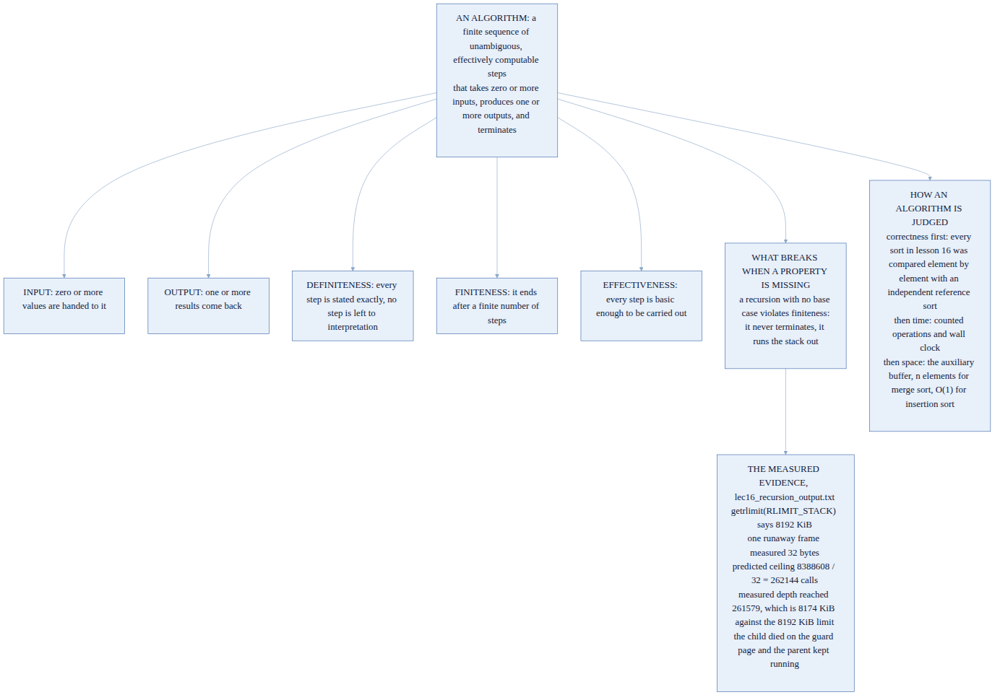

### The proof

| Fact | Measured value | Capture file |
|---|---|---|
| stack limit, `getrlimit(RLIMIT_STACK)` | 8192 KiB | `lec16_recursion_output.txt` |
| one runaway frame | 32 bytes | `lec16_recursion_output.txt` |
| predicted ceiling | 8388608 / 32 = 262144 calls | `lec16_recursion_output.txt` |
| depth actually reached | 261579 calls | `lec16_recursion_output.txt` |
| that depth in memory | 8174 KiB against the 8192 KiB limit | `lec16_recursion_output.txt` |
| correctness check used | element by element against an independent reference sort | `lec16_18_sorts_run_output.txt` |

The difference between prediction and measurement is 565 calls, 0.215530 percent. The child died
on the guard page, and the parent kept running, so the failure was reported instead of guessed.

### The C formulation

```c
/* the five properties, made checkable in code */
int sum_to(int n) {                 /* input: n. output: one int */
    if (n <= 0) return 0;           /* definiteness and finiteness: the base case */
    return n + sum_to(n - 1);       /* effectiveness: one add per step */
}
```

### Exam traps

| Trap | What costs the marks |
|---|---|
| a recursion with no base case violates finiteness | name finiteness, and give the measured depth and the limit |
| correctness before complexity | a fast wrong answer is worth nothing, so state the reference comparison first |
| an algorithm is not a program | the algorithm is the step sequence, the program is one implementation of it |
| a stack overflow is not a wrong answer | the code dies with a fault, it does not return a bad number |

### Numericals

1. Name the five properties of an algorithm.
2. Say which property a recursion with no base case violates.
3. Give the measured stack limit, the measured frame stride of the runaway, the predicted ceiling and the depth actually reached.
4. State the difference between an algorithm and a program in one line.
5. Say why correctness is checked before complexity, and name the check this project used.
6. At n = 8 the reference checksum is 14498326412155018299. Say which four runs produced that same value and what that proves.
7. Give the time complexity of searching for a value in an unsorted array of n elements, best and worst case.
8. Name the three axes an algorithm is judged on.

---

## 9 · Asymptotic notation

### The plain explanation

*Scope: not in the handout, the token appears 0 times in the lecture plan. Source: capture `lec22_analysis_run_output.txt`, textbook Goodrich and Tamassia, Algorithm Design, and CLRS chapter 3.*

Asymptotic notation describes how a cost grows with the input size, not how long one run takes on
one machine. Big O is an upper bound: past some input size the cost stays under a constant times
a model function. Ω is the matching lower bound, and Θ is both at once. The notation exists so two algorithms can be compared without timing them, and the
comparison is only meaningful when the certificate is stated: which constant, and from which
input size. That pair is checkable by evaluating both sides of the inequality.

### The mechanism

| Claim | Meaning | Certificate shape |
|---|---|---|
| f is O(g) | f(n) ≤ c·g(n) for all n ≥ n₀ | one constant c, one threshold n₀ |
| f is Ω(g) | f(n) ≥ c·g(n) for all n ≥ n₀ | one constant c, one threshold n₀ |
| f is Θ(g) | c₁·g(n) ≤ f(n) ≤ c₂·g(n) for all n ≥ n₀ | two constants, one shared n₀ |

For f(n) = 3n² + 5n + 7 against g(n) = 4n², scanned over n = 1 to 20000:

| Candidate c | Upper bound f ≤ c·g | Lower bound f ≥ c·g |
|---|---|---|
| 3/4 | fails from n = 1, no n₀ | certified from n = 1, smallest margin 12 |
| 9/10 | certified from n = 10, margin 3 | fails from n = 10, never recovers |
| 1/1 | certified from n = 7, margin 7 | fails from n = 7, no n₀ |
| 2/1 | certified from n = 2, margin 3 | fails from n = 2, no n₀ |

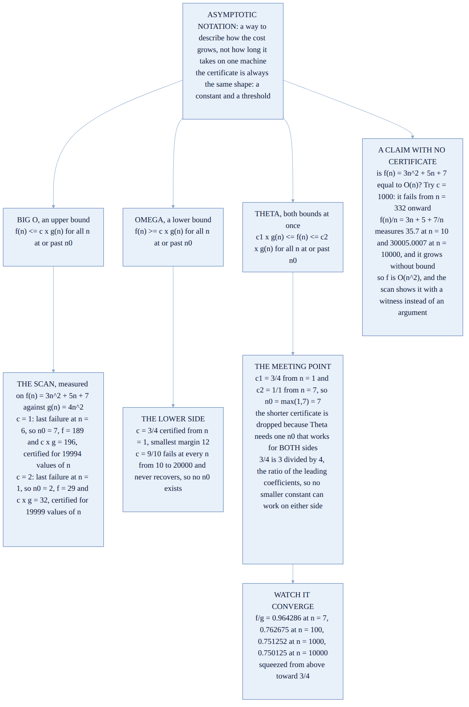

### The proof

| Fact | Measured value | Capture file |
|---|---|---|
| c = 1 upper bound | last failure n = 6, n₀ = 7, f = 189 against c·g = 196 | `lec22_analysis_run_output.txt` |
| tail verified for c = 1 | 19994 values of n | `lec22_analysis_run_output.txt` |
| largest lower bound constant | 3/4, certified from n = 1 | `lec22_analysis_run_output.txt` |
| 3/4 as an upper bound | fails at n = 1 | `lec22_analysis_run_output.txt` |
| Θ certificate | c₁ = 3/4 from n = 1, c₂ = 1 from n = 7, n₀ = max(1,7) = 7 | `lec22_analysis_run_output.txt` |
| violations at n₀ = 7 | 0 below, 0 above, over 19994 values | `lec22_analysis_run_output.txt` |
| f/g convergence | f(n)/g(n) → 3/4 as n → ∞: 0.964286, 0.762675, 0.751252, 0.750125 at n = 7, 100, 1000, 10000 | `lec22_analysis_run_output.txt` |
| the O(n) claim | c = 1000 fails from n = 332 | `lec22_analysis_run_output.txt` |

### The C formulation

```c
/* a certificate is a constant and a threshold, and both can be checked in code */
int certifies_upper(long long (*f)(long long), long long (*g)(long long),
                    double c, long long n0, long long limit) {
    for (long long n = n0; n <= limit; n++)
        if ((double)f(n) > c * (double)g(n)) return 0;   /* the bound is broken */
    return 1;                                            /* certified over the tail */
}
```

### Exam traps

| Trap | What costs the marks |
|---|---|
| the constant is not the class | 100·n is still O(n), and 3n² + 5n + 7 is still O(n²) |
| Θ needs one n₀ for both sides | the certificate from n = 1 is dropped when the upper bound needs n = 7 |
| the constant is the ratio of leading coefficients | 3 divided by 4 is 3/4, and no smaller constant works on either side |
| an absent certificate is not a proof | "f is O(n)" fails the scan, and the measured ratio f(n)/n grows without bound |

### Numericals

1. Write the formal definition of Θ(g(n)) in one line.
2. Show that 3n² + 5n + 7 is O(n²) using the capture's certificate for c = 1. Give the last failing n, n₀, and both sides at n₀.
3. Repeat for c = 2, and say why a looser constant buys a smaller n₀.
4. Give the largest constant that works as a lower bound for that f and g, and say at which constant the lower bound dies.
5. Give the full Θ certificate for that pair: c₁, c₂, n₀, and the number of violations on each side.
6. Show that 3n² + 5n + 2 is O(n²). Give the smallest integer c and the smallest n₀ that work with it, and verify at n₀ − 1 and at n₀.
7. Give the measured values of f(n)/n at n = 10, 100, 1000 and 10000, and say what they prove about the claim f is O(n).
8. Give the thresholds n₀ at which n² overtakes k·n·log₂ n for k = 8, k = 64 and k = 1024.
9. The capture prints the growth of 2ⁿ against n³ over one decade of n. Give the factor for 2ⁿ and for n³, and the ratio at n = 10000.

---

## 10 · Finding Complexity

### The plain explanation

*Scope: not in the handout, the token appears 0 times in the lecture plan. Source: capture `lec22_analysis_run_output.txt`, lesson `22_algorithm_analysis.cpp`.*

Finding complexity means counting the operations an algorithm performs and then naming the class
of that count, written as a bound on a model function. It exists because the class is what decides
whether a solution survives a larger input, and because a count can be checked while a guess
cannot. The count comes from the loop structure: one pass over n values is n, two nested passes
are n squared, halving each step is log2 n, and a triangular loop is n(n - 1)/2. Best, worst and
average case are then the same function measured on different inputs.
### The mechanism

| Loop shape | Count | At n = 1024, measured |
|---|---|---|
| `for (i = 0; i < n; i++)` | n | 1024 |
| `for (i...) for (j...)` | n² | 1048576 |
| `for (i = 1; i < n; i *= 2)` | ⌈log₂ n⌉ | 10 |
| `for (j = i+1; j < n; j++)` | n(n − 1)/2 | 523776 |
| `for (j = 0; j < i; j++)` | n(n − 1)/2 | 523776 |

Every count above was printed by the program next to a closed form it computed independently, and
the verdict column in the capture reads match for all of them.

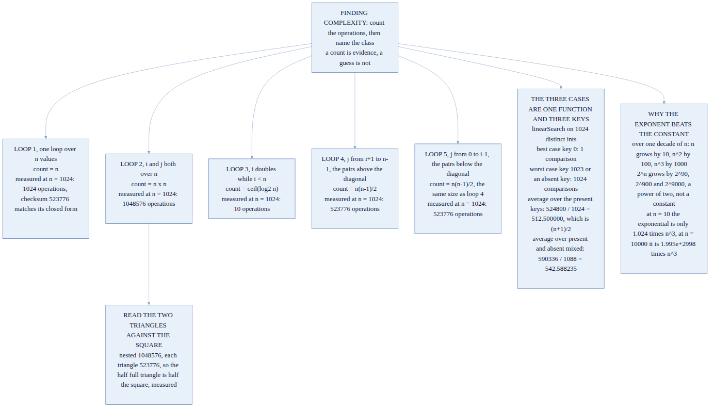

### The proof

| Case | Input | Comparisons | Closed form |
|---|---|---|---|
| best | key 0, present at index 0 | 1 | 1 |
| worst | key 1023, present at the last index | 1024 | n = 1024 |
| worst, absent | key 5000 | 1024 | n = 1024, the whole array |
| average, present keys | all 1024 keys | 512.500000 | (n + 1)/2 |
| average, present and absent mixed | 1088 keys | 542.588235 | 590336 / 1088 |

All rows from `lec22_analysis_run_output.txt`. Σ comparisons over the 1024 present keys is 524800,
and the capture checks that against 1024 × 1025 / 2.

### The C formulation

```c
#include <stddef.h>

size_t count_ops(size_t n) {
    size_t ops = 0;
    for (size_t i = 0; i < n; i++)      /* n */
        ops++;
    for (size_t i = 0; i < n; i++)      /* n * n */
        for (size_t j = 0; j < n; j++)
            ops++;
    for (size_t i = 1; i < n; i *= 2)   /* ceil(log2 n) */
        ops++;
    for (size_t i = 0; i < n; i++)      /* n(n-1)/2 */
        for (size_t j = i + 1; j < n; j++)
            ops++;
    return ops;
}
```

### Exam traps

| Trap | What costs the marks |
|---|---|
| count, then name the class | giving the class without the count is a guess, and the marks are for the count |
| the triangular loop is half the square | 523776 against 1048576 at n = 1024, measured |
| best case is not average case | 1 comparison against 542.588235 for one function |
| the exponent beats the constant | over one decade of n, n grows by 10, n² by 100, 2ⁿ by 2⁹⁰ |

### Numericals

1. Give the exact iteration count and the Θ class of `for (i = 1; i <= n; i++) for (j = 1; j <= i; j++) work();`. Evaluate at n = 10 and n = 100.
2. Give the operation count for two nested loops over n at n = 1024, and the count for one loop over n at the same size.
3. Give the count for the two triangular loops at n = 1024 and read both against the nested count.
4. Give the count for a loop that doubles its counter while it is below n, at n = 1024.
5. A loop body runs n² times and a second loop beside it halves a counter until it reaches 1. At n = 1024 give both counts, the total, the dominant term and the Θ class.
6. `linearSearch` walks 1024 distinct ints from index 0. Give the comparisons for key 0, for key 1023, and for an absent key.
7. Give the average comparisons for a successful search and for a mixed set of present and absent keys, and the two fractions behind them.
8. Give the factor by which each of n, n², n³ and 2^n multiplies when n is multiplied by 10.
9. `2^10000` is capped in the capture. Give the decimal exponent and the number of decimal digits, and say why the value itself cannot be printed.

---

## 11 · Trees fundamentals

### The plain explanation

*Scope: in the handout, tagged End Term, lecture 17. Source: capture `lec19_21_trees_run_output.txt`, lesson `19_tree_representation.cpp`, textbook Drozdek, Data Structures and Algorithms in C++.*

A tree is a set of nodes joined so that there is exactly one path from the root to any node, and
no cycles. A binary tree adds one rule: each node has at most two children, called left and right.
Trees exist because they turn a linear search into a decision at every step: at each node you
throw away one of two whole subtrees. That is what makes a search cost the height of the tree
instead of the number of nodes. The vocabulary is small: root, leaf, height, degree, depth.
### The mechanism

| Term | Meaning |
|---|---|
| root | the one node with no parent |
| leaf | a node with no children |
| height | the number of edges on the longest path from the root to a leaf |
| degree | the number of children of a node |
| depth of a node | the number of edges from the root down to it |

| Representation | Child of i | Parent of i | Cost |
|---|---|---|---|
| array by level, slot 1 is the root | left 2i, right 2i + 1 | i / 2, integer division | 4 bytes per slot, shape decides how many slots |
| node plus pointers | follow `left` at offset 8 | walk from the root | 24 bytes per node, 7 allocations for 7 nodes |

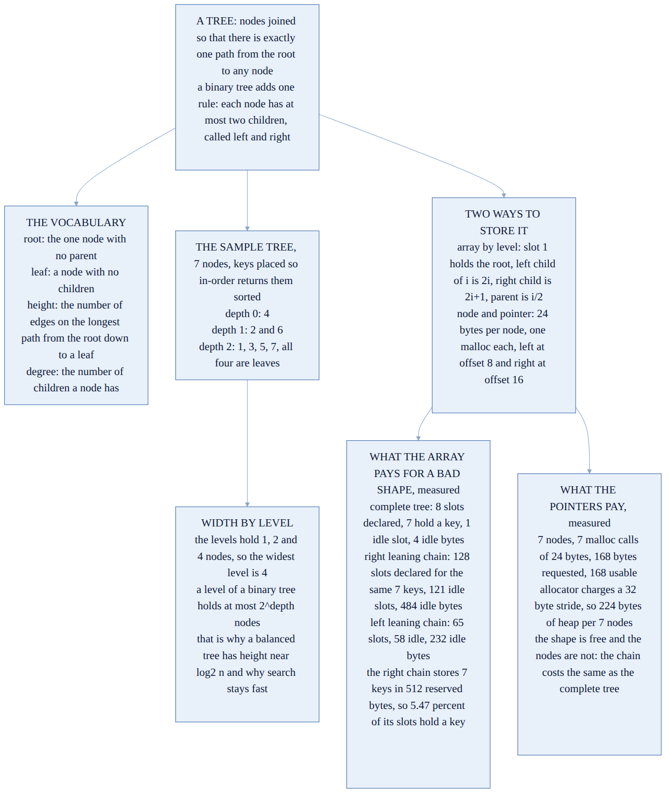

### The proof

| Shape | Slots declared | Slots holding a key | Idle slots | Idle bytes | Capture file |
|---|---|---|---|---|---|
| complete tree, 7 keys | 8 | 7 | 1 | 4 | `lec19_21_trees_run_output.txt` |
| right leaning chain, 7 keys | 128 | 7 | 121 | 484 | `lec19_21_trees_run_output.txt` |
| left leaning chain, 7 keys | 65 | 7 | 58 | 232 | `lec19_21_trees_run_output.txt` |
| pointer form, complete, 7 nodes | 7 allocations | 7 | 0 | 0 | `lec19_21_trees_run_output.txt` |
| pointer form, chain, 7 nodes | 7 allocations | 7 | 0 | 0 | `lec19_21_trees_run_output.txt` |

The right chain stores 7 keys of 4 bytes and reserves 512 bytes to do it, so 5.47 percent of its
slots hold a key. The pointer form charged 224 bytes of heap for the same 7 nodes, 7 × 32.

### The C formulation

```c
#include <stdlib.h>

struct Node {
    int key;
    struct Node *left;
    struct Node *right;
};

/* array by level: slot 1 holds the root, slot 0 stays unused */
#define LEFT(i)  (2 * (i))
#define RIGHT(i) (2 * (i) + 1)
#define PARENT(i) ((i) / 2)

int height(const struct Node *n) {
    if (!n) return 0;                    /* an empty tree has height 0 */
    int l = height(n->left), r = height(n->right);
    return 1 + (l > r ? l : r);
}
```

### Exam traps

| Trap | What costs the marks |
|---|---|
| height against depth | height counts down from a node to a leaf, depth counts from the root down to a node, and the two only agree on the root |
| the array pays by shape, not by node count | 128 slots for 7 keys in a right leaning chain, measured |
| the pointer form pays by node | 7 allocations for the chain, the same as for the complete tree |
| the level capacity is 2^depth | a level at depth d holds at most 2^d nodes, which is why a balanced tree is short |

### Numericals

1. Define root, leaf, height and degree, one line each.
2. The sample tree holds 4 at the root, 2 and 6 below it, and 1, 3, 5, 7 below those. Give the nodes at each depth and the widest level.
3. Give the maximum number of nodes on a level at depth d, and the maximum number of nodes in a binary tree of height h.
4. A complete binary tree has height 9. Give the maximum and the minimum number of nodes, with the formula for each.
5. In the array representation, slot 5 holds 50. Give its left child slot, its right child slot and its parent slot with the values the capture prints.
6. A complete 7 node tree is stored by level. Give the slots declared, the slots holding a key, the idle slots and the idle bytes.
7. The same 7 keys are skewed into a right leaning chain. Give the slots declared, the idle slots and the idle bytes, and the percentage of slots that hold a key.
8. The pointer form stores 7 nodes. Give the allocation count, the bytes requested, and the heap charged at the measured stride.
9. Give the measured depth of the 7 node named tree and of the 7 node chain, the bytes per frame, and the peak stack bytes for the chain.

---

## 12 · Formulation in C

### The plain explanation

*Scope: never as a single row, implied by every implementation row of the handout. Source: capture `lec23_formulations_run_output.txt`, lesson `23_structure_formulations.cpp`, textbook Kanetkar, Let Us C, structs and pointers.*

Formulation in C means writing the structure down so that the machine lays it out the way you
expect. Two rules produce every offset and every padding row: a member of size s and alignment a
starts at the first offset that is a multiple of a, and the whole struct is padded up to a
multiple of its own largest alignment. The topic exists because the paper asks for the byte
arithmetic, not for prose: sizeof, the offset of each member, how much padding there is, and which
layout wastes less.
### The mechanism

| Structure | Declaration | `sizeof` | Padding |
|---|---|---|---|
| array | `struct ArrayForm { int a[8]; };` | 32 | 0 |
| list node | `struct ListNodeForm { int data; ListNodeForm* next; };` | 16 | 4 bytes at 4 to 7 |
| stack by array | `struct ArrayStackForm { int data[8]; size_t top; };` | 40 | 0 |
| stack by linked list | `struct LinkedStackForm { ListNodeForm* top; size_t count; };` | 16 | 0 |
| queue by array | `struct ArrayQueueForm { int data[8]; size_t front; size_t back; };` | 48 | 0 |
| circular queue | `struct CircularQueueForm { int data[8]; size_t front; size_t count; };` | 48 | 0 |
| tree node | `struct TreeNodeForm { int key; TreeNodeForm* left; TreeNodeForm* right; };` | 24 | 4 bytes at 4 to 7 |
| BST wrapper | `class BstForm { TreeNodeForm* root_; size_t count_; };` | 16 | 0 |

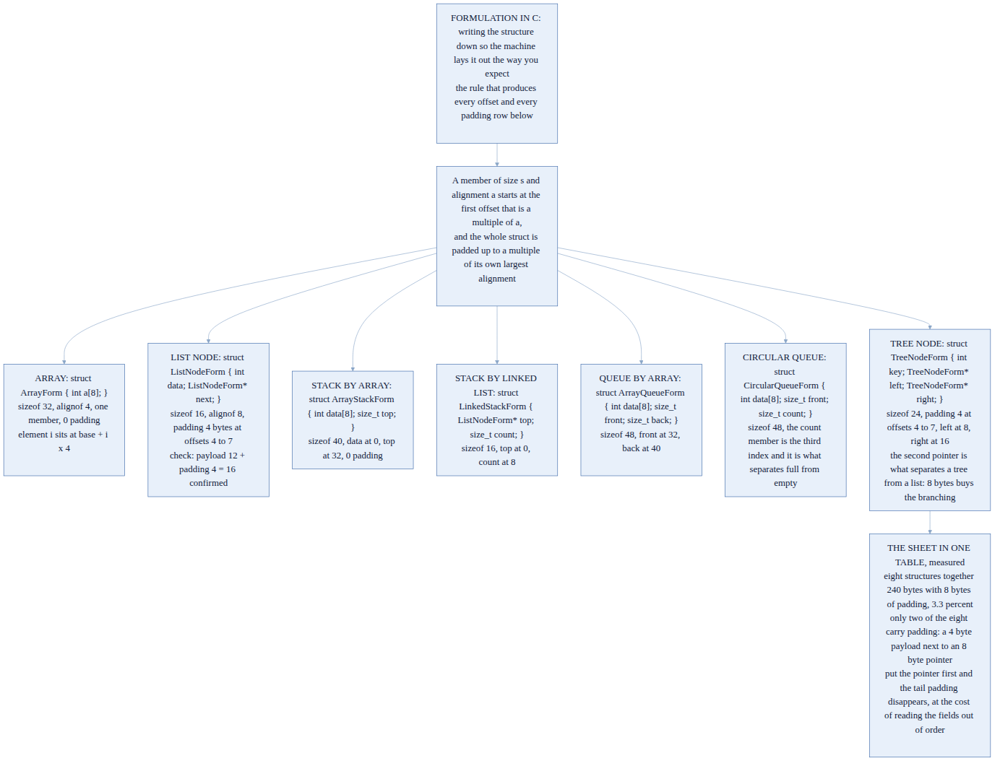

### The proof

| Fact | Measured value | Capture file |
|---|---|---|
| eight structures together | 240 bytes, 8 bytes of padding, 3.3 percent | `lec23_formulations_run_output.txt` |
| structures carrying padding | 2 of the 8 | `lec23_formulations_run_output.txt` |
| list node check | payload 12 + padding 4 = 16, confirmed | `lec23_formulations_run_output.txt` |
| tree node check | payload 20 + padding 4 = 24, confirmed | `lec23_formulations_run_output.txt` |
| wasted percentage, list node | 25.0 | `lec23_formulations_run_output.txt` |
| wasted percentage, tree node | 16.7 | `lec23_formulations_run_output.txt` |
| BST wrapper mirror check | 16 against 16, identical layout confirmed | `lec23_formulations_run_output.txt` |

### The C formulation

```c
#include <assert.h>
#include <stddef.h>

struct ListNodeForm {
    int data;                  /* offset 0, size 4 */
    struct ListNodeForm *next; /* offset 8, size 8, 4 padding bytes at 4 to 7 */
};

struct TreeNodeForm {
    int key;                   /* offset 0, size 4 */
    struct TreeNodeForm *left; /* offset 8 */
    struct TreeNodeForm *right;/* offset 16 */
};

/* the check the sheet performs on itself, in code */
static_assert(sizeof(struct ListNodeForm) == 16, "list node is 16 bytes");
static_assert(offsetof(struct ListNodeForm, next) == 8, "next sits at offset 8");
static_assert(sizeof(struct TreeNodeForm) == 24, "tree node is 24 bytes");
```

### Exam traps

| Trap | What costs the marks |
|---|---|
| write `sizeof(Node)` and show the struct on its own line | `sizeof(Node{int; Node*})` is not valid C, and a struct type name is not a value |
| the rule, not the table | state the multiple of alignment rule, then the offsets follow from it |
| a 4 byte payload next to an 8 byte pointer costs 4 | that single pattern is the only source of padding in the whole sheet |
| two index arrays can have the same `sizeof` | the queue and the ring are both 32 + 16, and the count member is what differs in meaning |

### Numericals

1. Give `sizeof` and every member offset for `struct Node { int data; Node* next; };`, and say where the padding sits.
2. Give `sizeof` for all eight structures of the sheet and the total with the padding figure.
3. Say why the queue by array is 48 bytes and not 40.
4. Say why the circular queue has the same `sizeof` as the plain queue by array.
5. Give `sizeof`, every offset and the padding for `struct TreeNodeForm { int key; TreeNodeForm* left; TreeNodeForm* right; };`.
6. Say which two of the eight structures carry padding and give the one pattern that explains both.
7. Give the wasted percentage of the tree node and of the list node.
8. Write the C declaration of a stack by array with capacity 8 and give its `sizeof`.
9. Write the C declaration of a BST wrapper class and give its `sizeof`, and say what the second member buys.

---

## 13 · Tree types and BST

### The plain explanation

*Scope: in the handout, tagged End Term, lectures 18 to 19. Source: capture `lec19_21_trees_run_output.txt`, lessons `20_tree_traversals.cpp` and `21_bst_operations.cpp`, textbooks Drozdek and Weiss.*

A binary search tree is a sorted sequence stored as shape. For every node, every key in its left
subtree is smaller and every key in its right subtree is larger. It exists because that one
invariant makes search, insert, minimum, maximum and successor all cost the height of the tree,
and it keeps the data in order without ever sorting an array. The catch is that the height is
decided by the insert order, not by the count: the same 31 keys give height 31 or height 5
depending on the order they arrive in.
### The mechanism

| Operation | Rule | Cost |
|---|---|---|
| search | one comparison per node on the path | O(h) |
| minimum | walk left until there is no left child | O(h) |
| maximum | walk right until there is no right child | O(h) |
| successor | leftmost node of the right subtree | O(h) |
| delete, case 1 | the node is a leaf, unlink it | O(h) to find it |
| delete, case 2 | one child, the child takes its place | O(h) to find it |
| delete, case 3 | two children, the successor's key is copied up, then the successor is removed as case 1 or 2 | O(h) |

| Insert order | Height | Shape |
|---|---|---|
| 1, 2, 3, ... 31 | 31 | a chain, every node has only a right child |
| 16, 8, 24, ... median first | 5 | perfectly balanced, 5 levels |

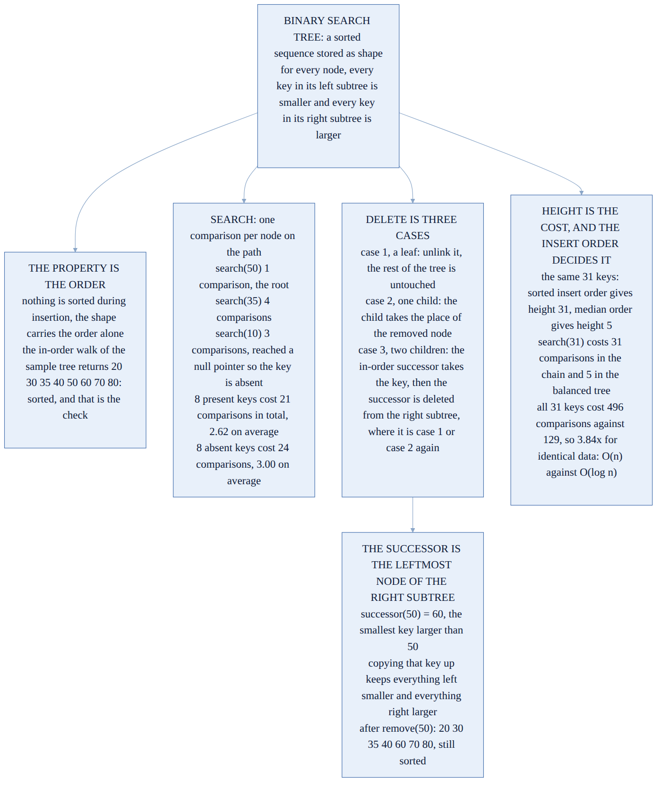

### The proof

| Fact | Measured value | Capture file |
|---|---|---|
| tree from insert order 50 30 70 20 40 60 80 35 | 8 nodes, height 4 | `lec19_21_trees_run_output.txt` |
| in-order walk | 20 30 35 40 50 60 70 80, sorted | `lec19_21_trees_run_output.txt` |
| search(50), search(35), search(80) | 1, 4, 3 comparisons | `lec19_21_trees_run_output.txt` |
| 8 present keys | 21 comparisons, 2.62 average | `lec19_21_trees_run_output.txt` |
| 8 absent keys | 24 comparisons, 3.00 average | `lec19_21_trees_run_output.txt` |
| successor(50), successor(80), successor(65) | 60, none, none | `lec19_21_trees_run_output.txt` |
| 31 keys, sorted order against median order | height 31 against 5 | `lec19_21_trees_run_output.txt` |
| comparisons for all 31 keys | 496 against 129, ratio 3.84 | `lec19_21_trees_run_output.txt` |

### The C formulation

```c
#include <stdio.h>
#include <stdlib.h>

struct Node {
    int key;
    struct Node *left;
    struct Node *right;
};

struct Node *insert(struct Node *root, int key) {
    if (!root) {                                  /* the empty tree case */
        struct Node *n = (struct Node *)malloc(sizeof(struct Node));
        n->key = key; n->left = n->right = NULL;
        return n;
    }
    if (key < root->key)      root->left  = insert(root->left,  key);
    else if (key > root->key) root->right = insert(root->right, key);
    return root;                                  /* equal keys are ignored here */
}

void inorder(const struct Node *root) {
    if (!root) return;
    inorder(root->left);
    printf("%d ", root->key);                     /* sorted order */
    inorder(root->right);
}
```

### Exam traps

| Trap | What costs the marks |
|---|---|
| height is not log n in general | sorted insert order gives height 31 for 31 keys, measured, so search is O(n) |
| the successor is not the right child | it is the leftmost node of the right subtree, which is why 60 succeeds 50 and not 70 |
| case 3 is two steps | copy the successor's key up, then delete the successor from the right subtree |
| equal keys need a stated policy | silently dropping them, or sending them left, changes the height and must be said out loud |

### Numericals

1. State the binary search tree ordering invariant in one line.
2. Insert 8, 3, 10, 1, 6, 14, 4, 7, 13 into an empty BST. Give the height in edges and the in-order sequence.
3. For the capture's tree (insert order 50 30 70 20 40 60 80 35) give the comparisons for searching 50, 35 and an absent key 10.
4. Give the total and average comparisons for the 8 present keys and for the 8 absent keys.
5. Give successor(50), successor(80) and successor(65).
6. The tree is rebuilt and the leaf 20 is deleted. Give the new in-order sequence, the size and the height.
7. From the same tree, 40 is deleted and it has one child. Give the new in-order sequence and the new height.
8. From the same tree, 50 is deleted and it has two children. Give the successor, the new in-order sequence and the height.
9. Insert the same 31 keys in sorted order and then in median order. Give both heights and both total comparison counts for searching all 31 keys.
10. A BST holds 15 nodes. Give the minimum height, the maximum height, and the average number of comparisons for a successful search in the balanced case, with the level arithmetic.

---

## 14 · Different Operations

### The plain explanation

*Scope: never as a single row, implied by the handout session outcomes. Source: every capture listed above, lesson `22_algorithm_analysis.cpp`.*

Different operations is the comparison table: the same data, five shapes, and a different bill for
each operation. A structure is not good or bad on its own, it is good or bad at one operation. An
array gives O(1) access by position and pays O(n) to insert at the front. A linked list is the
exact reverse. A stack offers only its top, a queue only its two ends, and a BST orders its data
by shape. The measured columns are what turn that table from an opinion into a decision.
### The mechanism

| Operation | Array | Linked list | Stack by array | Circular queue | BST |
|---|---|---|---|---|---|
| access by position | O(1), 1 read | O(n), n hops | not offered | not offered | O(h), h comparisons |
| search a value | O(n) | O(n) | O(n) | O(n) | O(h) |
| insert at the front | O(n), shift all | O(1), 2 writes | push at top O(1) | not offered | O(h) |
| insert at the rear | O(1), or O(n) on a grow | O(n) without a tail pointer | not offered | O(1), 3 writes | O(h) |
| delete at the front | O(n), shift back | O(1), 1 write plus 1 free | pop O(1) | O(1), 3 writes | O(h) |
| find the minimum | O(n) | O(n) | O(n) | O(n) | O(h), walk left |

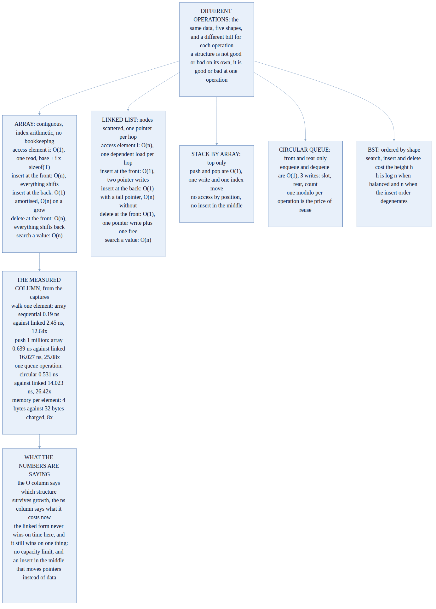

### The proof

| Operation | Array | Linked | Ratio | Capture file |
|---|---|---|---|---|
| walk one element | 0.19 ns sequential | 2.45 ns | 12.64× | `lec05_run_output.txt` |
| walk one element, array out of order | 2.46 ns | 2.45 ns | 12.69× against sequential | `lec05_run_output.txt` |
| push, 1 million elements | 0.639 ns | 16.027 ns | 25.08× | `lec11_15_run_output.txt` |
| pop, 1 million elements | 0.323 ns | 8.330 ns | 25.79× | `lec11_15_run_output.txt` |
| one queue operation | circular 0.531 ns | 14.023 ns | 26.42× | `lec11_15_run_output.txt` |
| memory per element | 4 bytes | 32 bytes charged | 8× | `lec05_run_output.txt` |

The capture also prints the two stack operations averaged over 2 million operations: push 0.688 ns
and pop 0.378 ns, which average to 0.533 ns.

### The C formulation

```c
#include <stddef.h>
#include <stdlib.h>

struct Node {
    int data;
    struct Node *next;
};

/* one operation, two structures: insert at the front */
void array_push_front(int *a, size_t *n, int v) {   /* O(n): everything shifts right */
    for (size_t i = *n; i > 0; i--) a[i] = a[i - 1];
    a[0] = v;
    (*n)++;
}

struct Node *list_push_front(struct Node *head, int v) {   /* O(1): two pointer writes */
    struct Node *p = (struct Node *)malloc(sizeof(struct Node));
    if (!p) return head;
    p->data = v;
    p->next = head;
    return p;
}
```

### Exam traps

| Trap | What costs the marks |
|---|---|
| give the O and the measured number | the table wants both columns, because the constant is where the 26× lives |
| O(1) is not always faster | the linked push is O(1) and still 25.08× slower than the array push, measured |
| insert in the middle is where the list wins | the array shifts data, the list rewrites two pointers, once you have walked there |
| the array wins on cache | 0.19 ns sequential against 2.45 ns scattered on the same array, so the shape beats the instruction count |

### Numericals

1. Fill the operation cost matrix for the array against the linked list over access by position, insert at the front, insert at the rear, delete at the front and search a value, with the O cost of each.
2. Give the measured nanoseconds per element for a sequential array walk, a scattered array walk and a linked walk, with the two ratios the capture prints.
3. Give the measured push cost per element for the array stack and the linked stack at 1 million elements, and the ratio.
4. Give the measured pop cost per element for the same two structures, and the ratio.
5. Give the measured cost of one queue operation for the circular array queue and the linked queue, and the ratio.
6. Give the memory per element for an array and for a linked list as the capture measures it, and the ratio.
7. Give the two per operation stack times at 2 million operations and their average.
8. Say which structure to choose for inserting in the middle of a large collection and why, and state the cost of the step you pay first.
9. Say which structure wins on cache behaviour, with the two measured numbers that show it.

---

## Answer keys

Keys are here, separate from the questions above. Each key is numbered 1 to 1 with its own topic's
questions. Derived arithmetic is marked as derived; everything else is quoted from a capture.

### Topic 1 · Array

| # | Answer |
|---|---|
| 1 | `&a[3]` = 0x7ffe7c3131b0 + 3 × 4 = 0x7ffe7c3131bc, and the value there is 40 |
| 2 | byte offset 16, address 0x7ffe7c3131c0 |
| 3 | 8 × 4 = 32 bytes, `&a[5]` = 0x1014, `&a[7]` = 0x101c |
| 4 | `&a[1023]` = 0x2000 + 1023 × 4 = 0x2ffc, one multiply and one add against 1024 loads |
| 5 | 0.19 ns sequential, 2.46 ns scattered, ratios 12.69× and 12.64× as printed; the 0.19 is the O(1) case, one load per element with the prefetcher helping |
| 6 | char 1, short 2, int 4, long 8, float 4, double 8, void* 8 |
| 7 | `sizeof` 12, `a` at 0, `b` at 4, `c` at 8, with padding at offsets 1 to 3 and 9 to 11 |
| 8 | offsets 4 to 7, 4 bytes that no member owns, because `next` is an 8 byte pointer and must start on an 8 byte boundary |

### Topic 2 · Pointers

| # | Answer |
|---|---|
| 1 | 8 bytes, because an address is 64 bits wide on this machine |
| 2 | `(char*)p + 1` moves 1 byte, `(int*)p + 1` moves 4, `(Node*)p + 1` moves 16 |
| 3 | `data` at offset 0 for 4 bytes, padding at offsets 4 to 7 for 4 bytes, `next` at offset 8 for 8 bytes |
| 4 | stride 32 bytes; 5 nodes charge 160 bytes, 1000 nodes charge 32000 bytes (derived arithmetic) |
| 5 | yes, 0x...1a8 is divisible by 8, which is what an 8 byte alignment requires |
| 6 | 4800 requested, 7200 usable, 9600 charged (300 × 32), 1200 in an array (300 × 4), ratio 8× (derived arithmetic) |
| 7 | stride 0x30 = 48 bytes per frame, and the stack grows down, since the innermost frame has the lowest address |
| 8 | both do n loads, but only the sequential one is contiguous, so the hardware prefetcher can run ahead; the scattered walk pays a cache miss per element |

### Topic 3 · Stack by Array

| # | Answer |
|---|---|
| 1 | pop gives 30, pop gives 20, top gives 10, and the stack still holds 1 element |
| 2 | 2 refused, contents 1 2 3 4 5, drain prints 5 4 3 2 1 |
| 3 | 20 bytes of array, 4 bytes of padding, 16 bytes of bookkeeping; `data` 0, `top` 24, `refusals` 32 |
| 4 | because `top` is a `size_t` and needs an 8 byte boundary, so 4 bytes are skipped after the 20 byte array |
| 5 | the canary slot; the capture measures `bench.data + 6 × sizeof(int)` equal to the canary address, with the canary holding 0xc0ffee |
| 6 | 0 blocks and 0 bytes; push 0.688 ns, pop 0.378 ns |
| 7 | 484.7 ns against 0.1 ns, ratio 4267.2× as printed |
| 8 | 20 / 40 = 50 percent payload (derived arithmetic) |

### Topic 4 · Queue

| # | Answer |
|---|---|
| 1 | 10 leaves first, then 20 |
| 2 | `front` 3, `rear` 5, `size` 2, and 3 free slots below `front` |
| 3 | REFUSED, because `rear` equals capacity while `size` is 2, so `full()` says yes with 3 slots unreachable |
| 4 | `empty()` says yes and `full()` says yes at the same time, and without an index reset it can never enqueue again |
| 5 | count 2, the next enqueue writes slot 4, the new `rear` is 0 after the wrap, count 3, and it is not full |
| 6 | 2 wrap-arounds; a naive queue would have refused after 5 enqueues |
| 7 | (2 − 3 + 5) mod 5 = 4, and the bare unsigned difference is 18446744073709551615 |
| 8 | circular 0.531 ns, linked 14.023 ns, ratio 26.42× as printed |
| 9 | the count design stores all 5, the sentinel design stores 4 of 5 |

### Topic 5 · Linked List

| # | Answer |
|---|---|
| 1 | the traversal prints 10 20 30, and `sizeof(Node)` is 16 bytes |
| 2 | `data` at 0 for 4 bytes, padding at 4 to 7 for 4 bytes, `next` at 8 for 8 bytes |
| 3 | walk to 20, then two writes: `new->next = cur->next` and `cur->next = new`; the reach is O(n) and the insert is O(1) |
| 4 | walk to the node before the last, then one pointer write to 0 and one `free`; it is O(n) because a singly linked list cannot step backwards |
| 5 | 4800 requested, 7200 usable, 9600 charged at the 32 byte stride, 1200 in an array, ratio 8× (derived arithmetic) |
| 6 | 3 comparisons for 30, 5 for 35, because an absent key scans the whole list before giving up |
| 7 | best 1, worst 5, average 2.5 (n / 2) |
| 8 | there is no index arithmetic, so there is no way to jump to the middle in O(1); reaching it costs O(n) hops |

### Topic 6 · Merge Sort

| # | Answer |
|---|---|
| 1 | 7 comparisons, result 1 2 4 5 8 9 10 11, and the bounds for two runs of 4 are min 4 and max 7 |
| 2 | 7 merges, 24 element copies, 16 comparisons, depth 4 |
| 3 | 0.8757, as the capture prints |
| 4 | measured depth 17 against log₂ 65536 + 1 = 17 |
| 5 | 4096 bytes requested, 4104 bytes usable |
| 6 | 0 blocks and 0 bytes for a buffer, and 301 comparisons against the array's 301, differing by 0 |
| 7 | T(n) = 2T(n/2) + Θ(n) with T(1) = Θ(1), which solves to Θ(n log n) |
| 8 | 8 × 3 − 8 + 1 = 17 (derived arithmetic), against the measured 16, because a merge stops comparing when one run empties |

### Topic 7 · Quick Sort

| # | Answer |
|---|---|
| 1 | pivot 3 lands at index 3, comparisons 7, swaps 3, and the array is 0 1 2 3 6 4 7 5 |
| 2 | comparisons 28, depth 8, swaps 0 |
| 3 | 523776 comparisons and depth 1024, which are n(n − 1)/2 and n |
| 4 | lomuto-last 523776 comparisons and depth 1024; hoare-first 12286 comparisons and depth 11 |
| 5 | a factor of 43, as the capture states it |
| 6 | fastest hoare-median3 with 139260 comparisons in 0.131 ms, slowest lomuto-last with 33550336 comparisons in 13.760 ms, factor 105.0 |
| 7 | lomuto-last 603641 swaps, hoare-first 246935 swaps |
| 8 | no: the partition swaps elements across the whole range, so equal keys change order |
| 9 | index 3, the middle sample; on sorted or reverse sorted input the three samples are the smallest, the middle and the largest, so their median is the true middle element |

### Topic 8 · Algorithm fundamentals

| # | Answer |
|---|---|
| 1 | input, output, definiteness, finiteness, effectiveness |
| 2 | finiteness |
| 3 | limit 8192 KiB, stride 32 bytes, predicted ceiling 262144 calls, reached 261579 calls, which is 8174 KiB |
| 4 | the algorithm is the finite step sequence; the program is one implementation of it in a language |
| 5 | a fast wrong answer is worthless, so correctness is checked first; here every sort was compared element by element against an independent reference sort |
| 6 | bubble, selection, insertion and the reference at n = 8, all producing checksum 14498326412155018299, which proves a wrong sort could not have passed |
| 7 | worst case O(n), because an unsorted array gives no way to stop early; best case O(1), the first element |
| 8 | correctness, time, space |

### Topic 9 · Asymptotic notation

| # | Answer |
|---|---|
| 1 | Θ(g(n)) = { f(n) : there exist positive constants c₁, c₂ and n₀ such that 0 ≤ c₁·g(n) ≤ f(n) ≤ c₂·g(n) for all n ≥ n₀ } |
| 2 | last failure at n = 6, so n₀ = 7; f(7) = 189 and c·g(7) = 196, so it holds, and the tail is verified for 19994 values of n |
| 3 | last failure at n = 1, so n₀ = 2; f(2) = 29 and c·g(2) = 32, verified for 19999 values |
| 4 | c = 3/4, certified from n = 1 with smallest margin 12; the lower bound dies at c = 9/10, which fails from n = 10 onward |
| 5 | c₁ = 3/4 from n = 1, c₂ = 1 from n = 7, n₀ = max(1,7) = 7, and 0 violations on each side over 19994 values |
| 6 | c = 4 and n₀ = 6: at n = 5, 102 against 100 fails; at n = 6, 140 against 144 holds (derived arithmetic) |
| 7 | 35.7, 305.07, 3005.007, 30005.0007; the ratio grows without bound, so no constant bounds it and f is O(n²), not O(n) |
| 8 | n₀ = 49 for k = 8, 641 for k = 64, 14337 for k = 1024 |
| 9 | n³ multiplies by 1000 per decade, 2ⁿ by 2⁹⁰00; the ratio at n = 10000 is 1.995e+2998, about 2998 orders of magnitude |

### Topic 10 · Finding Complexity

| # | Answer |
|---|---|
| 1 | n(n + 1)/2 operations, Θ(n²); 55 at n = 10 and 5050 at n = 100 |
| 2 | 1048576 for the nested loops, 1024 for the single loop |
| 3 | 523776 each, against 1048576 for the square, so each triangle is half of it |
| 4 | 10, which is ⌈log₂ 1024⌉ |
| 5 | 1048576 plus 10 = 1048586, the dominant term is n², so Θ(n²) |
| 6 | 1 comparison for key 0, 1024 for key 1023, and 1024 for an absent key, which scans the whole array |
| 7 | 512.500000 for the successful case (524800 / 1024) and 542.588235 for the mixed case (590336 / 1088) |
| 8 | n → 10n multiplies n by 10, n² by 100, n³ by 1000, and 2ⁿ by 2⁹⁰ |
| 9 | log₁₀(2¹⁰⁰⁰⁰) = 3010.299957, so 3011 decimal digits; the value needs 10001 bits and overflows both 64 bit integers and the largest finite double of 1.79769e+308 |

### Topic 11 · Trees fundamentals

| # | Answer |
|---|---|
| 1 | root: the one node with no parent. leaf: a node with no children. height: edges on the longest path from the root to a leaf. degree: the number of children of a node |
| 2 | depth 0 holds 4, depth 1 holds 2 and 6, depth 2 holds 1, 3, 5, 7; the widest level holds 4 nodes |
| 3 | at most 2^d nodes at depth d, and at most 2^(h+1) − 1 nodes in a tree of height h |
| 4 | maximum 2^10 − 1 = 1023, minimum 2^9 = 512 (derived arithmetic) |
| 5 | left child slot 10, right child slot 11, parent slot 5 / 2 = 2 |
| 6 | 8 slots declared, 7 holding a key, 1 idle slot, 4 idle bytes |
| 7 | 128 slots declared, 121 idle, 484 idle bytes, and 5.47 percent of slots hold a key |
| 8 | 7 allocations, 168 bytes requested, 224 bytes of heap charged at the 32 byte stride |
| 9 | named tree depth 3, chain depth 7, 64 bytes per frame, so 7 × 64 = 448 bytes peak for the chain (derived arithmetic) |

### Topic 12 · Formulation in C

| # | Answer |
|---|---|
| 1 | `sizeof` 16, `data` at 0, `next` at 8, padding at offsets 4 to 7 |
| 2 | array 32, list node 16, stack by array 40, stack by linked list 16, queue by array 48, circular queue 48, tree node 24, BST wrapper 16; total 240 with 8 bytes of padding, 3.3 percent |
| 3 | because it holds 32 bytes of array plus two 8 byte `size_t` indices, and no padding is needed after a 32 byte array |
| 4 | both are a 32 byte array plus 16 bytes of indices; only the meaning of the third member differs |
| 5 | `sizeof` 24, `key` at 0, padding at 4 to 7, `left` at 8, `right` at 16 |
| 6 | the list node and the tree node; both put a 4 byte payload next to an 8 byte pointer, which forces 4 bytes of padding |
| 7 | tree node 16.7 percent, list node 25.0 percent |
| 8 | `struct ArrayStackForm { int data[8]; size_t top; };`, `sizeof` 40 |
| 9 | `class BstForm { TreeNodeForm* root_; size_t count_; };`, `sizeof` 16; the count member makes `size()` O(1) instead of a full walk |

### Topic 13 · Tree types and BST

| # | Answer |
|---|---|
| 1 | for every node, every key in its left subtree is smaller than its key, and every key in its right subtree is larger |
| 2 | height 3 edges (4 levels), in-order 1 3 4 6 7 8 10 13 14 |
| 3 | search(50) 1 comparison, search(35) 4 comparisons, search(10) 3 comparisons and not found |
| 4 | present keys 21 comparisons over 8 keys, 2.62 average; absent keys 24 comparisons over 8 keys, 3.00 average |
| 5 | successor(50) = 60, successor(80) = none, successor(65) = none, since 65 is not in the tree |
| 6 | in-order 30 35 40 50 60 70 80, size 7, height 4 |
| 7 | in-order 20 30 35 50 60 70 80, height 3, because the child 35 moves up into the 40 slot |
| 8 | successor 60, in-order 20 30 35 40 60 70 80, height 4 |
| 9 | sorted order height 31 with 496 comparisons; median order height 5 with 129 comparisons, a ratio of 3.84 |
| 10 | minimum height 3 edges for a perfect tree of 15 nodes, maximum 14 edges for a chain, and the balanced successful search averages 49 / 15 = 3.267 comparisons (derived arithmetic) |

### Topic 14 · Different Operations

| # | Answer |
|---|---|
| 1 | access O(1) against O(n); insert at the front O(n) against O(1); insert at the rear O(1) against O(n) without a tail pointer; delete at the front O(n) against O(1); search O(n) against O(n) |
| 2 | 0.19 ns sequential, 2.46 ns scattered, 2.45 ns linked; 12.69× for the scattered array against sequential and 12.64× for the list |
| 3 | array 0.639 ns against linked 16.027 ns, ratio 25.08× |
| 4 | array 0.323 ns against linked 8.330 ns, ratio 25.79× |
| 5 | circular 0.531 ns against linked 14.023 ns, ratio 26.42× |
| 6 | 4 bytes per element in an array against 32 bytes charged per node, ratio 8× |
| 7 | push 0.688 ns and pop 0.378 ns, average 0.533 ns (derived arithmetic) |
| 8 | the linked list, because the insert itself is O(1) with two pointer writes; the step you pay first is the O(n) walk to the position |
| 9 | the array, on 0.19 ns sequential against 2.45 ns for a linked walk |
